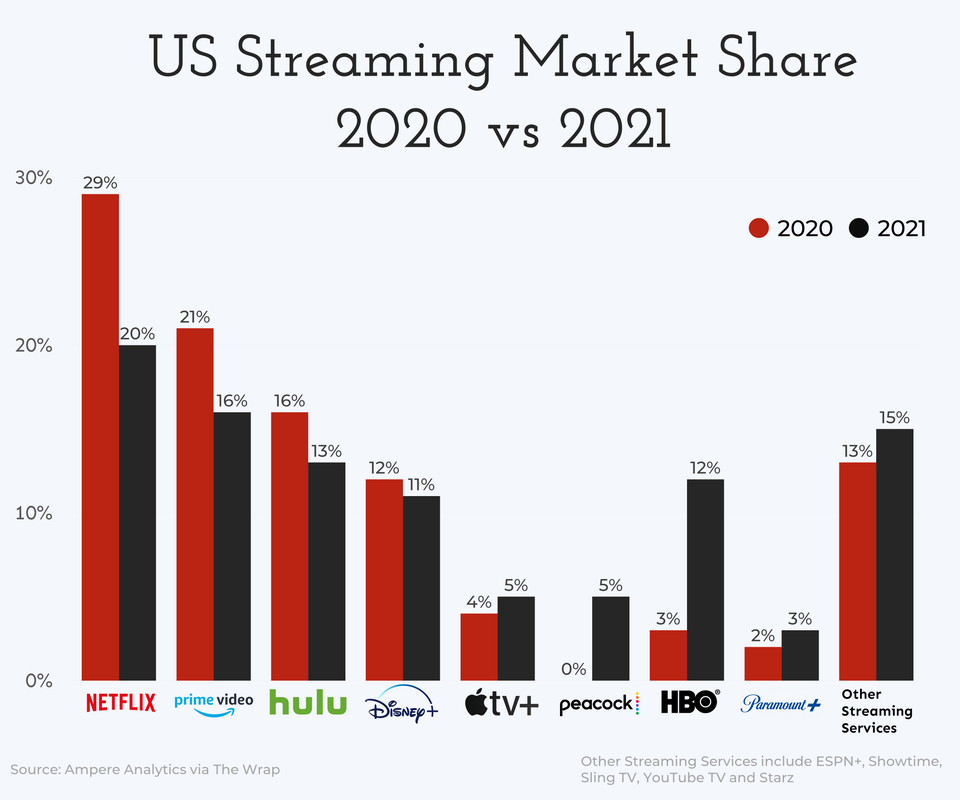

```{r, setup, include = FALSE}
library(dplyr)

knitr::opts_chunk$set(
  class.output  = "bg-success",
  class.message = "bg-info text-info",
  class.warning = "bg-warning text-warning",
  class.error   = "bg-danger text-danger"
)
```

I saw [this post](https://www.reddit.com/r/dataisbeautiful/comments/mtld5f/oc_us_streaming_services_market_share_2020_vs_2021/) on Reddit's r/dataisbeautiful showing this plot



and thought it looked like a good candidate for trying out some plot improvement techniques.

I've played with [adding images to plot axes](https://jcarroll.com.au/2019/08/13/ggtext-for-images-as-x-axis-labels/) 
several times (also [here](https://jcarroll.com.au/2016/06/02/images-as-x-axis-labels/), [here](https://jcarroll.com.au/2016/06/03/images-as-x-axis-labels-updated/), [here](https://jcarroll.com.au/2018/10/16/even-more-images-as-x-axis-labels/)) so that part shouldn't pose 
too much of a challenge. First, I'll try to rebuild the original. The [original was built in powerpoint](https://www.reddit.com/r/dataisbeautiful/comments/mtld5f/oc_us_streaming_services_market_share_2020_vs_2021/gv0bv4j?utm_source=share&utm_medium=web2x&context=3) but I'll be reproducing it with R.

The data itself appears to be captured from something like [this page](https://www.thewrap.com/netflix-streaming-us-market-share-chart/) (paywalled) but the precise values aren't important; I'll just take them directly from the original plot manually
```{r}
streaming <- tibble::tribble(
  ~service, ~share2020, ~share2021,
  "netflix", 29, 20,
  "prime", 21, 16,
  "hulu", 16, 13,
  "disney", 12, 11,
  "apple", 4, 5,
  "peacock", 0, 5,
  "hbo", 3, 12,
  "paramount", 2, 3,
  "other", 13, 15,
)
```
I can build a simple barplot from this data with `ggplot2`. First we'll need it in long format, with the services ordered as 
they are in the original, and build a basic bar plot with dodged bars
```{r, fig.path = "static"}
library(ggplot2)

## pivot to long format with the year and share as their own columns
streaming_long <- tidyr::pivot_longer(streaming, cols = -service, names_to = "year", values_to = "share")

## plot the years side-by-side in the original order
p <- ggplot(streaming_long) + 
  geom_col(aes(factor(service, levels = streaming$service), share, fill = year), position = "dodge") + 
  ## add the percentages just above each bar
  geom_text(aes(service, share + 1, label = paste0(share, "%"), group = year), position = position_dodge(width = 1)) +
  ## use similar colours to the original
  scale_fill_manual(values = c(share2020 = "red3", share2021 = "black")) + 
  labs(title = "US Streaming Market Share", subtitle = "2020 vs 2021", x = "", y = "") +
  theme_minimal() + 
  theme(plot.title = element_text(size = 26), plot.subtitle = element_text(size = 26))
p
```
That's fairly close. For the logos I'll use the versions on Wikipedia
```{r}
logos <- tibble::tribble(
  ~service, ~logo,
  "netflix", "https://upload.wikimedia.org/wikipedia/commons/thumb/0/08/Netflix_2015_logo.svg/340px-Netflix_2015_logo.svg.png",
  "prime", "https://upload.wikimedia.org/wikipedia/commons/thumb/1/11/Amazon_Prime_Video_logo.svg/450px-Amazon_Prime_Video_logo.svg.png",
  "hulu", "https://upload.wikimedia.org/wikipedia/commons/thumb/e/e4/Hulu_Logo.svg/440px-Hulu_Logo.svg.png",
  "disney", "https://upload.wikimedia.org/wikipedia/commons/thumb/3/3e/Disney%2B_logo.svg/320px-Disney%2B_logo.svg.png",
  "apple",  "https://upload.wikimedia.org/wikipedia/commons/thumb/2/28/Apple_TV_Plus_Logo.svg/500px-Apple_TV_Plus_Logo.svg.png",
  "peacock", "https://upload.wikimedia.org/wikipedia/commons/thumb/d/d3/NBCUniversal_Peacock_Logo.svg/440px-NBCUniversal_Peacock_Logo.svg.png",
  "hbo", "https://upload.wikimedia.org/wikipedia/commons/thumb/d/de/HBO_logo.svg/440px-HBO_logo.svg.png",
  "paramount", "https://upload.wikimedia.org/wikipedia/commons/thumb/a/a5/Paramount_Plus.svg/440px-Paramount_Plus.svg.png",
  "other", "other"
)
labels <- setNames(paste0(""), logos$service)
labels[["other"]] <- "other<br />streaming<br />services"
```
and leverage `{ggtext}` to set these as the axis labels
```{r, fig.path = "static"}
p <- p + scale_x_discrete(labels = labels) + theme(axis.text.x = ggtext::element_markdown())
p
```
My first thought on seeing this plot with the legend was that `{ggtext}` makes this a lot easier to read by using the 
title _as_ the legend
```{r, fig.path = "static"}
p <- p + 
  labs(subtitle = "<span style = 'color: red3;'>2020</span> vs 2021") + 
  theme(plot.subtitle = ggtext::element_markdown(), legend.position = "none")
p
```
Next, this should possibly be a horizontal bar plot so that the labels read nicely
```{r, fig.path = "static"}
p + 
  coord_flip() + 
  scale_x_discrete(labels = labels, limits = rev(streaming$service)) + 
  theme(axis.text.y = ggtext::element_markdown())
```
The 'insight' which this is trying to display is how each service's share has grown 
or shrunk. It wasn't obvious to me that the original was ordered by that - decreases shown first, then increases (in some order, I'm still
not sure what). What might make for a better plot to center it on the 2020 share and show the growth (positive or negative)
```{r, fig.path = "static"}
streaming_delta <- dplyr::mutate(streaming, growth = share2021 - share2020)

p <- ggplot(streaming_delta) + 
  geom_col(aes(factor(service, levels = streaming$service), growth, fill = growth > 0)) + 
  labs(title = "US Streaming Market Share", subtitle = "2020 vs 2021", x = "", y = "") +
  theme_minimal() + theme(plot.title = element_text(size = 26), plot.subtitle = element_text(size = 26)) + 
  scale_x_discrete(labels = labels) + 
  coord_flip() +
  theme(axis.text.y = ggtext::element_markdown()) 
p
```
Each comparison in the original required two bars, and the separation between the services didn't make that easy to read. In this version,
the absolute scale is lost (services starting high and decreasing aren't distinct from those starting low and gaining slightly) so what about 
using a barbell plot to show the separation between the two values rather than relying on comparing two bars?
```{r, fig.path = "static"}
p <- ggplot(streaming) + 
  ggalt::geom_dumbbell(aes(factor(service, levels = rev(streaming$service)), 
                           x = share2020, xend = share2021), 
                       colour_x = "red3", size_x = 6,
                       colour_xend = "black", size_xend = 6,
                       size = 1, dot_guide = TRUE, dot_guide_size = 0.5, dot_guide_colour = "grey25") + 
  scale_y_discrete(labels = labels) + 
  labs(title = "US Streaming Market Share", x = "", y = "") +
  labs(subtitle = "<span style = 'color: red3;'>2020</span> vs 2021") + 
  theme_minimal() +
  theme(plot.title = element_text(size = 26), plot.subtitle = element_text(size = 26)) +
  theme(axis.text.y = ggtext::element_markdown(), plot.subtitle = ggtext::element_markdown(), legend.position = "none") 
p
```


<br />
<details>
  <summary>
    <tt>devtools::session_info()</tt>
  </summary>
```{r sessionInfo, echo = FALSE}
devtools::session_info()
```
</details>
<br />
