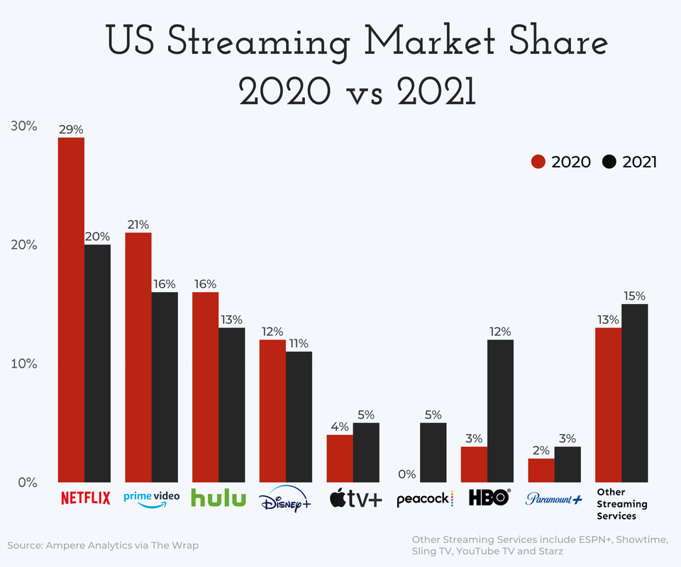
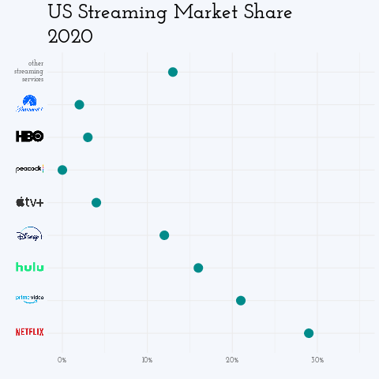

```{r, setup, include = FALSE}
library(dplyr)
library(extrafont)
library(ggimage)
library(ggalluvial)
library(ggalt, include.only = "geom_dumbbell")
library(gganimate)
loadfonts()

knitr::opts_chunk$set(
  class.output  = "bg-success",
  class.message = "bg-info text-info",
  class.warning = "bg-warning text-warning",
  class.error   = "bg-danger text-danger",
  fig.path = "static",
  out.width = "100%"
)
```

I saw [this post](https://www.reddit.com/r/dataisbeautiful/comments/mtld5f/oc_us_streaming_services_market_share_2020_vs_2021/)
on Reddit's r/dataisbeautiful showing this plot of streaming services market
share, comparing 2020 to 2021


and thought it looked like a good candidate for trying out some plot improvement techniques. 

<!--more-->

I saw [this post](https://www.reddit.com/r/dataisbeautiful/comments/mtld5f/oc_us_streaming_services_market_share_2020_vs_2021/)
on Reddit's r/dataisbeautiful showing this plot of streaming services market
share, comparing 2020 to 2021



and thought it looked like a good candidate for trying out some plot improvement techniques. 

Yes, that was a reasonably long while ago, this post has taken quite some time to put together. Life.

I've played with [adding images to plot axes](https://jcarroll.com.au/2019/08/13/ggtext-for-images-as-x-axis-labels/) 
several times (also [here](https://jcarroll.com.au/2016/06/02/images-as-x-axis-labels/), [here](https://jcarroll.com.au/2016/06/03/images-as-x-axis-labels-updated/), [here](https://jcarroll.com.au/2018/10/16/even-more-images-as-x-axis-labels/)) so that part shouldn't pose 
too much of a challenge. First, I'll try to rebuild the original. The [original was built in powerpoint](https://www.reddit.com/r/dataisbeautiful/comments/mtld5f/oc_us_streaming_services_market_share_2020_vs_2021/gv0bv4j?utm_source=share&utm_medium=web2x&context=3) but I'll be reproducing it with R (surprise, surprise).

The data itself appears to be captured from something like [this page](https://www.thewrap.com/netflix-streaming-us-market-share-chart/) (paywalled) but the precise values aren't important; I'll just take them directly from the original plot manually
```{r}
streaming <- tibble::tribble(
  ~service, ~`2020`, ~`2021`,
  "netflix",    29, 20,
  "prime",      21, 16,
  "hulu",       16, 13,
  "disney",     12, 11,
  "apple",       4,  5,
  "peacock",     0,  5,
  "hbo",         3, 12,
  "paramount",   2,  3,
  "other",      13, 15,
)
```
I can build a simple barplot from this data with `{ggplot2}`. First we'll need it in long format, with the services ordered as 
they are in the original. From that I can build a basic bar plot with dodged bars. There's a few fiddly bits to work out, which I'll try to 
go through with code comments.
```{r}
library(ggplot2)

## pivot to long format with the 
## year and share as their own columns
streaming_long <- tidyr::pivot_longer(streaming, 
                                      cols = -service, 
                                      names_to = "year", 
                                      values_to = "share")

## plot the years side-by-side in the original order
p <- ggplot(streaming_long) + 
  geom_col(aes(factor(service, levels = streaming$service), 
               share, fill = year), position = position_dodge(width = 0.9)) + 
  ## add a hidden set of points to make the legend circles easily
  geom_point(aes(x = service, y = -10, color = year, fill = year), size = 4) + 
  ## add the percentages just above each bar
  geom_text(aes(service, share + 1, label = paste0(share, "%"), group = year),
            position = position_dodge(width = 0.9), size = 3) +
  ## use similar colours to the original
  scale_fill_manual(values = c(`2020` = "red3", `2021` = "black")) +
  scale_color_manual(values = c(`2020` = "red3", `2021` = "black")) + 
  ## hide the fill legend and make the color legend horizontal
  guides(fill = "none", color = guide_legend(direction = "horizontal")) +
  scale_y_continuous(labels = scales::percent_format(scale = 1), 
                     limits = c(0, 35)) +
  labs(title = "US Streaming Market Share", 
       subtitle = "2020 vs 2021", 
       caption = "Source: Ampere Analytics via The Wrap
       
       Other Streatming Services include ESPN+, Showtime,
       Sling TV, Youtube TV, and Starz",
       x = "", y = "") +
  theme_minimal() + 
  theme(axis.text = element_text(size = 10),
        plot.title = element_text(size = 28, hjust= 0.5), 
        plot.subtitle = element_text(size = 28, hjust = 0.5),
        plot.caption = element_text(size = 7, color = "grey60"),
        plot.background = element_rect(fill = "#f4f7fc", size = 0),
        legend.title = element_blank(),
        legend.text= element_text(size = 12),
        panel.grid = element_blank(),
        ## move the color legend to an inset 
        legend.position = c(0.85, 0.8)) 
p
```
Not bad. Let's get some of the other elements looking right. I used a font identifying site to pick a similar font 
which seems to be [Josefin Slab SemiBold](https://www.ffonts.net/Josefin-Slab-SemiBold-Italic.font.download).
```{r}
library(extrafont)
fontfamily <- "Josefin Slab SemiBold"

p <- p + theme(plot.title = element_text(family = fontfamily),
               plot.subtitle = element_text(family = fontfamily))
p
```
That's fairly close. For the logos I'll use the versions on Wikipedia
```{r}
wiki <- "https://upload.wikimedia.org/wikipedia/commons/thumb/"
logos <- tibble::tribble(
  ~service, ~logo,
  "netflix", paste0(wiki, "0/08/Netflix_2015_logo.svg/340px-Netflix_2015_logo.svg.png"),
  "prime", paste0(wiki, "1/11/Amazon_Prime_Video_logo.svg/450px-Amazon_Prime_Video_logo.svg.png"),
  "hulu", paste0(wiki, "e/e4/Hulu_Logo.svg/440px-Hulu_Logo.svg.png"),
  "disney", paste0(wiki, "3/3e/Disney%2B_logo.svg/320px-Disney%2B_logo.svg.png"),
  "apple",  paste0(wiki, "2/28/Apple_TV_Plus_Logo.svg/500px-Apple_TV_Plus_Logo.svg.png"),
  "peacock", paste0(wiki, "d/d3/NBCUniversal_Peacock_Logo.svg/440px-NBCUniversal_Peacock_Logo.svg.png"),
  "hbo", paste0(wiki, "d/de/HBO_logo.svg/440px-HBO_logo.svg.png"),
  "paramount", paste0(wiki, "a/a5/Paramount_Plus.svg/440px-Paramount_Plus.svg.png"),
  "other", "other.png"
) %>% 
  mutate(path = file.path("images", paste(service, tools::file_ext(logo), sep = ".")))
labels <- setNames(paste0(""), logos$service)
labels[["other"]] <- "other<br />streaming<br />services"
```
and save a local copy for faster loading/just in case
```{r, eval = FALSE}
for (r in 1:8) {
  download.file(logos$logo[r], logos$path[r])
}
```
I can leverage `{ggtext}` to set these as the axis labels
```{r}
p <- p + 
  scale_x_discrete(labels = labels) + 
  theme(axis.text.x = ggtext::element_markdown())
p
```
That's not too bad - for the sake of scrolling, here's the original again


Now to try to improve it.

My first thought on seeing this plot with the legend was that `{ggtext}` makes this a lot easier to read by using the 
title _as_ the legend. For the sake of the 'removed rows containing missing values' warning I'll also drop the points layer
```{r}
p$layers[[2]] <- NULL ## drop the geom_points layer
p <- p + 
  labs(subtitle = "<span style = 'color: red3;'>2020</span> vs 2021") + 
  theme(plot.subtitle = ggtext::element_markdown(), legend.position = "none")
p
```
To help make the black bars more distinct from the text, we could make these a different colour
```{r}
p <- p + 
  scale_fill_manual(values = c(`2020` = "red3", `2021` = "darkcyan")) + 
  labs(subtitle = paste0("<span style = 'color: red3;'>2020</span> ",
                         "vs <span style = 'color: darkcyan;'>2021</span>")) + 
  theme(plot.subtitle = ggtext::element_markdown(), legend.position = "none")
p
```
Now to see if there's a better way to represent this data. These are fractions of the total share... would a pie chart be a candidate? 
```{r}
streaming_pie <- left_join(streaming_long, logos, by = "service")

p_pie <- ggplot(streaming_pie, aes(1, share, fill = service, image = path)) + 
  geom_col() + 
  coord_polar("y") +
  ggimage::geom_image(size = 0.12, position = position_stack(vjust = 0.5)) +
  facet_wrap(~year, strip.position = "bottom") +
  guides(fill = "none", color = guide_legend(direction = "horizontal")) +
  labs(title = "US Streaming Market Share", subtitle = "2020 vs 2021", x = "", y = "") +
  theme_void() + 
  theme(text = element_text(size = 32),
        plot.title = element_text(family = fontfamily, size = 26, hjust = 0.5), 
        plot.subtitle = element_text(family = fontfamily, size = 26, hjust = 0.5),
        plot.background = element_rect(fill = "#f4f7fc", size = 0),
        legend.title = element_blank())
p_pie
```
No, that's harder for making comparisons. Forget that idea.

This should possibly be a horizontal bar plot so that the labels read nicely
```{r}
p + 
  coord_flip() + 
  scale_x_discrete(labels = labels, limits = rev(streaming$service)) + 
  theme(axis.text.y = ggtext::element_markdown())
```
The 'insight' this is trying to display is how each service's share has grown 
or shrunk. It wasn't obvious to me that the original was ordered by that - decreases shown first, then increases (in some order, I'm still
not sure what). What might make for a better plot to center it on the 2020 share and show the growth (positive or negative)
```{r}
streaming_delta <- dplyr::mutate(streaming, growth = `2021` - `2020`)

p <- ggplot(streaming_delta) + 
  geom_col(aes(factor(service, levels = streaming$service), growth, fill = growth > 0)) + 
  labs(title = "US Streaming Market Share Growth", x = "", y = "") +
  theme_minimal() + 
  theme(text = element_text(family = fontfamily),
        plot.title = element_text(size = 26), 
        plot.subtitle = element_text(size = 26)) + 
  scale_x_discrete(labels = labels) + 
  coord_flip() +
  theme(axis.text.y = ggtext::element_markdown()) +
  scale_fill_manual(values = c(`TRUE` = "darkcyan", `FALSE` = "red3")) + 
  labs(subtitle = paste0("<span style = 'color: darkcyan;'>Growth</span> ",
                         "vs <span style = 'color: red3;'>Loss</span> (% of 2020)")) + 
  theme(plot.subtitle = ggtext::element_markdown(),
        plot.background = element_rect(fill = "#f4f7fc", size = 0))
p
```
Each comparison in the original required two bars, and the separation between the services didn't make that easy to read. In this version,
the absolute scale is lost (services starting high and decreasing aren't so distinct from those starting low and gaining slightly) 
so what about using a dumbbell plot to show the separation between the two values while retaining their overall scales, rather than relying on comparing two bars?
```{r}
library(ggalt, include.only = "geom_dumbbell")

p <- ggplot(streaming) + 
  ggalt::geom_dumbbell(aes(factor(service, levels = rev(streaming$service)), 
                           x = `2020`, xend = `2021`), 
                       colour_x = "red3", size_x = 6,
                       colour_xend = "darkcyan", size_xend = 6,
                       size = 1, dot_guide = TRUE, 
                       dot_guide_size = 0.5, 
                       dot_guide_colour = "grey25") + 
  scale_x_continuous(labels = scales::percent_format(scale = 1), 
                   limits = c(0, 35)) +
  scale_y_discrete(labels = labels) + 
  labs(title = "US Streaming Market Share", x = "", y = "") +
  labs(subtitle = paste0("<span style = 'color: red3;'>2020</span> ",
                         "vs <span style = 'color: darkcyan;'>2021</span>")) + 
  theme_minimal() +
  theme(plot.title = element_text(family = fontfamily, size = 26), 
        plot.subtitle = element_text(family = fontfamily, size = 26)) +
  theme(axis.text.y = ggtext::element_markdown(), 
        plot.subtitle = ggtext::element_markdown(), 
        plot.background = element_rect(fill = "#f4f7fc", size = 0),
        legend.position = "none") 
p
```
One last option to bring this data to life would be to animate between the two states...
```{r, eval = FALSE}
library(gganimate)

p <- ggplot(streaming_long) + 
  geom_point(aes(share, 
                 factor(service, levels = streaming$service)), 
             size = 5, color = "darkcyan") + 
  scale_y_discrete(labels = labels) +
  labs(title = "US Streaming Market Share", x = "", y = "") +
  labs(subtitle = "{closest_state}") + 
  scale_x_continuous(labels = scales::percent_format(scale = 1), 
                     limits = c(0, 35)) +
  theme_minimal() +
  theme(text = element_text(family = fontfamily), 
        plot.title = element_text(size = 26), 
        plot.subtitle = element_text(size = 26),
        legend.position = "none") +
  theme(axis.text.y = ggtext::element_markdown(),
        plot.background = element_rect(fill = "#f4f7fc", size = 0))
  
anim <- p + 
  transition_states(year, transition_length = 4) +
  ease_aes() +
  enter_fade() +
  exit_fade()
animate(anim, renderer = gifski_renderer())
anim_save(filename = "images/streaming.gif")
```
{width=100%}
I think these last few communicate more than the original. It's always amazing how easy it is to bring this data into R and 
start playing with different presentations. Sure, perfecting the plots can take a little while, but 
the data is there to be played with.

One visualization which might have been interesting would be if we had the data on the transitions between services. Then 
an [alluvial plot](https://en.wikipedia.org/wiki/Alluvial_diagram) would be very informative. Simulating that...
```{r}
streaming_flow <- tibble::tribble(
    ~`2020`, ~Freq, ~`2021`,
  "netflix",    12, "netflix",
  "netflix",     4, "prime",
  "netflix",     6, "disney",
  "netflix",     3, "apple",
  "netflix",     4, "hbo",
  "prime",      16, "prime",
  "prime",       5, "netflix",
  "prime",       2, "hulu",
  "prime",       1, "disney",
  "prime",       3, "peacock",
  "prime",       4, "hbo",
  "hulu",       13, "hulu",
  "hulu",        1, "netflix",
  "hulu",        2, "prime",
  "hulu",        1, "disney",
  "disney",     11, "disney",
  "disney",      1, "netflix",
  "disney",      3, "prime",
  "disney",      1, "hulu",
  "apple",       4, "apple",
  "apple",       2, "netflix",
  "apple",       1, "prime",
  "peacock",     2, "peacock",
  "peacock",     1, "netflix",
  "hbo",         3, "hbo",
  "hbo",         1, "prime"
)

library(ggalluvial)

lodes <- to_lodes_form(streaming_flow, axes = c("2020", "2021"))
lodes <- left_join(lodes, logos,  by = c("stratum" = "service"))
lodes <- arrange(lodes, stratum)

ggplot(lodes, aes(x = x, stratum = stratum, alluvium = alluvium, 
                  y = Freq, fill = stratum, label = stratum, image = path)) + 
  geom_flow() +
  geom_stratum(alpha = 0.6) + 
  geom_text(stat = "stratum", size = 4) +
  scale_x_discrete(limits = c("2020", "2021"), 
                   expand = c(0.1, 0.1)) +
  labs(title = " US Streaming Market Share Flow", 
       subtitle = " 2020 to 2021") +
  theme_void() +
  theme(axis.text.x = element_text(size = 20, vjust = 3),
        plot.title = element_text(family = fontfamily, size = 26), 
        plot.subtitle = element_text(family = fontfamily, size = 26),
        plot.background = element_rect(fill = "#f4f7fc", size = 0),
        legend.position = "none") 
```
I spent way too long trying to get the logos into this one, but there seems to be 
a fundamental issue with combining `{ggalluvial}` with `{ggimage}` which I coulnd't resolve.

Do you have a better way to present this data? Let me know in the comments or on [Twitter](https://twitter.com/carroll_jono).

<br />
<br />
<details>
  <summary>
    <tt>devtools::session_info()</tt>
  </summary>
```{r sessionInfo, echo = FALSE}
devtools::session_info()
```
</details>
<br />
