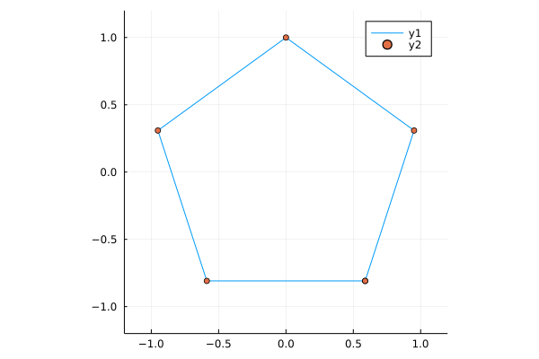
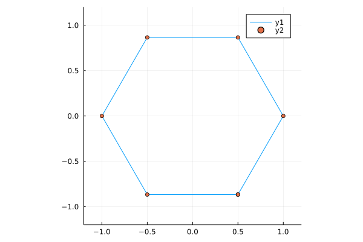
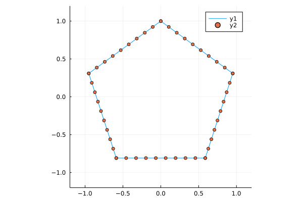
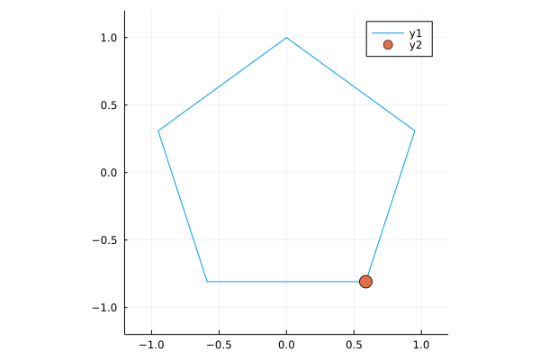
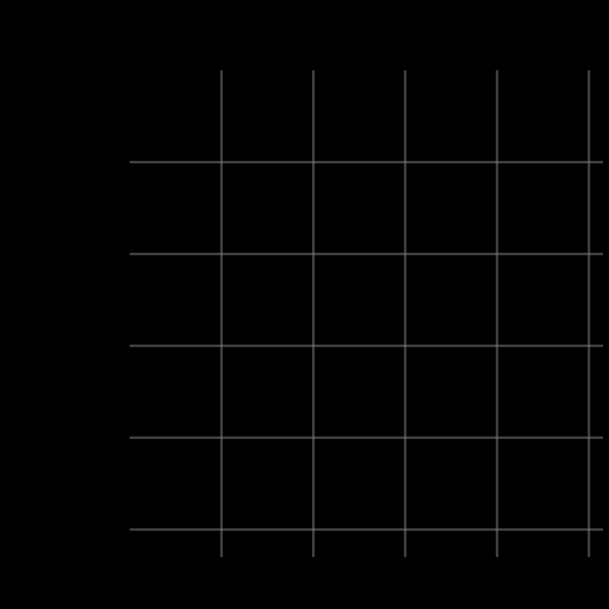

```{r, setup, include = FALSE}
knitr::opts_chunk$set(
  class.output  = "bg-success",
  class.message = "bg-info text-info",
  class.warning = "bg-warning text-warning",
  class.error   = "bg-danger text-danger",
  eval = FALSE
)
```

Another 'small learning project' for me as I continue to learn Julia. I've said many 
times that small projects with a defined goal are one of the best ways to learn, at 
least for me. This one was inspired by [yet another Reddit post](https://www.reddit.com/r/oddlysatisfying/comments/uc054a/lissajous_polygons/)


<!--more-->

Another 'small learning project' for me as I continue to learn Julia. I've said many 
times that small projects with a defined goal are one of the best ways to learn, at 
least for me. This one was inspired by [yet another Reddit post](https://www.reddit.com/r/oddlysatisfying/comments/uc054a/lissajous_polygons/)

<iframe id="reddit-embed" src="https://www.redditmedia.com/r/oddlysatisfying/comments/uc054a/lissajous_polygons/?ref_source=embed&amp;ref=share&amp;embed=true" sandbox="allow-scripts allow-same-origin allow-popups" style="border: none;" height="620" width="640" scrolling="no"></iframe>

These are at least reminiscent of [Lissajous curves](https://en.wikipedia.org/wiki/Lissajous_curve) but they 
primarily just looked pretty cool - that animation is very nicely put together.

That graphic was [made using Typescript](https://codepen.io/ScarpMetal/pen/abEPdwK) which 
is itself neat to begin with, but it looked like something that Julia might be well-suited to, 
at least the parts I've learned so far. It seems to involve interpolating between points and animation, 
both of which I [recently covered on my mini blog](https://jcarroll.xyz/2022/04/07/interpolation-animation-in.html).

Better yet, it appeared that matrix operations might be a useful component, for which Julia seems particularly well-suited.

The first thing I needed to do was to get a polygon plotted in Julia. This already challenged my existing 
knowledge, but that's where the learning happens. I dabbled with the `Shape` class and didn't get very far. I found 
some other implementations that plotted shapes, but none (at least that I understood) that produced a set of 
points I could interpolate between.

I ended up defining my own function that calculates the vertices of an n-sided polygon with a bit of math. There's 
very likely already something that does it, but it failed the discoverability aspect. The function I came up with is

```{julia}
"""
    vertices(center, R, n[, closed])

# Arguments
- `center::Point`: center of polygon
- `R::Real`: circumradius
- `n::Int`: number of sides
- `closed::Bool`: should the first point be repeated?

Polygon has a flat bottom and points progress counterclockwise 
starting at the right end of the base

The final point is the starting point when closed = true
"""
function vertices(center::Point, R::Real, n::Int, closed::Bool=true) 
    X = center[1] .+ R * cos.(π/n .* (1 .+ 2 .* (0:n-1)) .- π/2)
    Y = center[2] .+ R * sin.(π/n .* (1 .+ 2 .* (0:n-1)) .- π/2)

    res = permutedims([X Y])
    ## append the start point if closed
    if closed
        res = hcat(res, res[:,1])
    end
    return res
end
```

This is where playing around with code and data where you know _what_ you want but 
not how to produce it is the most useful. Coming from R, I was at risk of trying to 
create a `data.frame` of `x` and `y` points, but `Array`s make more sense here. Getting 
the points in the right structure was the biggest learning experience for me - combining 
`Array`s of `Point`s doesn't quite work in the way I expect coming from R, but I think this works.

I did play with the idea of making my own `struct` for this group of `Point`s, but even though 
(I think) it inherited from `AbstractArray`, none of the `Array` methods seemed to work for it - more 
to learn for next time!

I wanted to make sure that the points I generated here seem to make sense, so I can plot them. Getting 
the plots to work requires `using Plots`, and `Point` comes from `GeometryBasics`, so

```{julia}
using Plots
import GeometryBasics: Point
```

then plotting the vertices of a polygon is as easy as

```{julia}
a = vertices(Point(0,0), 1, 5, true);
plot(a[1,:], a[2,:], xlim = (-1.2, 1.2), ylim = (-1.2, 1.2), ratio = 1)
scatter!(a[1,:], a[2,:])
```



And just by changing the number of vertices

```{julia}
a = vertices(Point(0,0), 1, 6, true);
plot(a[1,:], a[2,:], xlim = (-1.2, 1.2), ylim = (-1.2, 1.2), ratio = 1)
scatter!(a[1,:], a[2,:])
```



I find it somewhat odd that `plot` doesn't have an `Array` method and I need to explicitly slice out the 
`x` and `y` arguments, but perhaps I'm ["holding it wrong"](https://uxdesign.cc/youre-holding-it-wrong-how-to-blame-the-user-6ebfd36f5664?gi=99891968d5b4)?

Next I wanted to interpolate points between these vertices. I played with interpolation 
in Julia in my [last mini blog post](https://jcarroll.xyz/2022/04/07/interpolation-animation-in.html) so 
I knew that function was

```{julia}
interpolate(a, b) = t -> ((1.0 - t) * a + t * b)
```

Interpolating between vertices meant interpolating between any two vertices, then repeating that over pairs. Taking 
the case of two vertices first

```{julia}
"""
    _interPoints(pts, steps, slice)

# Arguments
- `pts::Array`: Array of `Point`s representing a polygon
- `steps::Int`: number of points to interpolate
- `slice::Int`: which polygon vertex to begin with; points will  be interpolated to the next vertex

This is an internal function to interpolate points between 
    two vertices of a polygon. It is intended to be used 
    in a `map` across slices of a polygon.
"""
function _interPoints(pts::Array, steps::Int, slice::Int) 
    int = interpolate(pts[:,slice], pts[:,slice+1])
    explode = [int(t) for t in range(0,1,length=steps)]
    return hcat(explode...)
end
```

which I can test with

```{julia}
a = vertices(Point(0,0), 1, 5, true);
b = _interPoints(a, 10, 1);
plot(a[1,:], a[2,:], ratio = 1)
scatter!(b[1,:], b[2,:])
```


Then, mapping across pairs of points is just

```{julia}
"""
    interPoints(pts, steps)

# Arguments
- `pts::Array`: Array of `Point`s representing a polygon
- `steps::Int`: number of points to interpolate between each pair of vertices

This takes an `Array` of `Point`s representing polygon vertices and interpolates between the vertices
"""
function interPoints(pts::Array, steps::Int) 
    res = map(s -> _interPoints(pts, steps, s), 1:(size(pts,2)-1))
    return hcat(res...)
end
```

Plotting all these points

```{julia}
a = vertices(Point(0,0), 1, 5, true);
b = interPoints(a, 10);
plot(b[1,:], b[2,:], xlim = (-1.2, 1.2), ylim = (-1.2, 1.2), ratio = 1)
scatter!(b[1,:], b[2,:])
```



Animating these points is as simple as

```{julia}
anim = @animate for t in 1:size(b,2)
    plot(b[1,:], b[2,:], xlim = (-1.2, 1.2), ylim = (-1.2, 1.2), ratio=1)
    scatter!([b[1,t]], [b[2,t]], markersize=8)
end

gif(anim, fps = 12)
```



and I think that's pretty great progress towards what I want to make. Now I just need to run more of these 
at different speeds, and find the intersections of them.

Taking the intersection problem first, I just want to create two polygons and extract the `x` values from one and 
the `y` values from the other. Simple enough

```{julia}
"""
Find the intersection of two Arrays (representing polygons)

# Arguments
- `a::Array`: first polygon (for x values)
- `b::Array`: second polygon (for y values)

Take the x values from a and the y values from b
"""
function intersection(a::Array, b::Array) 
    permutedims(hcat([(a[1, :])...], [(b[2, :])...]))
end
```

`permutedims` was the big win for me here - I naively expected to be able to transpose 
an `Array` but that ends up with some `LinearAlgebra.Adjoint` mess and I got confused

```{julia, eval = TRUE}
[1 2; 3 4]

[1 2; 3 4]'
```

Anyway, this appears to be able to take the intersection of two `Array`s. Let's plot it!

```{julia}
t1 = interPoints(vertices(Point(2,8), 0.5, 5), 10);
t2 = interPoints(vertices(Point(1,7), 0.5, 5), 10);
tx = intersection(t1, t2);

plot(t1[1,:], t1[2,:], xlim = (0,3.5), ylim = (6,9), ratio = 1)
plot!(t2[1,:], t2[2,:])
plot!(tx[1,:], tx[2,:])
```


Perfect! Now I just need to do it a bunch more times (at different 'speeds') and animate it. 

I originally worked out the array math by hand and found a suitable number of points to plot 
for any given polygon and which multiplicative factors I could use, then I worked backwards to 
formalise it into a function

```{julia}
"""

    speed_factor(poly, speed)

# Arguments
- `poly::Array`: Array of `Point`s representing a polygon
- `speed::Real`: mulitiplicative factor representing how the number of times a polygon should be traversed
"""
function speed_factor(poly::Array, speed::Real)
    if (speed % 1 == 0)
        res = repeat(poly, outer = (1,Int(speed)))
    else 
        n = Int(floor(speed / 1))
        res = repeat(poly, outer=(1,n))
        n_rem = Int(speed*size(poly,2)-size(res,2))
        res = hcat(res, poly[:,1:n_rem])
    end
    res
end
```

If I create a polygon of 72 interpolated points, I can create another with the same number of 
points but with larger gaps between them. This means the 'faster' polygon will loop around some `n>1` number 
of times.

```{julia}
r = 0.4; # circumradius for the polygon
d = 3;   # number of vertices

# Both produce a 2x72 Array{Float64,2}
tx1 = interPoints(vertices(Point(2,6), r, d), 24)
tx2 = speed_factor(interPoints(vertices(Point(3,6), r, d), 16) , 1.5) 
```

I can create a series of these, say, at speeds of 1, 1.5, 2, 2.4, and 3. These are just nice 
numbers which are all integer divisors of the largest number of points (72)

```{julia}
## n = 3
r = 0.4;
d = 3;

tx1 = interPoints(vertices(Point(2,6), r, d), 24)
tx2 = speed_factor(interPoints(vertices(Point(3,6), r, d), 16), 1.5) 
tx3 = speed_factor(interPoints(vertices(Point(4,6), r, d), 12), 2)
tx4 = speed_factor(interPoints(vertices(Point(5,6), r, d), 10), 2.4)
tx5 = speed_factor(interPoints(vertices(Point(6,6), r, d), 8), 3)

ty1 = interPoints(vertices(Point(1,5), r, d), 24)
ty2 = speed_factor(interPoints(vertices(Point(1,4), r, d), 16), 1.5)
ty3 = speed_factor(interPoints(vertices(Point(1,3), r, d), 12), 2)
ty4 = speed_factor(interPoints(vertices(Point(1,2), r, d), 10), 2.4)
ty5 = speed_factor(interPoints(vertices(Point(1,1), r, d), 8), 3)
```

The variable name is arbitrary, but these are a sequence of polygons along the `x` and `y` axes of 
some plot area.

One thing that I really like about Julia is that _anything_ can be in an `Array` (similar to lists in R) so 
I can combine these groups of points into an `Array` of `Array`s

```{julia}
allx = [tx1, tx2, tx3, tx4, tx5]
ally = [ty1, ty2, ty3, ty4, ty5]
```

Now, how to calculate all the intersections? Julia of course does "broadcasting" where we can take some 
operation and (in R parlance) "vectorize it". That initially led me to 

```{julia}
intersection.(allx, ally)
```

which does indeed do that - it produces a `5-element Array{Array{Float64,2},1}` but that's not what I wanted... 
this _only_ calculates the 'diagonal' of `intersection(tx1, ty1)`, `intersection(tx2, ty2)`, ...

Thankfully, Julia _also_ has list comprehensions, so the full 'matrix' of intersections is actually

```{julia}
allint = [intersection(x, y) for x in allx, y in ally]
```

which produces a `5×5 Array{Array{Float64,2},2}` - the full matrix! With that in place, we now have all the 
pieces we need, so we just need to plot them.

The following sets up a plot on every 'timestep' (one per point in the interpolation) where it redraws the canvas, 
with the progressive drawing of each polygon and the intersections, plus some tracking lines along the `x` and `y` 
extractions. One of the very neat things I entirely failed to appreciate earlier was the concept of 
enumerated objects - Julia knows that if I ask for `x in obj` I want to iterate over all the elements

```{julia}
bbox = Point(6.5,6.5);

anim3 = @animate for t in 1:size(tx1,2)
    plot(xlim=(0,bbox[2]), ylim=(0,bbox[2]), 
        legend=false, ratio=1, axis=nothing, border=:none, 
        background_color="black", size=(1200,1200))
    for p in 1:size(allx,1)
        plot!(allx[p][1,1:t], allx[p][2,1:t], color=p, linewidth=6)
        plot!(ally[p][1,1:t], ally[p][2,1:t], color=p, linewidth=6)
        
        plot!([allx[p][1,t], allx[p][1,t]], [0.5, allx[p][2,t]], color="grey", alpha=0.5, linewidth=5)
        plot!([ally[p][1,t], bbox[2]], [ally[p][2,t], ally[p][2,t]], color="grey", alpha=0.5, linewidth=5)
    end
    for p in allint
        plot!(p[1,1:t], p[2,1:t], color="blue", linewidth=5)
    end
end

gif(anim3, "n3.gif", fps=12)
```

And, finally, the result



With all that in place, it's reasonably straightforward to adapt this to other polygons. For `n=4`

```{julia}
r = 0.4;
d = 4;

tx1 = interPoints(vertices(Point(2,6), r, d), 24)
tx2 = speed_factor(interPoints(vertices(Point(3,6), r, d), 16), 1.5)
tx3 = speed_factor(interPoints(vertices(Point(4,6), r, d), 12), 2)
tx4 = speed_factor(interPoints(vertices(Point(5,6), r, d), 10), 2.4)
tx5 = speed_factor(interPoints(vertices(Point(6,6), r, d), 8), 3)

ty1 = interPoints(vertices(Point(1,5), r, d), 24)
ty2 = speed_factor(interPoints(vertices(Point(1,4), r, d), 16), 1.5)
ty3 = speed_factor(interPoints(vertices(Point(1,3), r, d), 12), 2)
ty4 = speed_factor(interPoints(vertices(Point(1,2), r, d), 10), 2.4)
ty5 = speed_factor(interPoints(vertices(Point(1,1), r, d), 8), 3)

allx = [tx1, tx2, tx3, tx4, tx5]
ally = [ty1, ty2, ty3, ty4, ty5]
allint = [intersection(x, y) for x in allx, y in ally]

bbox = Point(6.5,6.5);

anim4 = @animate for t in 1:size(tx1,2)
    plot(xlim=(0,bbox[2]), ylim=(0,bbox[2]), 
        legend=false, ratio=1, axis=nothing, border=:none, 
        background_color="black", size=(1200,1200))
    for p in 1:size(allx,1)
        plot!(allx[p][1,1:t], allx[p][2,1:t], color=p, linewidth=6)
        plot!(ally[p][1,1:t], ally[p][2,1:t], color=p, linewidth=6)
        
        plot!([allx[p][1,t], allx[p][1,t]], [0.5, allx[p][2,t]], color="grey", alpha=0.5, linewidth=5)
        plot!([ally[p][1,t], bbox[2]], [ally[p][2,t], ally[p][2,t]], color="grey", alpha=0.5, linewidth=5)
    end
    for p in allint
        plot!(p[1,1:t], p[2,1:t], color="blue", linewidth=5)
    end
end

gif(anim4, "n4.gif", fps=12)
```


`n=5` (very similar code)


and `n=6`


I was extremely happy to see these come together, and I'm genuinely surprised by how little code it took. I could 
certainly imagine trying to do the same in R, but I have doubts that it would come together quite so cleanly.

This is definitely still part of my journey towards learning Julia, so if there's something in here you can spot 
that I could have done better, I do encourage you to let me know! Either here in the comments or on [Twitter](https://twitter.com/carroll_jono).

The code for generating all of this can be found [here](https://gist.github.com/jonocarroll/e22ea4982a27e6663ec75b82b55b3ec3).

<br />
<details>
  <summary>
    <tt>devtools::session_info()</tt>
  </summary>
```{r sessionInfo, echo = FALSE, eval = TRUE}
devtools::session_info()
```
</details>
<br />
