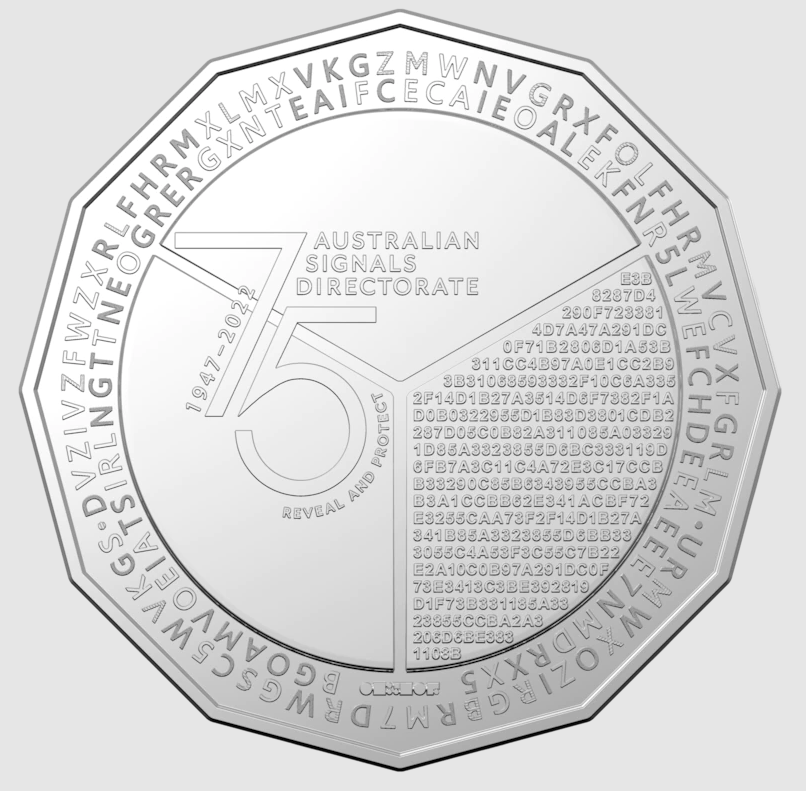

```{r, setup, include = FALSE}
knitr::opts_chunk$set(
  class.output  = "bg-success",
  class.message = "bg-info text-info",
  class.warning = "bg-warning text-warning",
  class.error   = "bg-danger text-danger"
)
```

I took a _very_ long time [to post about the last Australian Signals Directorate (then DSD) decryption](https://jcarroll.com.au/2021/12/23/adventures-in-x86-asm/), so this time I'll be a lot more punctual. [This article](https://www.abc.net.au/news/2022-09-01/act-spy-agency-releases-coin-with-secret-code/101391964) was published today announcing that ASD have collaborated to release a new 50c coin containing a decryption challenge.


<!--more-->

I took a _very_ long time [to post about the last Australian Signals Directorate (then DSD) decryption](https://jcarroll.com.au/2021/12/23/adventures-in-x86-asm/), so this time I'll be a lot more punctual. [This article](https://www.abc.net.au/news/2022-09-01/act-spy-agency-releases-coin-with-secret-code/101391964) was published today announcing that ASD have collaborated to release a new 50c coin containing a decryption challenge.



That looks like fun! Typing in the letters and numbers from the image certainly wasn't, but after that. Of course, I'll be solving the entire thing with R.

Apparently there's 4 challenges here. 

The first problem is the text around the edge That looks to be split into sections. The shortest one is

```{r}
edge1 <- "URMWXOZIRGBRM7DRWGSC5WVKGS"
```

I tried a few different substitution ciphers and hit gold with an [Atbash cipher](https://en.wikipedia.org/wiki/Atbash) where the alphabet is simply reversed. That's easy enough to code up...

```{r}
solve_atbash <- function(txt) {
  txt <- strsplit(txt, "")[[1]]
  atbash <- rev(LETTERS)
  res <- LETTERS[match(txt, atbash)]
  # if an element doesn't match, it's probably a number 
  # and can go straight in
  res[is.na(res)] <- txt[is.na(res)]
  paste(res, collapse = "")
}
```

R having the alphabet available as `LETTERS` is certainly nice in this case. Applying that to the string above we get

```{r}
solve_atbash(edge1)
```

which we can space out a bit to read "FIND CLARITY IN 7 WIDTH X 5 DEPTH". Sounds like we're going to need a matrix - good news for R!

Trying the next edge letters 

```{r}
edge2 <- "DVZIVZFWZXRLFHRMXLMXVKGZMWNVGRXFOLFHRMVCVXFGRLM"
solve_atbash(edge2)
```

which once again needs some spaces, but we can read "WE ARE AUDACIOUS IN CONCEPT AND METICULOUS IN EXECUTION". No additional hints there, I guess - just some filler.

The inner ring of text doesn't reveal anything with the cipher

```{r}
inner <- "BGOAMVOEIATSIRLNGTTNEOGRERGXNTEAIFCECAIEOALEKFNR5LWEFCHDEEAEEE7NMDRXX5"
solve_atbash(inner)
```

but we had the earlier clue of a 7 x 5 matrix... that's only 35 characters, so maybe we need 2

```{r}
mat1 <- matrix(strsplit(inner, "")[[1]][1:35], 5, 7, byrow = TRUE)
mat1
```

Looking down the columns the text reads consistently, so let's paste those together

```{r}
res1 <- paste(apply(mat1, 2, paste, collapse = ""), collapse = "")
```

Doing the same for the remaining letters then joining the results

```{r}
mat2 <- matrix(strsplit(inner, "")[[1]][36:70], 5, 7, byrow = TRUE)
res2 <- paste(apply(mat2, 2, paste, collapse = ""), collapse = "")
paste(res1, res2, collapse = "")
```

which, with spaces, reads "BELONGING TO A GREAT TEAM STRIVING FOR EXCELLENCE WE MAKE A DIFFERENCE XOR HEX A5D75".

`XOR` is familiar from [the last time I solved the challenge](https://jcarroll.com.au/2021/12/23/adventures-in-x86-asm/)! The key 'A5D75' (l33tspeek for ASD's 75th Anniversary, I take it) doesn't have an even number of characters so the bytes won't work out, so I'll duplicate it enough times to properly `xor` with the input. I can only assume the big chunk of hex text is the remaining input. Typing that in was ... interesting.

```{r}
hex <- "
E3B8287D4290F7233814D7A47A291DC0F71B2806
D1A53B311CC4B97A0E1CC2B93B31068593332F10
C6A3352F14D1B27A3514D6F7382F1AD0B0322955
D1B83D3801CDB2287D05C0B82A311085A033291D
85A3323855D6BC333119D6FB7A3C11C4A72E3C17
CCBB33290C85B6343955CCBA3B3A1CCBB62E341A
CBF72E3255CAA73F2F14D1B27A341B85A3323855
D6BB333055C4A53F3C55C7B22E2A10C0B97A291D
C0F73E3413C3BE392819D1F73B331185A3323855
CCBA2A3206D6BE3831108B"
hex <- gsub("\\n", "", hex) # remove linebreaks
# split into pairs of bytes
pairs <- sapply(seq(1, nchar(hex), by = 2), function(x) substr(hex, x, x+1))
# xor key from earlier solution, duplicated so that pairs can be extracted
xor <- "A5D75A5D75"
# duplicate to length of input
xor <- rep(sapply(seq(1, nchar(xor), by = 2), function(x) substr(xor, x, x+1)), 40)[1:length(pairs)]
# xor input and key as integers
res <- bitwXor(strtoi(pairs, 16L), strtoi(xor, 16L))
# convert result to ASCII
cat(rawToChar(as.raw(res)))
```

What a nice challenge! I don't expect to be getting a phone call from ASD any time soon, but this was certainly fun to solve with R.

I was thrown for a while with the pattern of circles and squares near the bottom of the coin, and the highlighted letters on the back. Perhaps there are more puzzles to solve?

Now I just need to get one of the coins as a souvenir.

<br />
<details>
  <summary>
    <tt>devtools::session_info()</tt>
  </summary>
```{r sessionInfo, echo = FALSE}
devtools::session_info()
```
</details>
<br />
