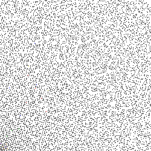

```{r, setup, include = FALSE}
library(ggplot2)
knitr::opts_chunk$set(
  class.output  = "bg-success",
  class.message = "bg-info text-info",
  class.warning = "bg-warning text-warning",
  class.error   = "bg-danger text-danger",
  fig.path = "images/",
  out.width = "100%"
)
```

Don't show me puzzles, unless you want to be responsible for me staying up too 
late solving them. I'm far too easily [nerd-sniped](https://xkcd.com/356/). This 
one was certainly the most complex I've ever solved. Quite complicated too, 
but definitely *complex* (you'll see).

<!--more-->

Don't show me puzzles, unless you want to be responsible for me staying up too 
late solving them. I'm far too easily [nerd-sniped](https://xkcd.com/356/). This 
one was certainly the most complex I've ever solved. Quite complicated too, 
but definitely *complex* (you'll see).

A few days ago a colleague of mine pointed me to [this FiveThirtyEight article](https://fivethirtyeight.com/features/can-you-stay-awake-for-50-hours-and-solve-150-puzzles/), which isn't new (2018), but does feature someone else we both work with
as the author of the first puzzle. Brandon is a mathematician-turned-computational-biologist/geneticist and a top-level MIT puzzler.

The puzzle in the article consists of this image (you may want to save and enlarge, yourself)

{width=250px height=250px}

and the clue:

> Ugh! Dad says the computer will hurt my eyes, but I doubt that’s his prime concern. Time to see what requires such complex security.

How could I possibly pass up an opportunity to solve such a cool puzzle?

I played with a few ideas, but can't say I made any progress. My colleague also 
pointed me to a solution from the MIT puzzles website (I won't spoil anything just yet)
after which things started to make a lot more sense.

The critical words in the clue are "prime" and "complex"... we're going to be dealing 
with [Gaussian Primes](https://en.wikipedia.org/wiki/Gaussian_integer#Gaussian_primes); a special case of [Gaussian Integers](https://en.wikipedia.org/wiki/Gaussian_integer).

I would say "math warning" but if math scares you, you probably could do with some scaring.

A Gaussian Integer is a complex number (with a *real* and an *imaginary* part) 
$z = a + bi$ where both $a$ and $b$ are integers. A Gaussian Integer is a 
Gaussian Prime 

> "if and only if either its norm is a prime number, or it is the 
product of a unit ($\pm 1$, $\pm i$) and a prime number of the form $4n + 3$"

The first part of this requires that the norm ($a^2 + b^2$) is itself a prime number. 
This will be a positive, real integer. The alternative means that $a=0$ or $b=0$ and we 
can write the absolute value of the other (which will be prime) as $4n + 3$ for some non-negative $n$.

Working with complex numbers in R is actually very well supported. It's not something 
you'd work with a lot in the vast majority of data science ("the average number of 
sprockets produced in the first quarter was $2n + 3i$"?) but R has `complex` as an 
atomic type.

Okay, with that in mind, we can generate a bunch of Gaussian Primes. In (mostly) 
base R, of course. First, we're going to need a way to determine if an integer is 
a prime number. We're not worried about performance, so let's just try to divide 
our target number $n$ by every number smaller than $\sqrt(n)$ (greater than 1); if anything divides cleanly, it's not a prime number. That can be implemented 
(shamelessly stolen from [StackOverflow](https://stackoverflow.com/a/19767707/4168169)) 
as

```{r is.prime}
is.prime <- function(n) n == 2L || all(n %% 2L:max(2,floor(sqrt(n))) != 0)
```

Sanity check:

```{r isprime_sanity}
is.prime(7)
is.prime(131)
is.prime(100)
```

Next we'll need a way to tell if a number is a Gaussian Prime. Implementing the 
definition above, and vectorizing it, involves working with the real (`Re()`) and 
imaginary (`Im()`) parts of a complex number

```{r gaussian_prime}
isGP <- function(n) {
  (Re(n) != 0 && Im(n) != 0 && is.prime(Re(n)^2+Im(n)^2)) ||
    (Re(n) == 0 && is.prime(Im(n)) && abs(Im(n)) %% 4 == 3) ||
    (Im(n) == 0 && is.prime(Re(n)) && abs(Re(n)) %% 4 == 3)
}
isGPv <- Vectorize(isGP)
```

Sanity check:

```{r GP_sanity}
isGP(-5-4i)
isGP(3)
isGP(1 + 3i)
isGP(3 + 20i) # https://planetmath.org/gaussianprime
```

Now we can build a grid of integers on the complex plane and mark which are 
Gaussian Primes. For the sake of this puzzle, we'll limit to 250 integers in 
each direction

```{r complex_plane}
x <- expand.grid(real = 0:249, im = 0:249)
x$complex <- x$real + (x$im)*1i
x$isGP <- isGPv(x$complex)
head(x)
```

I'm *solving* this in base R, but we can use a package for visualising things...

```{r gg}
library(ggplot2)
gg <- ggplot(x, aes(real, im, fill = isGP)) +
  geom_tile() +
  scale_fill_manual(
    values = c(`TRUE` = "black", `FALSE` = "white"), guide = "none"
  ) +
  theme_void() + 
  theme(aspect.ratio = 1)
gg
```

Careful inspection shows that this does match the puzzle image, except that the 
puzzle version has some additional coloured pixels... Interesting.

Reading the puzzle image (fetched directly, because Chrome wants to give me a .webp and 
maybe I'm getting too old to deal with that) in as pixel data into three channels 
(R, G, B) (yes, one external package, fine)

```{r readpng}
img <- "puzzle.png"
# download.file("https://fivethirtyeight.com/wp-content/uploads/2018/01/puzzle1.png", img)
img <- png::readPNG(img)
```

we can rescale these to 8-bit numbers, convert to hex, then combine into hex colours

```{r hex}
img <- list(
  red = img[,,1]*255, 
  green = img[,,2]*255, 
  blue = img[,,3]*255
)
img <- lapply(img, as.hexmode)
img <- matrix(
  do.call(paste0, img), 
  nrow = 250, ncol = 250, 
  byrow = TRUE
)
# identify the locations of pixels 
#  that are not black or white
idx <- which(! img == "000000" & ! img == "ffffff", arr.ind = TRUE)
cols <- img[idx]

d <- as.data.frame(idx)
# image reads with (0,0) top left
#  so flip it
d$col <- 250 - d$col 
# start at 0
d$row <- d$row - 1 
d$color <- cols
head(d)
```

These colours can be identified just by entering them into a search engine, 
or by using one of the [very recent RStudio builds](https://github.com/rstudio/rstudio/issues/5424)

```{r colours}
known_colors <- c(red = "ff0000", orange = "ff9919", yellow = "cccc00",
                  green = "00ff00", blue = "0000ff", purple = "7f00cc")

d$colorname <- names(known_colors)[match(d$color, known_colors)]
head(d)
```

Now comes the hard part (and I'll gladly admit I'd never have figured this out 
without seeing a solution first) - if we assume the coloured pixels represent 
**complex** numbers, and we can factor those into the product of two Gaussian 
**Prime**s (remember the clue?) then we can do *something* with those. So, how
do we find the factors? Multiplying two numbers, even complex numbers is pretty 
straightforward. Figuring out which two prime factors a number has (even a regular
integer) is the [foundation of cryptographic keys](https://en.wikipedia.org/wiki/Integer_factorization#Prime_decomposition).

More searching turns up [this resource](https://www.alpertron.com.ar/GAUSSIAN.HTM) 
which details an approach:

> There are three cases:
> 
> > 1. The prime factor p of the norm is 2: This means that the factor of the
> > Gaussian integer is 1+i or 1-i.
> > 
> > 2. The prime factor p of the norm is multiple of 4 plus 3: this value cannot
> > be expressed as a sum of two squares, so p is not a norm, but p2
> > is. Since p2 = p2 + 02, and there is no prime norm that divides p2, the number
> > p + 0i is a Gaussian prime, and the repeated factor p must be discarded.
> > 
> > 3. The prime factor p of the norm is multiple of 4 plus 1: this number can be
> > expressed as a sum of two squares, by using the methods explained in the sum
> > of squares page. If p = m2 + n2, then you can check whether m + ni or m − ni
> > are divisors of the original Gaussian number.

This translates to: Given the norm of norm $N$ of a Gaussian Prime, the factors of 
$N$ (denoted $p$) will either be $1 \pm i$, or if $p$ is of the form $p = m^2 + n^2$ 
then candidates are $m \pm ni$.

So, we'll need a function to operate on the norm of our Gaussian Prime. The norm 
itself is defined as

```{r compnorm}
complexnorm <- function(z) {
  Re(z)^2 + Im(z)^2
}
```

Sanity check:

```{r norm_sanity}
complexnorm(3 + 4i)
```

We can implement the approach above as

```{r }
norm_factors <- function(n) {

  ## N(n) %% 2 == 0
  if (n %% 2 == 0) {
    if (divides(n, (1+1i))) return(1+1i)
    if (divides(n, (1-1i))) return(1-1i)

    ## N(n) %% 4 == 3
  } else if (n %% 4 == 3) {
    return(NULL)

    ## N(n) %% 4 == 1
  } else if (n %% 4 == 1) {
    return(sos(n))

    ## something's wrong
  } else {
    stop("this shouldn't happen")
  }
}
```

There are a couple of undefined functions here (R is fine with this; it's lazy).

We need a way to tell if two complex numbers are "neatly" divisible, in the sense 
that they produce a Gaussian Integer. I've called that `divides()` and an 
implementation could be

```{r divides}
divides <- function(x, y) {
  z <- x / y
  (intish(Re(z)) && intish(Im(z)))
}
```
This relies on being able to say that a real, floating-point value looks like an 
integer. This is an annoying part of working with numbers - sometimes, especially 
if you're doing maths, numbers aren't precisely representable in the computer as 
you hope. The classic example is 

```{r is3}
0.1 + 0.2 == 0.3
```

Why doesn't that work? Looks simple enough. Let's print more digits

```{r explain3}
print(0.1 + 0.2, digits = 20)
```
This is so common, there's even a website: https://0.30000000000000004.com/

So, can't we just use R's `is.integer()`? Would I be going through this if we could?

```{r isinteger}
is.integer(3) # entered as a numeric value
is.integer(3L) # entered as an integer
```
so, if we have a not-entered-as-an-integer, it's not an integer. What about trying 
to round-trip through `as.integer()` and comparing to the original? If `x` and 
`as.integer(x)` are the same, it's an integer, right?

```{r asinteger}
as.integer(3)        # makes sense
as.integer(3.000001) # so far so good
as.integer(3.999999) # oh, no
```
so, if our value is ever so slightly under the integer, it will be rounded all 
the way down to the next integer. Okay, so, how can we do this? `round()` rounds 
towards integers, so let's check if the absolute difference between `x` and `round(x)`
is very small

```{r round}
intish <- function(x) {
  abs(round(x) - x) < 1e-7
}
```

Sanity check:

```{r divides_sanity}
# 43 + 80i = (8 + 3i)(8 + 7i)
divides(43 + 80i, 8 + 3i)
divides(43 + 80i, 8 + 7i)
divides(43 + 80i, 5 + 5i)
```
The other missing function is for the last condition of `norm_factors()`, 
when the factor can be represented as the sum of two squares, so `sos()` could 
be implemented as

```{r sos}
sos <- function(p) {
  s <- sqrt(p)
  i <- seq_len(ceiling(s))
  g <- expand.grid(i, i)
  g$sos <- g[, 1]^2 + g[, 2]^2
  opts <- unlist(g[g$sos == p, c(1, 2)][1, ])
  c(round(opts[1]) + round(opts[2])*1i,
    round(opts[1]) - round(opts[2])*1i,
    round(opts[2]) + round(opts[1])*1i,
    round(opts[2]) - round(opts[1])*1i)
}
```
This enumerates all the combinations of integers $i$ up to $\sqrt(p)$ and checks 
if the sum of any two squares is equal to the input $p$. If so, those are returned 
as candidates of the form $m \pm ni$.

In order to use the above approach of `norm_factors` we need to find the prime 
factors of the norm of a Gaussian Prime. We will then test each of those with 
this approach. 

Finding the prime factors of a regular integer is a little more straightforward 
(for very small integers, less than thousands; for integers with thousands of *digits* 
we get into public-key cryptography spaces). In this case, we just enumerate the 
integers, check if the input is divisible, and take those that are prime (according 
to our earlier definition)

```{r primefactors}
all_prime_factors <- function(x) {
  div <- seq_len(x)
  f <- div[x %% div == 0]
  f[sapply(f, is.prime)]
}
```
Again, it's [StackOverflow](https://stackoverflow.com/q/6424856/4168169) to the 
rescue here. In case JD Long is reading this, you may be pleased to see that 
yes, your musings are still being read (and leveraged) over a decade later.

Sanity check:

```{r prime_factors_sanity}
all_prime_factors(325)
```

Now we can put that all together into a function that finds the factors of 
a Gaussian Prime

```{r GP}
GP_factors <- function(n) {
  # get all prime factors of the norm of n
  allf <- all_prime_factors(complexnorm(n))
  # get all candidate factors of those
  tests <- lapply(allf, norm_factors)
  # flatten into a vector of candidates
  tests <- unlist(tests)
  # remove anything that didn't work
  tests <- tests[!is.na(tests)]
  # check if n can be divided by any candidates and keep those
  tests <- tests[sapply(tests, function(x) divides(n, x))]
  # check if we have a Gaussian Prime and keep those
  tests <- tests[isGPv(tests)]
  # only find positive real and imaginary elements
  res <- tests[sapply(tests, function(x) Re(x) > 0 && Im(x) > 0)]

  # the factors should be the candidate and n / candidate
  # rounded to integers just to be sure
  unique(unname(c(round(res), round(n / res))))
}
```
but does it work? How about the example from earlier...

Sanity check:

```{r GP_factors_sanity}
# 43 + 80i = (8 + 3i)(8 + 7i)
GP_factors(43 + 80i)
```
That. Is. So. Satisfying!

Applying this to our coloured points (converted back to complex)

```{r GPcols}
d$complex <- d$row + d$col*1i
d$factor_pairs <- sapply(seq_len(nrow(d)),
                         function(x) {
                           list(unique(GP_factors(d$complex[x])))
                         })
head(d)
```

Now we just extract the real and imaginary parts of those pairs

```{r getpairs}
d$factor1 <- sapply(d$factor_pairs, `[[`, 1)
d$factor2 <- sapply(d$factor_pairs, `[[`, 2)
d$x1 <- sapply(d$factor1, Re)
d$y1 <- sapply(d$factor1, Im)
d$x2 <- sapply(d$factor2, Re)
d$y2 <- sapply(d$factor2, Im)
head(d)
```

Looping over the different colors as groups, we can draw segments on our image
joining the two Gaussian Prime factors. The segments are all in one corner of 
the plot, so I've zoomed in to the first dozen pixels square. I've also faded the 
Gaussian Primes to make the solution a bit clearer

```{r segments}
gglist <- list()
suppressMessages({ # replacing fill scale
  for (col in names(known_colors)) {
    dcol <- d[d$colorname == col, ]
    gglist[[col]] <- gg +
      geom_segment(data = dcol,
                   aes(x = x1, y = y1,
                       xend = x2, yend = y2,
                       col = colorname),
                   size = 1.5,
                   inherit.aes = FALSE) +
      coord_cartesian(xlim = c(0, 12), ylim = c(0, 12)) +
      scale_color_manual(values =
                           setNames(d$colorname, d$colorname),
                         guide = "none") +
      scale_fill_manual(
        values = c(`TRUE` = "grey90", `FALSE` = "white"), 
        guide = "none"
      ) +
      theme_void() +
      theme(aspect.ratio = 1)
  }
})
```

And, finally, printing the result as a nice reveal, we can plot all of those at once

```{r answer}
cowplot::plot_grid(plotlist = gglist, nrow = 2)
```
This spells out "BOTNET" which is the answer to the puzzle! And what a puzzle!

I had a lot of fun solving this - I'm not sure if there was an easier way, and I 
definitely couldn't have made it this far without a significant hint, but I'm 
very pleased that I could solve the entire thing in (mostly) base R.

As always, comments, critiques, and suggestions are welcome both here and on 
[Twitter](https://twitter.com/carroll_jono/).

<br />
<details>
  <summary>
    <tt>devtools::session_info()</tt>
  </summary>
```{r sessionInfo, echo = FALSE}
devtools::session_info()
```
</details>
<br />
