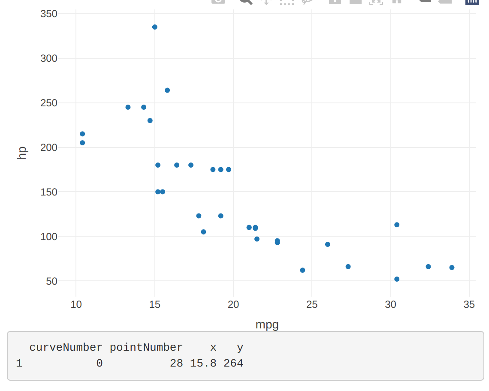
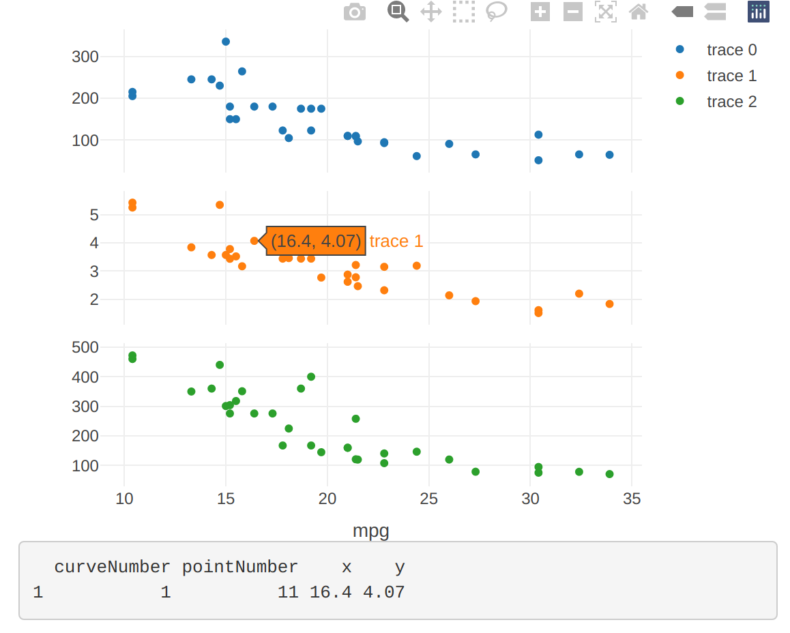

```{r, setup, include = FALSE}
knitr::opts_chunk$set(
  class.output  = "bg-success",
  class.message = "bg-info text-info",
  class.warning = "bg-warning text-warning",
  class.error   = "bg-danger text-danger"
)
```

Plotly has a nice way of making click-events available to the calling language, but 
it doesn't quite work simply when using `subplot()`. This isn't a post about a new 
feature, but I didn't quickly find a resource for it so I'll add my findings to 
make it easier for the next person.

<!--more-->

Plotly has a nice way of making click-events available to the calling language, but 
it doesn't quite work simply when using `subplot()`. This isn't a post about a new 
feature, but I didn't quickly find a resource for it so I'll add my findings to 
make it easier for the next person.

[Plotly](https://plotly.com/graphing-libraries/) (as a graphics library) is a 
JavaScript library that has been ported to R, Python, Julia, and - surprising to me - 
MATLAB and F#. It provides an interactive plotting framework that works really 
nicely for web-facing apps including R's [{shiny}](https://shiny.posit.co/).

I'm currently building an internal tool at work and wanted to add some click-event-based 
reactivity. Plotly supports that by registering an 'event' with a 'source' which 
can be listened to with an `event_data()` call. A simple shiny app demonstrating that 
might be

```{r, eval = FALSE}
library(plotly)
library(shiny)

ui <- basicPage("",
                mainPanel(
                  plotlyOutput("p"),
                  verbatimTextOutput("out")
                )
)

server <- function(input, output, session) {
  output$p <- renderPlotly({
    plotly::plot_ly(data = mtcars,
                    y = ~ hp,
                    x = ~ mpg,
                    type = "scatter",
                    mode = "markers",
                    source = "click_src") |> # default is "A"
      event_register("plotly_click")
  })

  output$out <- renderPrint({
    click_data <- event_data("plotly_click", source = "click_src")
    req(click_data)
    message("CLICK!")
    click_data
  })
}

runApp(shinyApp(ui = ui, server = server))
```

{width=600px}
 
There's a bit to break down here if you're not familiar with {shiny}; 

* A user interface stored as `ui` which describes how the app should "look". In this 
extremely simple case, it's some `plotly` output followed by some text.
* A server function which performs the 'backend' operations,  sending outputs to the components 
corresponding to the UI elements. In this case producing a `plotly` plot of the `mtcars`
dataset with a 'scatter' plot of the `hp` column on the y-axis and the `mpg` column on 
the x-axis. The `source` argument specifies a 'label' for the event (defaulting to `"A"` 
but specified as `"click_src"` in this case). Finally, the 'event' is registered. This 
example also includes a text output of the data associated with clicking on a point 
in the plot, and a message the console every time that happens.
* A call to `runApp()` which starts an app with the specified `ui` and `server`.

This generates a simple shiny app with one plot. Clicking on any of the points produces 
a text output containing:

* `curveNumber`: identifying the 'trace' number for that data. We only have one, so this 
will always be `0` (JavaScript starts counting at 0)
* `pointNumber`: ostensibly the index of the clicked point in the original dataset, though 
I believe that may not always be the case
* `x` the x-coordinate of the clicked point
* `y` the y-coordinate of the clicked point

This is nice for interacting with the plot to, say, highlight a row in a table 
containing the same data. With two of these plots side-by-side one can give each 
a unique `source` and "listen" to those independently.

If, however, we have several plots and want them to share a common x-axis (so that 
panning works across all of the plots) we need to "combine" the plots using 
`plotly::subplot()`. This doesn't take a `source` argument itself, and when we provide a 
list of several plots, it produces a warning that 

```{r, eval = FALSE,  class.source = "bg-warning"}
Warning: Can only have one: source
```

_How, then, do we identify which subplot was clicked?_

If each subplot contained a single "trace", then `curveNumber` would correspond 
to that trace (in the order they were supplied to `subplot`) and we could identify 
which subplot was clicked. A small example of the server code 
(the UI would be the same) for such a setup might be

```{r, eval = FALSE}
server <- function(input, output, session) {
  output$p <- renderPlotly({
    p1 <- plotly::plot_ly(data = mtcars,
                          y = ~ hp,
                          x = ~ mpg,
                          type = "scatter",
                          mode = "markers")

    p2 <- plotly::plot_ly(data = mtcars,
                          y = ~ wt,
                          x = ~ mpg,
                          type = "scatter",
                          mode = "markers")

    p3 <- plotly::plot_ly(data = mtcars,
                          y = ~ disp,
                          x = ~ mpg,
                          type = "scatter",
                          mode = "markers")

    s <- plotly::subplot(
      list(p1, p2, p3),
      shareX = TRUE,
      nrows = 3,
      heights = c(1, 1, 1)/3
    ) |>
      event_register("plotly_click")
    s$x$source <- "click_src" # subplot does not take a `source` argument
    s
  })

  output$out <- renderPrint({
    click_data <- event_data("plotly_click", source = "click_src")
    req(click_data)
    message("CLICK!")
    click_data
  })
}
```

{width=600px}

Because `subplot` doesn't take a `source` argument, the (single) source needs 
to be added into the resulting object by force with the `s$x$source` line. This works, 
and we can get click data back from each subplot. In theory, `curveNumber` identifies 
which subplot was clicked.

However, if a subplot contained multiple traces (as my actual example did - a
difficult to count number of traces that was updated as the underlying data
changed... each different 'color' point you plot is a unique trace) then this
gets complicated.

A minor update to the server, adding one additional "markers" trace to the 
second plot...

```{r addmarkers, eval = FALSE}
    p2 <- plotly::plot_ly(data = mtcars,
                          y = ~ wt,
                          x = ~ mpg,
                          type = "scatter",
                          mode = "markers") |>
      add_markers(y = ~ drat)                   # <- an additional trace
```

{width=600px}

So, how can we identify the subplot when we can't count the traces? The solution 
appears to be to add another entry to the click-data using `customdata`...

```{r customdata, eval = FALSE}
server <- function(input, output, session) {
  output$p <- renderPlotly({
    p1 <- plotly::plot_ly(data = mtcars,
                          y = ~ hp,
                          x = ~ mpg,
                          type = "scatter",
                          mode = "markers",
                          customdata = "first_plot")       # <--

    p2 <- plotly::plot_ly(data = mtcars,
                          y = ~ wt,
                          x = ~ mpg,
                          type = "scatter",
                          mode = "markers",
                          customdata = "second_plot") |>   # <--
      add_markers(y = ~ drat, customdata = "second_plot")  # <--

    p3 <- plotly::plot_ly(data = mtcars,
                          y = ~ disp,
                          x = ~ mpg,
                          type = "scatter",
                          mode = "markers",
                          customdata = "third_plot")       # <--

    s <- plotly::subplot(
      list(p1, p2, p3),
      shareX = TRUE,
      nrows = 3,
      heights = c(1, 1, 1)/3
    ) |>
      event_register("plotly_click")
    s$x$source <- "click_src"
    s
  })

  output$out <- renderPrint({
    click_data <- event_data("plotly_click", source = "click_src")
    req(click_data)
    message("CLICK!")
    click_data 
  })
}
```

{width=600px}

In this example I've added a single `customdata` value to each plot so it will be 
recycled across all of the data points in each plot. I've also added the same 
`"second_plot"` value to both of the traces in the second plot, but you could 
further distinguish those if desired. You can also add a vector of `customdata` 
(one value per point, in order) to individually identify the records, such as a `key` 
value to deterministically reproduce the `pointNumber` functionality.

As a final check (after doing all the old-school research myself) I asked an AI 
how to identify which plot was clicked and it more or less gave the answers I've 
described here, with some (different) example code and all. It took a bit of 
prompting to get it to go further than just using the `curveNumber` but I was amazed 
that it really did produce a (more or less) working proof-of-concept with minimal 
refinement. I definitely need to jump straight to that more often instead of fiddling 
around with solutions that _don't_ work for too long.

Is there a better way to achieve this? Let me know! I'm pretty much not on the bird site 
any more but I can be found on [Mastodon](https://fosstodon.org/@jonocarroll) or 
use the comments below.

<br />
<details>
  <summary>
    <tt>devtools::session_info()</tt>
  </summary>
```{r sessionInfo, echo = FALSE}
devtools::session_info()
```

</details>
<br />