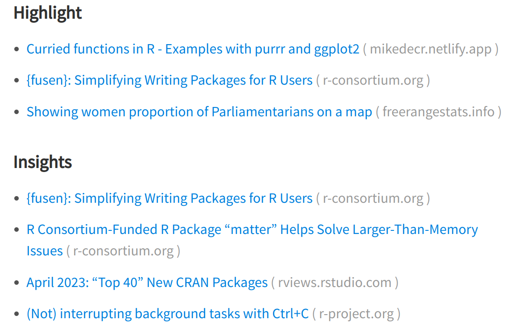
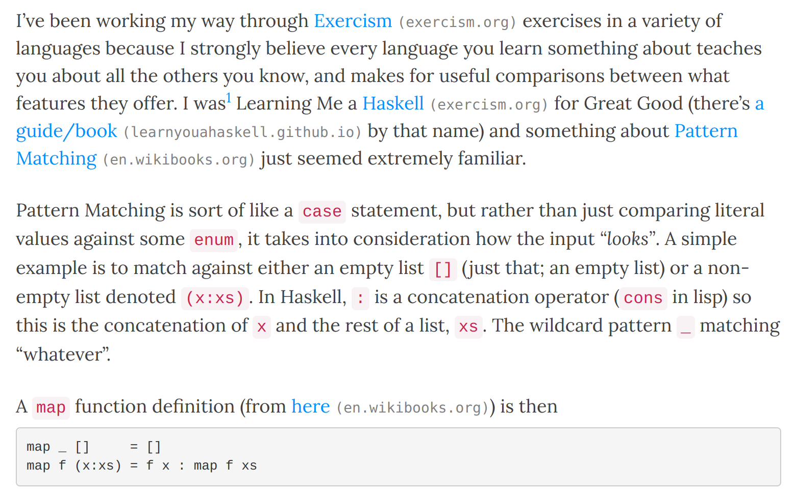

This might not have been difficult for a seasoned web-dev, but it was reasonably tricky 
to find a clear solution online (at least it was for me) so here's how I added the 
neat domain hints next to all the hyperlinks on my blog.

<!--more-->

This might not have been difficult for a seasoned web-dev, but it was reasonably tricky 
to find a clear solution online (at least it was for me) so here's how I added the 
neat domain hints next to all the hyperlinks on my blog.

I'm familiar with these from the [RWeekly](https://rweekly.org) site where hyperlinks 
are annotated with the target domain - 



<div class="figcaption">Rweekly.org annotated hyperlinks</div>

I find this really useful to see where a link will take me. 

I hadn't looked into _how_ those were being added, but we 
certainly weren't doing it manually; we use regular markdown links like

```md
[link description](https://example.com)
```

I recently saw a blog where these also appeared and it made me want to figure out 
how to add those to mine. Trying to search for "add domain next to hyperlink" doesn't 
seem to produce much along the lines of what I was trying to do, and to make matters 
worse, I wasn't sure whether this was part of Hugo/blogdown, JavaScript, CSS, or 
something else entirely.

I finally got enough clues to patch together a solution and I'm pretty happy with it!

My approach was to add some JavaScript (JQuery, I believe) to all built pages that inserts 
the hostname of the link target in parentheses. The simple version of that looks like

```js
$('a').each(function () {
    this.hostname && $(this).after(' ('+this.hostname+')');
});
```

Breaking this down:

* `$(a)` locates all instances of an anchor (`<a href="...">`)
* `.each()` is a `map` over each of these, which takes a function
* provided the `hostname` attribute is not empty, some text is inserted `after()` which 
adds `this.hostname`; just the base URL of the site being linked to

Getting this sourced into my blog means placing this inside a 

```js
$(document).ready(function() {

}
```

block. I added all of that to a new `links.js` file in `static/js/` (which I had to 
create). I then edited `/layouts/partials/footer_custom.html` to include

```
<script src="{{ "js/links.js" | relURL }}"></script>
```

This inserts a `<script>` line into every page, adding the path of that file 
relative to the actual site. Phew. 

On testing that, it _does_ work, but it works for _every_ link on the page, including 
those in the header, the social media share buttons... everything. That's exactly 
what we asked for, of course, by selecting `$(a)`.

After using the `Inspect` developer tools, I found that the main `article` of a blog 
post on my site has a `blog-post` class, so I can filter down the annotations to 
just anchors within that with

```js
$(document).ready(function() {
  $('.blog-post a').each(function() {
      this.hostname && $(this).after(' ('+this.hostname+')');
  });
});
```

Checking the output, that prevents the header links from being annotated, 
but the share buttons are still within that `article`. Excluding those 
specifically just needs a `.not()`

```js
$(document).ready(function() {
  $('.blog-post a').not('.share a').each(function() {
      this.hostname && $(this).after(' ('+this.hostname+')');
  });
});
```

Lastly, there are some annotations to my own page - those aren't necessary 
(though I suppose they don't hurt). I can remove those from being processed 
by checking if the link destination `hostname` is the same as the current page
`hostname` (i.e. if it's a link to the current site or an external link)

```js
$(document).ready(function() {
  $('.blog-post a').not('.share a').each(function() {
      if (this.hostname != window.location.hostname) {
          this.hostname && $(this).after(' ('+this.hostname+')');
      }
  });
});
```

And that's it! External links are now annotated.

As a last step, I decided to style these slightly differently. That means adding 
a class to the added text, which I did with a `<span>`

```js
$(document).ready(function() {
  $('.blog-post a').not('.share a').each(function() {
      if (this.hostname != window.location.hostname) {
          this.hostname && $(this).after(' <span class="link-annot">('+this.hostname+')</span>');
      }
  });
});
```

Adding some CSS for this class means some of the same steps; I added a new 
`static/css/links.css` file and added

```css
.link-annot {
  color: #808080;
  font-size: 14px;
  font-family: monospace;
}
```

to make the annotations grey, slightly smaller than the body text, and in monospace font.

I made sure this was sourced into the pages by editing `/layouts/partials/head_custom.html` 
to include

```
<link rel="stylesheet" href="{{ "css/links.css" | relURL }}" />
```

and finally, I have what I wanted!



<div class="figcaption">Hyperlink annotations; automatically added and styled</div>

If anyone wants to do the same, all of the changes I needed to make are in [this](https://github.com/jonocarroll/jcarroll.com.au/pull/26/files) pull request

Was there an easier way to do this? Let me know on [Mastodon](https://fosstodon.org/@jonocarroll) or use the comments below.


