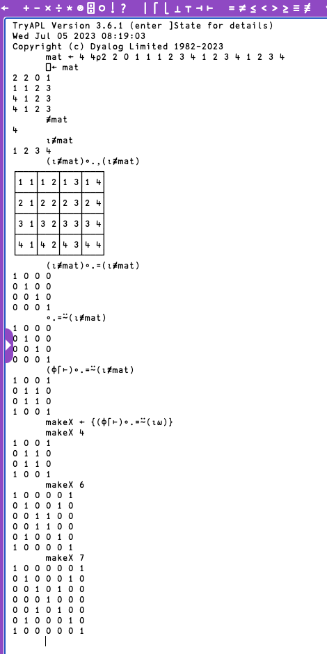

```{r, setup, include = FALSE}
knitr::opts_chunk$set(
  class.output  = "bg-success",
  class.message = "bg-info text-info",
  class.warning = "bg-warning text-warning",
  class.error   = "bg-danger text-danger"
)
```

I've been learning at least one new programming language a month through
[Exercism](https://exercism.org/) which has been really fun and interesting. I frequently say that "every language you learn teaches you something about all the 
others you know" and with nearly a dozen under my belt so far I'm starting to worry about the combinatorics of that statement. 

APL isn't on the list of languages but I've seen it in [codegolf](https://codegolf.stackexchange.com/) solutions often enough that it 
seemed worth a look.

<!--more-->

I've been learning at least one new programming language a month through
[Exercism](https://exercism.org/) which has been really fun and interesting. I frequently say that "every language you learn teaches you something about all the 
others you know" and with nearly a dozen under my belt so far I'm starting to worry about the combinatorics of that statement. 

APL isn't on the list of languages but I've seen it in [codegolf](https://codegolf.stackexchange.com/) solutions often enough that it 
seemed worth a look.

Now, when I say "learning" I mean "good enough to do 5 toy exercises" which is 
what you need to do to in order to earn the badge for that month in the ["#12in23
challenge"](https://exercism.org/challenges/12in23) (gamification FTW). That's often
sufficient for me to get a taste for the language and see if it's something I'd 
like to dive deeper into.

It means I've been watching a lot of "\<language\> beginner tutorial" videos recently, 
which may have been what prompted YouTube to suggest to me a video from
[code_report](https://www.youtube.com/@code_report); I think [this one](https://www.youtube.com/watch?v=UVUjnzpQKUo) 
comparing a [leetcode](https://leetcode.com/) solution to the problem

> find the GCD (greatest common divisor) of the smallest and largest numbers in an array

written in 16 (sixteen!!!) languages. Some of those I know a little or a moderate 
amount about, but one stood out. The APL solution comprises 5 glyphs (symbols)
representing operations

```apl
      ⌈/∨⌊/
```

I've seen APL solutions pop up in code-golf and they've just looked like madness, 
which is fair. The linked video prompted me to look into some of their other videos 
and they do a great job explaining the glyphs in APL and how they compare to other 
languages. It turns out this madness is not nearly as hard to read as it looks. 
The above glyphs represent "maximum" (⌈), "reduce" (/), "GCD" (∨), and "minimum" (⌊) 
and those all correspond well to the problem statement. The function itself is ["point-free"](https://en.wikipedia.org/wiki/Tacit_programming) whereby the argument(s) 
aren't specified at all; like saying `mean` rather than `mean(x)`. For the truly 
adventurous: ['The Hideous Beauty of Point-Free Programming; An exercise in combinators using Haskell'](https://blog.devgenius.io/the-hideous-beauty-of-point-free-programming-e8608e3df09d)

I ended up diving deeper and deeper, and it all started to make more and more sense. 

In a recent stream, [ThePrimeagen](https://www.youtube.com/@ThePrimeagen) responded 
to the comment about some language that "\<x\> is more readable" with "readability is 
just familiarity" and that stuck with me - I'm not entirely sure I 100% agree with it 
because I can find several ways to write some code that someone familiar with that 
language will either find easy or hard to read, despite familiarity. I think {dplyr} in R
does a fantastic job of abstracting operations with verbs and making data pipelines
easy to comprehend, certainly much more than the base-equivalent code.

So, would APL be "readable" if I was more familiar with it? Let's find out!

There aren't *that* many glyphs in APL - there are far more unique functions in 
most big libraries from any mainstream language. Looking at the top of the 'ride' 
editor for Dyalog APL there are 80 glyphs. To make a slightly unfair example, there 
are a lot of exported functions (`r length(getNamespaceExports("dplyr"))` of them) in {dplyr}... 

```{r}
packageVersion("dplyr")
ns <- sort(getNamespaceExports("dplyr"))
head(ns, 20)
tail(ns, 20)
```

Taking the functions listed as `S3method` or `export` in the
[`NAMESPACE`](https://github.com/tidyverse/dplyr/blob/main/NAMESPACE) 
file is 470+. Sure, these aren't _all_ user-facing, but still. Lots. 

So, 80 isn't a "huge" number, if that's the **entire language**.

I watched some more videos about what the glyphs mean and how they work. I 
started to become slightly familiar with what they mean. Learning is done with 
the hands, not the eyes, though - as [this (not new) blog post](https://giansegato.com/essays/edutainment-is-not-learning) goes into great 
detail on, so 
I felt that I needed to actually write something. I installed Dyalog APL and the 
ride editor (given that it uses glyphs, a non-standard editor seems to make sense; 
I've otherwise been completing the Exercism solutions in emacs). I also found [tryapl.org](https://tryapl.org) as an online editor.

The first step was to just follow along what I'd seen in the videos. I had 
most recently watched [this one](https://www.youtube.com/watch?v=8ynsN4nJxzU) that 
does include a comparison to R (and Julia) so I tried to recreate what I'd seen 
built up. I was shocked that I actually could!



From reshaping into a matrix, to building up the sequence, to inserting the 
combinator - it all came together easily enough.

On "combinators" - if you aren't familiar with Lambda Calculus and have a spare hour, 
[this](https://youtu.be/3VQ382QG-y4) is a wonderful talk explaining the basics 
and demonstrating them using JavaScript.

More videos, more learning. I found [this one](https://youtu.be/MKb4WD6mioE) 
which is another leetcode problem which was roughly 

> find the maximum value of the sum of rows of a matrix

That sounded like something R would easily handle, but this particular 
video didn't feature R. It *did* feature C++, the solution for which 
requires two `for` loops and looked (to me) horrific - I'm used to just 
passing a matrix to an R function and not having to worry about loops.

I've had many discussions on this topic because for whatever reason, `for` 
loops have a particular reputation in R despite them not (necessarily) being 
any worse than any other solution. The short response is that if you're using one
when you could be using vectorisation, you're probably stating your problem poorly 
and can do better (in terms of readability, performance, or both). [This video](https://youtu.be/TdbweYvwnss) 
covers the points really nicely.

Jenny Bryan [made the point](https://speakerdeck.com/jennybc/row-oriented-workflows-in-r-with-the-tidyverse?slide=16) that 

> Of course someone has to write loops... It doesn't have to be you

alluding to the fact that vectorisation (either with the `*apply` family or `purrr`)
still has a C loop buried within (I covered some of this myself in [another post](https://jcarroll.com.au/2022/04/22/where-for-loop-art-thou/)). 

[Miles McBain makes a point of never using them](https://fosstodon.org/@milesmcbain/110658467908744395) (directly).

Okay, so, returning to the leetcode problem. The APL solution in the video is 
reshaping (`⍴`) a vector to a matrix then reducing (`/`) addition (`+`) across rows (last-axis; c.f. first axis would be `+⌿`) and reducing (`/`) that with maximum (`⌈`)
making the entire solution 

```apl
      x ← 3 3⍴1 2 3 5 5 5 3 1 4
      ⌈/+/x
 15
```

which is an elegant, compact solution. APL agrees to ignore the `[1]` at the 
start of R's default output if R agrees to ignore the odd indenting of APL commands.

As a sidenote: I **love** that I finally get to use the OG assignment arrow `←`
that inspired the usage in R (as `<-`). This isn't some ligature font, it's the 
actual arrow glyph with Unicode code point U+2190. The APL keyboard has this on 
a key and that was common around the time that it made it into R (or S).

The video explains that this solution is 
particularly nice because it's explicit that two "reduce" operations 
are occurring. The `+` operator in APL can be either unary (takes 1 argument) or 
binary (takes 2 arguments) but it can't loop over an entire vector. To achieve that, 
it's combined with `/` which performs "reduce", essentially applying `+` across 
the input.

It's a fairly straightforward answer with R, too:

```{r}
a <- matrix(c(1, 2, 3,
              5, 5, 5,
              3, 1, 4),
            3, 3, byrow = TRUE)
a

max(rowSums(a))
```

and done. Nice. No `for` loops. Or are there? Of course there are, somewhere, but 
can we write this "like" the APL solution and be more explicit with the "reduce" 
steps over binary operators? R has a `Reduce()` function for exactly this case.

A simplified `rowSums()` function could just be applying the `sum` operation to 
the rows of the matrix

```{r}
s <- function(x) apply(x, 1, sum)
```

but `sum(x)` is itself vectorised - it's an application of the binary `+` operation 
across a vector, so really we could have 

```{r}
s <- function(x) apply(x, 1, \(y) Reduce(`+`, y))
s(a)
```

This isn't so bad compared to APL which "naturally" performs the reduction 
over that dimension. Compare (`⍝` signifies a comment):

```apl
      x
1 2 3
5 5 5
3 1 4

⍝ "rowSums"

      +/x
6 15 8

⍝ "colSums"

      +⌿x
9 8 12
```

There's nothing here that says `x` _needs_ to have more than 1 dimension, though - 
it's the same operator(s) on a vector, just that they do the same thing

```apl
      +/(1 2 3)
6
      +⌿(1 2 3)
6
```

`max` is also vectorised, so a simple, ostensibly binary version of that could be 

```{r}
m <- function(x, y) ifelse(x > y, x, y)
m(1, 2)
m(4, 2)
```

Together, an R solution using these could be

```{r}
Reduce(m, s(a))
```

which, if we shortened `Reduce` to a single character

```{r}
R <- Reduce
```

would be

```{r}
R(m, s(a))
```

That's not a lot more characters than APL. I've abstracted at least one of the functions, though - APL uses the operators directly, in which case we'd have

```{r}
maxWealth <- \(x) R(m, apply(x, 1, \(y) R(`+`, y)))
maxWealth(a)
```

That's _only_ using `Reduce`, binary `+`, a simplified `max` (which we could 
imagine was a built-in we could shorten to `m`), and the `apply` over rows.

Comparing these directly (with some artistic license):

```
 m R + R
 ⌈ / + /
```

The point of this whole exercise wasn't to rebuild the APL solution in R - it 
was to think more deeply about what abstractions R offers and how they compare 
to a language that uses (only) the atomic constructs directly.

I *love* that in R I can pass either individual values or a vector to `sum` 
and it "just deals with it"

```{r}
sum(4, 5, 6) # sum some "scalars"

vals <- c(4, 5, 6)
sum(vals) # sum a vector
```

This ability to hide/abstract the looping over dimensions and to work directly with 
objects with more than one dimension is what [qualifies R as an "array language"](https://en.wikipedia.org/wiki/Array_programming#R).
This is also (mimicking, perhaps) ["rank polymorphism"](https://www.jernesto.com/articles/rapl.html) which APL does have. Julia 
gets around this with "broadcasting". But, at least in R, this hides/abstracts some of what is happening, and sometimes/often, that's a `for` loop.

Does every programmer need to know the gory details? Absolutely not. Might it be 
useful for gaining a better understanding of the language and how to work with it? 
I really think it is. It's why I'm digging further and further into functional 
programming in general. 

I do believe that the APL solution is more explicit in what it's doing; that it 
doesn't hide (much, if any) of the implementation details. I'm comfortable 
with the abstractions in R and will continue to write R for this reason, but if 
I had a need to do some array math in any other language, I now feel like APL 
really does have a lot to offer.

**Bonus Round** 

I was thinking about the leetcode problem and thought that a slightly more 
complex version would be to return "which row has the maximum?" rather than 
the maximum itself. 

In R, there is another useful function to achieve this

```{r}
which.max(rowSums(a))
```

so, have I learned enough APL to do this myself?

There's a "Grade Down" operator (`⍒`) which seems equivalent to R's 
`order(decreasing = TRUE)` and a "First" operator (`⊃`) like `head(n = 1)` 
so a solution seems to be to get the indices of the sorted (decreasing) 
elements then take the first one

```apl
      ⊃⍒+/x
2
```

Apparently an alternative would be to find the (first) element of the input (`⍵`) that 
matches the maximum which would be

```apl
      {⍵⍳⌈/⍵}(+/x)
2
```

which, at least to me, isn't as elegant. 

Lastly, [Kieran Healy](https://mastodon.social/@kjhealy/110661489858307306) 
relayed to me a small algorithm for finding 'primes smaller 
than some number' in APL which cleaned up as

```apl
      ((⊢~∘.×⍨)1↓⍳)(50)
2 3 5 7 11 13 17 19 23 29 31 37 41 43 47
```

This makes use of some combinators (e.g. the C-combinator `⍨` - possibly the 
coolest glyph in the entire system), 
but roughly involves filtering values not (`~`) 
members (`∈`) of values produced by the outer (`º`) product (`.`) using 
multiplication (`×`) (i.e. numbers that can be made by multiplying other 
numbers) from the sequence (`⍳`) from 2 to some value (dropping (`↓`) 1; 
`3↓⍳8 == 4:8`). With the small amount I've learned - mostly from watching 
someone else use the language - I was able to decipher at least _what_ the 
operators were in all of that, even if I probably couldn't come up with the 
solution myself. 

I'm happy to call that "readable".

I looked around for code to generate the primes below some number in R. I couldn't (easily) find one that worked without an explicit loop. I found 
a version in [{sfsmisc}](https://github.com/mmaechler/sfsmisc/blob/81015322032edd9f900e5103ac11c70de49619bd/R/prime-numbers-fn.R#L15-L31) which compacts to

```{r}
primes. <- function(n) {
  ## By Bill Venables <= 2001
  x <- 1:n
  x[1] <- 0
  p <- 1
  while((p <- p + 1) <= floor(sqrt(n)))
    if(x[p] != 0)
      x[seq(p^2, n, p)] <- 0
  x[x > 0]
}
primes.(50)
```

Taking inspiration from the APL solution, though - what if we just generate all 
products from the set of numbers `2:n` and exclude those as "not prime" from all 
the numbers up to `n`?

```{r}
primes <- function(n) {
  s <- 2:n
  setdiff(s, c(outer(s, s, `*`)))
}
primes(50)
```

That... works! It's slower and uses more memory, for sure, but that wasn't 
our criteria, and isn't relevant for a once-off evaluation. Even better - I can 
"read" exactly what it's doing.

I've learned a lot and I'll continue to learn more about APL because I really do 
think that understanding how these operators come together to build a function 
will be enlightening in terms of a functional approach. 

I still haven't made it to trying out BQN (_almost_ constructed by incrementing 
each letter of APL, `IBM -> HAL` style, but perhaps officially 
["Big Questions Notation"](https://mlochbaum.github.io/BQN/), and sometimes 
pronounced "bacon") but it sounds like it has some newer improvements over APL 
and will be worth a try.

As always, comments and discussions are welcome here or on [Mastodon](https://fosstodon.org/@jonocarroll).

<br />
<details>
  <summary>
    <tt>devtools::session_info()</tt>
  </summary>
```{r sessionInfo, echo = FALSE}
devtools::session_info()
```
</details>
<br />
