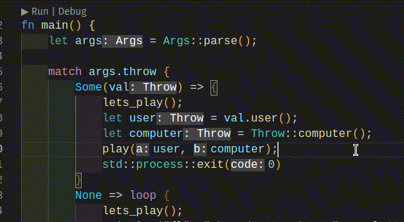

```{r, setup, include = FALSE}
knitr::opts_chunk$set(
  class.output  = "bg-success",
  class.message = "bg-info text-info",
  class.warning = "bg-warning text-warning",
  class.error   = "bg-danger text-danger"
)
```

With Functional Programming, we write functions which take arguments and do something with 
or based on those arguments. You might not think there's much to learn about given that 
tiny description of "an argument to a function" but the syntax and mechanics of different 
langugages is actually widely variable and intricate.

<!--more-->

With Functional Programming, we write functions which take arguments and do something with 
or based on those arguments. You might not think there's much to learn about given that 
tiny description of "an argument to a function" but the syntax and mechanics of different 
langugages is actually widely variable and intricate.

Let's say I have some function in R that takes three arguments, `x`, `y`, and `z`, 
and just prints them out in a string in that order.

```{r}
r_fun <- function(x, y, z) {
  sprintf("arguments are: %s, %s, %s", x, y, z)
}
```

Calling this function with good practices (specifying all the argument names in full)
would look like this

```{r}
r_fun(x = "a", y = "b", z = "c")
```

I said "in full" because by default, R will happily do *partial* matching, so long 
as it can uniquely figure out which argument you mean

```{r}
long_args <- function(alphabet = "a to z", altitude = 100) {
  print(sprintf("alphabet: %s", alphabet))
  print(sprintf("altitude: %d", altitude))
}
long_args(alphabet = "[A-Z]", altitude = 50)
```

In this case, both arguments start with `"al"` so it's ambiguous up to there

```{r, error = TRUE}
long_args(al = "letters")
```

but we only *need* to specify enough letters to disambiguate

```{r}
long_args(alpha = "LETTERS", alt = 200)
```

Relying on this behaviour is dangerous, and it's recommended to turn on warnings 
when this happens with 

```{r, warning = TRUE}
options(warnPartialMatchArgs = TRUE)
long_args(alpha = "LETTERS", alt = 200)
```

```{r, echo = FALSE}
options(warnPartialMatchArgs = FALSE)
```

You don't _have to_ use argument names when calling the function, though - you can just rely on positional arguments

```{r}
r_fun("a", "b", "c")
```

and this is *very* commonly done, despite it being less clear to what any of those 
refer, and runs the risk that the function changes argument ordering in an updated 
version. It works, though.

Extensive sidenote: square-bracket matrix subsetting officially uses the (poorly? traditionally?)
named arguments `i` and `j` as `[i, j]` but it actually entirely ignores them and uses
positional arguments. The documentation (`` ?`[` ``) does warn about this

> "Note that these operations do not match their index arguments in the standard way:
argument names are ignored and positional matching only is used. So m[j = 2, i = 1] is
equivalent to m[2, 1] and not to m[1, 2]."

but it would be very easy to get bitten by it if one tried to use the names directly

```{r}
m <- matrix(1:9, 3, 3, byrow = TRUE)
m

m[i = 1, j = 2]
m[j = 2, i = 2]
```


[Thomas Lumley](https://fediscience.org/@tslumley/110670564210497040) 
notes that 

> "it used to be that no primitive functions did argument matching by name. "/" and "-'
and switch() and some others still don't. I'm not sure why "[" wasn't changed in 2.11
when a bunch of primitives got normal argument matching."

Worse still, perhaps - the `seq()` function creates a sequence of values. It has the 
formal arguments with defaults `from = 1` and `to = 1` so you can calculate

```{r}
seq(from = 2, to = 5)
```

or you can leverage the default of `from = 1`

```{r}
seq(to = 5)
```

However, there are **five** "forms" in which 
you can provide arguments to this function and they behave differently. If you _only_ 
specify the first argument unnamed, it treats this as `to` despite the first argument being `from`

```{r}
seq(5)
```

which is extra strange, because if you _do_ specify `to` with its ostensibly default value `1`, the sequence is backwards

```{r}
seq(5, to = 1)
```

Back to our function - a feature that makes R really neat is that you can specify 
the named arguments in *any order*

```{r}
r_fun(z = "c", x = "a", y = "b")
```

If you don't specify them by name, R will default to positions, so specifying just 
one (e.g. `z`) but leaving the rest unspecified, R will presume you want the others
in positional order

```{r}
r_fun(z = "c", "a", "b")
```

Where it gets really interesting is you can go *back* to named arguments further along
and again, R will figure out that you mean the remaining unnamed argument

```{r}
r_fun(z = "c", "b", x = "a")
```

This only holds if the function _doesn't_ use the ellipses `...` which 
captures "any other arguments" when calling the function, often to be passed 
on to another function. If the function signature has `...` then all the 
unnamed arguments are captured. This example function just 
combines any other arguments into a comma-separated string, if there 
are any (tested with the under-documented `...length()` which returns the number 
of arguments captured via `...`)

```{r}
dot_f <- function(a = 1, b = 2, ...) {
  print(sprintf("named arguments: %s, %s", a, b))
  if (...length()) {
    print(sprintf("additional arguments: %s", toString(list(...))))
  }
}
```

You can call this with just the named arguments

```{r}
dot_f(a = 3, b = 4)
```

or you can add more argument (no name required)

```{r}
dot_f(a = 3, b = 4, 5)
```

As before, none of the names are really required, and we can add as 
many as we want

```{r}
dot_f(3, 4, 5, 6, 7)
```

We _can_ name them if we want

```{r}
dot_f(a = 3, b = 4, blah = 5)
```

but here be danger, because those names can be _anything_ and aren't matched 
to the actual function, so this works (say, I misspelled an argument name `a` as `A`)

```{r}
dot_f(A = 3, B = 4, 5)
```

Notice that the additional arguments are the ones I named (not those in 
the function definition); the `5` has been positionally matched to `a`; and `b`
has taken its default value of `2` because no other arguments were provided.

We can still mix up the ordering of positions, provided everything else matches up

```{r}
dot_f(3, b = 4, 5)
dot_f(3, b = 4, 5, a = 2)
```

The flexibility in all of this is what encouraged Joe Cheng to use R as an 
interface to HTML in the form of shiny, what he calls 
["a bizzarely good host language"](https://youtu.be/HpqLXB_TnpI?t=1723) (should link
to the right timestamp) and he notes that other languages don't let you do 
this sort of mixing up of named and positional arguments.

Okay, that's R - weird and fun, but a lot of flexibility.

I saw [this post](https://thoughtbot.com/blog/rust-doesn-t-have-named-arguments-so-what) mentioned in the `#rust` hashtag on Mastodon and had a look - it surprised me 
at first because I thought "what do you mean Rust doesn't have named arguments?"... 

I've become so used to the inline help from VSCode when I'm writing Rust that I 
didn't realise I wasn't using named arguments. 

Here's a function I wrote for my [toy rock-paper-scissors game in Rust](https://github.com/jonocarroll/rps.rs)

```rust
fn play(a: Throw, b: Throw) -> GameResult {
    let result = match a.cmp(&b) {
        Ordering::Equal => GameResult::Tie,
        Ordering::Greater => GameResult::YouWin,
        Ordering::Less => GameResult::YouLose,
    };

    println!("{} {}", "Result:".purple().bold(), result);

    result
}
```

It has arguments `a` and `b` because I did a terrible job naming them - I knew 
exactly how I planned to use them, so bad luck to anyone else.

Calling that function further down in the code I have

```rust
let user = val.user();
let computer = Throw::computer();
play(user, computer);
```

BUT what I see in the editor has the argument names, unless I switch off 
hints (which I have bound to holding Ctrl+Alt at the moment)



So, I can't just rearrange arguments in Rust?

If I define a function with two arguments

```rust
>> fn two_args(a: f64, b: &str) -> String {
        let res = format!("all arguments: {a}, {b}");
        res
}
```

then I can call it

```rust
>> two_args(42.0, "forty-two")
"all arguments: 42, forty-two"
```

Just swapping the arguments obviously fails because `42.0` isn't a `&str` and 
`"forty-two"` isn't a `f64`. But there isn't a way to say "the value for that 
argument is this"; I can't use any of these

```rust
two_args(a = 42.0, b = "forty-two")
two_args(a: 42.0, b: "forty-two")

two_args(b = "forty-two", a = 42.0)
two_args(b: "forty-two", a: 42.0)
```

I suspect the fact that this was a surprise to me means I'm earlier in my Rust 
learning than I had thought - I clearly haven't built anything that has 
functionality I didn't directly need, because I haven't had to worry about 
calling functions in strange ways yet.

There is one loophole... time to break out another cool toy: [{rextendr}](https://github.com/extendr/rextendr)

```{r, eval = TRUE}
library(rextendr)

rust_function(
  'fn two_args(a: f64, b: &str) -> String {
          let res = format!("all arguments: {a}, {b}");
          res
  }'
)
```

This produces an R function that takes two arguments, `a` and `b` which I can call
as if it was an R function

```{r}
two_args(a = 42, b = "forty-two")
```

I can call it without argument names

```{r}
two_args(42, "forty-two")
```

and I *can* swap them

```{r}
two_args(b = "forty-two", a = 42)
```

This is just because the argument matching happens before the values get 
sent down to the Rust code - the function here is an R function that calls 
other code internally

```{r}
two_args
```

I somewhat started out the idea for this blogpost as I was learning some Typescript and 
came across this [https://github.com/gibbok/typescript-book#typescript-fundamental-comparison-rules](https://github.com/gibbok/typescript-book#typescript-fundamental-comparison-rules)

_"Function parameters are compared by types, not by their names:"_
```typescript
type X = (a: number) => void;
type Y = (a: number) => void;
let x: X = (j: number) => undefined;
let y: Y = (k: number) => undefined;
y = x; // Valid
x = y; // Valid
```

which initially struck me as strange, and I needed to work through some examples in a live 
setting. On reflection, I think I see that this is exactly what I would specify in 
e.g. [Haskell](http://learnyouahaskell.com/types-and-typeclasses) - "a function that takes a number", not "a function with an argument named `a` which 
is a number"

```haskell
x :: Float -> Nothing
```

Because technically all functions in Haskell [actually only take a single argument](https://wiki.haskell.org/Currying) (the notation `Int -> Int -> Int` reveals this
fact nicely, but in practice the notation makes it feel like multiple arguments can be used)
there is no way to "pass arguments by name" but there _is_ a neat way to swap the order 
of arguments that a function expects to receive; [`flip`](https://hackage.haskell.org/package/base-4.18.0.0/docs/Prelude.html#v:flip)

```haskell
flip :: (a -> b -> c) -> b -> a -> c

>>> flip (++) "hello" "world"
"worldhello"

-- or

>>> "hello" ++ "world"
"helloworld
```

Those of you familiar with R's S3 dispatch functionality will perhaps note that 
the 'first' argument has a special role; it controls exactly which method will 
be called. If we had some function which was flexible in the sense that it could 
take several different 'classes' and do something different with them, we would 
write that as

```{r}
flexi <- function(a, b) {
  UseMethod("flexi")
}

flexi.matrix <- function(a, b) {
  paste0("a is a matrix, b = ", b)
}

flexi.data.frame <- function(a, b) {
  paste0("a is a data.frame, b = ", b)
}

flexi.default <- function(a, b) {
  paste0("a is something else, b = ", b)
}
```

Now, depending on whether `a` is a `matrix`, a `data.frame`, or something else, one 
of the 'methods' will be called

```{r}
flexi(a = matrix(), b = 7)
flexi(a = data.frame(), b = 8)
flexi(a = 1, b = 9)
```

even if we swap the order of the arguments in the call

```{r}
flexi(b = 3, a = matrix())
```

S4 dispatch goes even further and dispatches based on more than just the class of 
the first argument. Stuart Lee has [a great guide on S4](https://stuartlee.org/2019/07/09/s4-short-guide/). The point is, you can do something 
different depending on what you pass to multiple arguments

```{r, eval = FALSE}
s4flexi(matrix(), data.frame(), 7)
s4flexi(matrix(), data.frame(), list())
s4flexi(matrix(), data.frame(), NULL)
```

Julia has some of the most interesting argument parsing. I love the Haskell-like 
function declarations - so little boilerplate! We define some function `f` that 
takes two arguments

```{julia}
f(a, b) = a + b
f(4, 5)
```

Similar to the Rust situation, though - these aren't named outside of the function body, 
so we can't refer to them either in that order or reversed

```{julia, eval = FALSE}
f(a = 4, b = 5)
```
```{julia, eval = FALSE, class.source = "bg-danger text-danger"}
MethodError: no method matching f(; a=4, b=5)
Closest candidates are:
  f(!Matched::Any, !Matched::Any) at none:3 got unsupported keyword arguments "a", "b"
```


The reason is that Julia uses the python-esque keyword argument syntax, where unnamed 
arguments appear first, followed by any keyword arguments following a `;`, so we can specify 
these correctly as

```{julia}
f(; a, b) = a + b
f(a = 4, b = 6)
```

Julia is optionally typed, which means we can be flippant with the types here, or we 
can be very specific - we can specify that `a` should be an integer and `b` should be 
a string, and that produces a _different_ method compared to what we already defined. In 
this case, I want to return a string with the two values

```{julia}
f(; a::Int, b::String) = "$a; $b"
f(a = 42, b = "life, universe, everything")
```

Since these are now named, we can swap them

```{julia}
f(b = "L, U, E", a = 42)
```

but what's even more powerful is we can define a general method, and add type-specific methods
for whatever combination of argument types we want; the first of these returns an integer, 
while the other two return strings

```{julia}
g(a, b) = a + b
g(a::Int, b::String) = "unnamed int, string: $a; $b"
g(a::String, b::Int) = "unnamed string, int: $a; $b"
```

Then, depending on what types we provide in each argument, a different method is called

```{julia}
g(3, 2)
g("abc", 123)
g(123, "abc")
```

Similar to S4, but so easy to declare and use! Of course, this doesn't work if we want these
to be named since that would be ambiguous.

As I'm slowly learning APL, I've found it interesting that there's a well-known approach of 
writing ["point-free" ("tacit")](https://en.wikipedia.org/wiki/Tacit_programming) functions which don't specify arguments at all.

Last of all, I've had the pleasure of dealing with C this week including passing a _pointer_ 
to some object into a function, in which case the value _outside of the function_ is updated. 
That's a whole other post I'm working on.

How does your favourite language use arguments? Let me know! I can be found on [Mastodon](https://fosstodon.org/@jonocarroll) or use the comments below.

<br />
<details>
  <summary>
    <tt>devtools::session_info()</tt>
  </summary>
```{r sessionInfo, echo = FALSE}
devtools::session_info()
```
</details>
<br />
