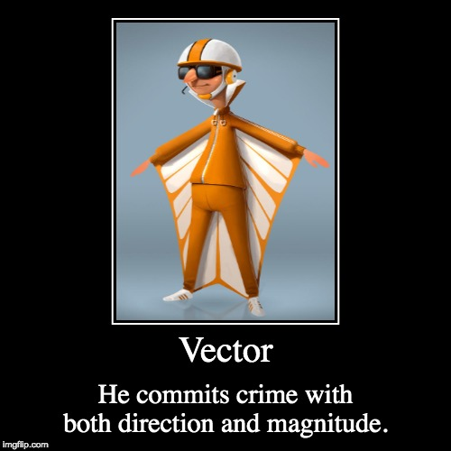
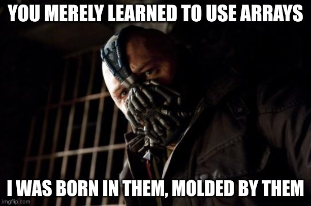

```{r, setup, include = FALSE}
knitr::opts_chunk$set(
  class.output  = "bg-success",
  class.message = "bg-info text-info",
  class.warning = "bg-warning text-warning",
  class.error   = "bg-danger text-danger"
)
```

I keep hearing the assertion that "writing APL/Haskell/etc... makes you think 
differently" and I kept wondering why I agreed with the statement but at the same time 
didn't think too much of it. I believe I've figured out that it's _because_ I happened to have 
been using Array-aware languages this whole time! It turns out R is an even better 
language for beginners than I thought.

<!--more-->

I keep hearing the assertion that "writing APL/Haskell/etc... makes you think 
differently" and I kept wondering why I agreed with the statement but at the same time 
didn't think too much of it. I believe I've figured out that it's _because_ I happened to have 
been using Array-aware languages this whole time! It turns out R is an even better 
language for beginners than I thought.

Let's start with some basics. A "scalar" value is just a number by itself. That might 
have some units that may or may not be represented well in what you're doing, but it's
a single value on its own, like `42`. A "vector" in R is just a collection of these "scalar" 
values and is constructed with the `c()` operator

```{r}
c(3, 4, 5, 6)
```

Going right back to basics, the `[1]` output at the start of the line indicates the index 
of the element directly to its right, in this case the first element. If we had more elements, 
then the newline starts with the index of the first element on that line. Here I've set the line width smaller than usual so that it wraps sooner

```{r, echo = FALSE}
opt <- options()
options(width = 40)
```
```{r}
1:42
```
```{r, echo = FALSE}
options(opt)
```

The quirk of how R works with vectors is the there aren't actually _any_ scalar values - if 
you try to create a vector with only a single element, it's still a vector

```{r}
x <- c(42)
x
is.vector(x)
```

(note the `[1]` indicating the first index of the vector `x` _and_ the vector `TRUE`). Even if you don't _try_ to make it a vector, it still is one

```{r}
x <- 42
x
is.vector(x)
```

Mike Mahoney has 
[a great post](https://www.mm218.dev/posts/2023-08-07-vector/) detailing the term 
"vector" and how it relates to an R vector as well as the more mathematical definition 
which involves constructing an "arrow" in some space so that you describe both "magnitude" 
and "direction" at the same time.



So, we _always_ have a vector if we have a 1-dimensional collection of data. But wait, 
you say, there's also `list`!

```{r}
x <- list(a = 42)
x
is.vector(x)
```

A nice try, but lists are also vectors, it's just that they're "recursive"

```{r}
is.recursive(x)
is.recursive(c(42))
```

Fine, what about a matrix, then?

```{r}
x <- matrix(1:9, nrow = 3, ncol = 3)
x
is.vector(x)
```

No, but that still makes sense - a matrix isn't a vector. It _is_ however, an "array" - the 
naming convention in R is a bit messy because, while "matrix" and "array" are often the 
same thing, as the dimensions increase, more things expect an "array" class, so R tags 
a "matrix" with both

```{r}
class(matrix())
```

This recently surprised Josiah Parry leading to [this post](https://josiahparry.com/posts/2023-06-11-matrix-bug) explaining some of the internal 
inconsistencies of this class of object.

Now that we have vectors figured out, I can get to the point of this post - that 
thinking about data with a "vector" or even "array" mindset works differently.

I started learning some APL because I loved some videos by [code_report](https://www.youtube.com/@code_report). The person 
behind those is Conor Hoekstra. I didn't realise that I'd actually heard a 
[CoRecursive](https://corecursive.com/065-competitive-coding-with-conor-hoekstra/) 
podcast episode interviewing him, so now I need to go back and re-listen to that one. Conor 
also hosts [The Array Cast](https://www.arraycast.com/) podcast that I heard him 
mention in yet another [of his podcasts](https://adspthepodcast.com/) (how do 
people have the time to make all of these!?!). I was listening to the [latest of these; 
an interview with Rob Pike](https://www.arraycast.com/episodes/episode60-rob-pike), one 
of the co-creators of Go and UTF-8 - it's a really interesting interview full of history, 
insights, and a lot of serious name dropping. 

Anyway, Rob is describing what it is he really likes about APL and says

> "I saw a talk some time ago, I wish I could remember where it was, where somebody said, this is why programming languages are so difficult for people. Let's say that I have a list of numbers and I want to add seven to every number on that list. And he went through about a dozen languages showing how you create a list of numbers and then add seven to it. Right? And it went on and on and on. And he said, "Wouldn't it be nice if you could just type 7+ and then write the list of numbers?" And he said, "Well, you know what? There's one language that actually does that, and that's APL." And I think there's something really profound in that, that there's no ceremony in APL. If you want to add two numbers together in any language, you can add two numbers together. But if you want to add a matrix and a matrix, or a matrix and a vector, or a vector and a scaler or whatever, there's no extra ceremony involved. You just write it down.

([link to shownotes](https://www.arraycast.com/episode-60-transcript#:~:text=I%20saw%20a%20talk%20some%20time%20ago))

The talk he mentions is linked in the shownotes as ["Stop Writing Dead Programs" by Jack Rusher (Strange Loop 2022)](https://youtu.be/8Ab3ArE8W3s&t=434) (linked to the relevant timestamp, and
which I'm pretty sure I've watched before - it's a great talk!) where 
Jack shows how to add `1` to a vector of values in a handful of languages. He demonstrates that in
some languages there's lots you need to write that has **nothing** to do with the problem itself; 
allocating memory, looping to some length, etc... then leads to demonstrating that the way to 
do this in APL is 

```r
1 + 1 2 3 4
```

with **none** of the overhead - just the declaration of what operation should occur.

The excitement with which Rob explains this in the podcast spoke to how important this 
idea is; that you can work with more than just scalar values in the mathematical sense 
without having to explain to the language _what you mean_ and write a loop around a vector.

Two questions were buzzing at the back of my mind, though:

1. Why isn't this such a revelation to me?

2. Is this not a common feature?

I _know_ R does work this way because I'm very familiar with it, and perhaps that _is_ 
the answer to the first question - I know R better than any other language I know, and 
perhaps I've just become accustomed to being able to do things like "add two vectors".

```{r}
a <- c(1, 2, 3, 4, 5) # or 1:5
a + 7
```


The ideas of "add two vectors" and "add a number to a vector" are one in the same, as discussed above. The ability to do so is called ["rank polymorphism"](https://en.wikipedia.org/wiki/Polymorphism_(computer_science)#Rank_polymorphism) and 
R has a weak version of it - not everything works for every dimension, but single values, vectors, and matrices do generalise for many functions. I can add a value to every element of a matrix, too

```{r}
m <- matrix(1:12, nrow = 3, ncol = 4)
m
m + 7
```

and adding a vector to a matrix repeats the operation over rows

```{r}
m <- matrix(1, nrow = 3, ncol = 4)
m
v <- c(11, 22, 33)
m + v
```

Sidenote: the distinction between "repeat over rows" and "repeat over columns" is also 
discussed in the Array Cast episode - if you want to know more, there's ["leading axis theory"](https://aplwiki.com/wiki/Leading_axis_theory). R uses column-major order which 
is why the matrix `m` filled the sequential values down the first column, and why you need 
to specify `byrow = TRUE` if you want to fill the other way. It's also why `m + v` repeats 
over rows, although if you are expecting it to repeat over columns and try to use a `v` with 4 
elements it will (silently) work, recycling the vector `v`, and giving you something you 
didn't expect

```{r}
v <- c(11, 22, 33, 44)
m + v
```

{reticulate} has a really [nice explainer](https://cran.r-project.org/web/packages/reticulate/vignettes/arrays.html) 
of the differences between R (column-major) and python (row-major), and importantly, 
the interop between these two.

So, is working with arrays actually so uncommon? I first thought of Julia, 
and since it's much newer than R and took a lot of inspiration from a variety 
of languages, perhaps it works

```julia
a = [1, 2, 3, 4, 5]
a + 7
```
```{r, eval = FALSE, class.source = "bg-danger"}
ERROR: MethodError: no method matching +(::Vector{Int64}, ::Int64)
For element-wise addition, use broadcasting with dot syntax: array .+ scalar
```

Not quite, but the error message is extremely helpful. Julia wants to perform 
element-wise addition using the broadcasting operator `.` so it needs to be

```julia
a .+ 7
```
```{r, eval = FALSE, class.source = "bg-success"}
5-element Vector{Int64}:
  8
  9
 10
 11
 12
```

Still, that's a "know the language" thing that's outside of "add a number to a vector", 
so no credit. 

Well, what about python? 

```python
>>> a = [1, 2, 3, 4, 5]
>>> a + 7
```
```{r, eval = FALSE, class.source = "bg-danger"}
Traceback (most recent call last):
  File "<stdin>", line 1, in <module>
TypeError: can only concatenate list (not "int") to list
```

The canonical way, I believe, is to use a list comprehension

```python
a = [1, 2, 3, 4, 5]
[i + 7 for i in a]
```
```{r, eval = FALSE, class.source = "bg-success"}
[8, 9, 10, 11, 12]
```

and we're once more using a language feature that's outside of "add a number to a 
vector" so again, no credit. For the pedants: there is library support for this 
if you use numpy

```python
import numpy as np

a = [1, 2, 3, 4, 5]
np.array(a) + 7
```
```{r, eval = FALSE, class.source = "bg-success"}
array([ 8,  9, 10, 11, 12])
```

but I wouldn't call that a success.

I asked ChatGPT what other languages could do this and it suggested MATLAB. Now, 
that's a proprietary language I don't have access to, but octave is an open-source 
alternative that is more or less the same, so I tried that

```r
a = [1, 2, 3, 4, 5];
a
```
```{r, eval = FALSE, class.source = "bg-success"}
a =

   1   2   3   4   5
```
```r
a + 7
```
```{r, eval = FALSE, class.source = "bg-success"}
ans =

    8    9   10   11   12
```

Okay, yeah - a win for MATLAB. I remember using MATLAB back at Uni in
an early (second year?) Maths (differential equations?) course and it was 
probably the very first time I was actually 
introduced to a programming language. IIRC, "everything is a matrix" (which works 
out okay for engineering and maths use-cases) so this a) probably isn't surprising that 
it works, and b) makes sense that it gets lumped in with the "array languages".

Thinking back to the other programming languages I've learned sufficiently, I wondered how Fortran
dealt with this - I used Fortran (90) for all of my PhD and postdoc calculations. 
I loved that Fortran had vectors (and n-dimensional arrays) without 
having to do any manual memory allocation, and for that reason alone it was well-suited to 
theoretical physics modeling. I've been re-learning some Fortran via Exercism, so 
I gave that a go

```r
$ cat array.f90
```
```{r, eval = FALSE, class.source = "bg-success"}
program add_to_array

  implicit none
  integer, dimension(5) :: a

  a = (/1, 2, 3, 4, 5/)
  print *, a + 7

end program add_to_array
```

Compiling and running this...
```r
$ gfortran -o array array.f90
$ ./array
```
```{r, eval = FALSE, class.source = "bg-success"}
           8           9          10          11          12
```

A win! Okay, a little ceremony to declare the vector itself, but that's strict
typing for you.

With these results at hand, I think back to the question

>  Why isn't this such a revelation to me?

I learned MATLAB, Fortran, then R, over the course of about a decade, and barely 
touched other languages with any seriousness while doing so... I've been using 
array languages more or less exclusively all this time.



Better still, they're all _column-major_ array languages.

I think _this_ is why APL seems to beautiful to me - it does what I _know_ I want and 
it does it with the least amount of ceremony.

I wrote a bit about this in [a previous post](https://jcarroll.com.au/2023/07/07/array-languages-r-vs-apl/) - that a language 
can hide some complexity for you, like the fact that it _does_ need to internally do a loop 
over some elements in order to add two vectors, but when the language itself provides 
an interface where you don't have to worry about that, things get beautiful.

At PyConAU this year there was a keynote ["The Complexity of Simplicity"](https://youtu.be/zUyR-Qbr4Yg) which reminded me a lot of another post 
["Complexity Has to Live Somewhere"](https://ferd.ca/complexity-has-to-live-somewhere.html). 
I think APL really nailed removing a lot of the syntax complexity of a language, leaving 
mainly just the operations you wish to perform. Haskell does similar but adds back in 
(albeit, useful) language features that involve syntax.

Of the languages I did learn first, I would have to say that R wins over MATLAB and Fortran 
in terms of suitability as a first programming language, but now that I recognise that the 
"array" way of thinking comes along with that, I really do think it has a big advantage 
over, say, python in terms of shaping that mindset. Sure, if you start out with numpy you 
may gain that same advantage, but either way I would like to think there's a lot to be 
gained from starting with an "array-aware" language.

Did I overlook another language that can work so nicely with arrays? Have you reflected on 
how you think in terms of arrays and programming in general? Let me know in the comments or 
on [Mastodon](https://fosstodon.org/@jonocarroll).

<br />
<details>
  <summary>
    <tt>devtools::session_info()</tt>
  </summary>
```{r sessionInfo, echo = FALSE}
devtools::session_info()
```
</details>
<br />
