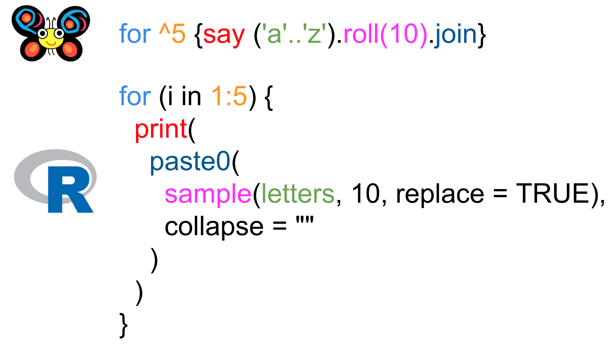
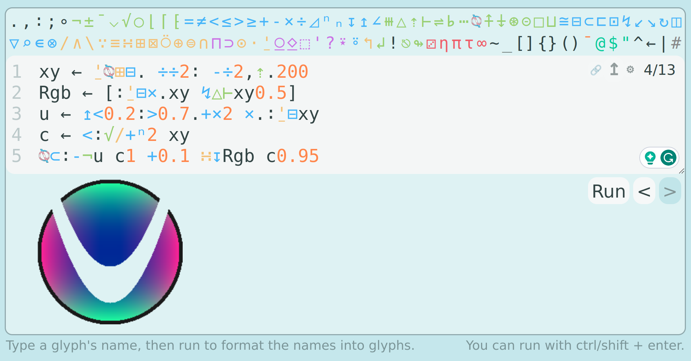

```{r, setup, include = FALSE}
knitr::opts_chunk$set(
  class.output  = "bg-success",
  class.message = "bg-info text-info",
  class.warning = "bg-warning text-warning",
  class.error   = "bg-danger text-danger"
)
```

If you're reading this hoping that I'm done with droning on about
array-languages, close the tab... it only gets worse from here. If you thought
APL was unreadable, even after my [earlier blog posts](https://jcarroll.com.au/2023/07/07/array-languages-r-vs-apl/), again -
close button is right there. In this post I try out a brand new _stack-based_
array language and continue to advocate for learning such things.

<!--more-->

If you're reading this hoping that I'm done with droning on about
array-languages, close the tab... it only gets worse from here. If you thought
APL was unreadable, even after my [earlier blog posts](https://jcarroll.com.au/2023/07/07/array-languages-r-vs-apl/), again -
close button is right there. In this post I try out a brand new _stack-based_
array language and continue to advocate for learning such things.

I subscribe to a lot of RSS feeds these days - it's certainly making a comeback, and it's 
great to see developers returning to blogging outside of paid platforms. Keeping up with 
all of those posts, however, does take quite a bit of time. So when I find one I do 
really find engaging, I do my best to dig in.

[This post](https://buttondown.email/hillelwayne/archive/picat-is-my-favorite-new-toolbox-language/)
by Hillel Wayne wasn't specifically interesting (my dance card for learning new languages is already 
pretty full, but I can't help looking at others) but it did present a small, bite-sized 
puzzle to solve; what's a simple way to "generate 5 random 10-character strings". Now, that's 
pretty much a code-golf question right there. Hillel presents a solution in [Raku](https://raku.org/) (a.k.a. Perl 6 - note the "p" and "6" in the Raku logo) as a "quick" solution

```
for ^5 {say ('a'..'z').roll(10).join}
```
```{r, eval = FALSE, class.source = "bg-success"}
dmjfpwxspu
vernmlljkw
korntotesp
rkpewsoqjn
blswvruden
```

and I can't argue with that - it's readable (even though I don't know much Perl/Raku), I can 
reason about what and how it's doing what it's doing (making an educated guess about `^` which 
is indeed a [range operation](https://docs.raku.org/language/operators#prefix_%5E) and `say` being 
an [output method](https://docs.raku.org/routine/say); `roll` is a nice choice for [random selection](https://docs.raku.org/routine/roll)).

When I see problems like this, I start to think through what tools I could use to solve it. I 
still default to R because it's the language I know best, but my first attempt isn't nearly 
as concise

```{r}
sapply(1:5, \(x) paste0(sample(letters, 10, replace = TRUE), collapse = ""))
```

I _do_ like that R has `letters` (and `LETTERS`) as built-in structures; that makes things a 
little easier. I _could_ write that just as easily as a for-loop, especially since I don't 
actually need an argument to the anonymous function

```{r}
for (i in 1:5) {
  print(
    paste0(
      sample(letters, 10, replace = TRUE), 
      collapse = ""
    )
  )
}
```

Side-by-side, these aren't all that different...



R defaults to `replace = FALSE` which needs adjusting, and doesn't like concatenating 
strings quite so easily as `join()`, but otherwise the translation is fairly 
straightforward. The Raku version is shorter, for sure.

I could probably go and try a few other languages, but I'm all too tempted to try APL. 
Unfortunately, [tryapl.org](https://tryapl.org/) seems to be down, but then I remembered... 
New on the scene is [Uiua](https://www.uiua.org/) (pronounced "wee-wuh") following the 
footsteps of other APL-descendants such as [BQN](https://mlochbaum.github.io/BQN/). This 
was covered by [The Array Cast panel](https://www.arraycast.com/episodes/episode63-uiua) 
who interviewed the author, as well as Conor from the same group in
[several](https://www.youtube.com/watch?v=iTC1EiX5bM0) [videos](https://www.youtube.com/watch?v=pq1k5USZZ9A).

The idea of a stack-based language is that you put some data "on the stack" then 
you no longer need to refer to arguments; a monadic function just applies to whatever 
is on the top of the stack. A dyadic function just applies to to the top two 
pieces of data on the stack. Need another copy of your data somewhere in your processing? Just 
duplicate it on the stack.

The way this works in practice is you "read" from right-to-left (same as APL), so if we 
put the values `2` and `3` on the stack then use the dyadic `+` function

```
+ 3 2
```
```{r, eval = FALSE, class.source = "bg-success"}
5
```

Similar to APL, this language uses glyphs for primitive functions, but a really nice 
feature is writing out the "name" of the function you want (in the above case, `add`) which 
the interpreter will convert to the glyph for you, so

```
add 3 2
```
```{r, eval = FALSE, class.source = "bg-success"}
5
```

produces the same code (with glyphs) and output.

Working with a stack would certainly be something different for me, but I figured it's 
worth a try! The first hurdle came quickly; how do I get the letters of the alphabet? 
Reading through the examples, I found that I can specify a string literal with `@`, and 
Uiua supports some [arithmetic on these](https://www.uiua.org/docs/types#:~:text=Character%20Arithmetic) so this works

```
+ @a 1
+ @a 25
```
```{r, eval = FALSE, class.source = "bg-success"}
@b
@z
```

Next, I needed to generate all the letters, and thankfully, adding a _range_ from 1 to 25 
(`⇡26`) works

```
+@a⇡26
```
```{r, eval = FALSE, class.source = "bg-success"}
"abcdefghijklmnopqrstuvwxyz"
```

Note that you can also use `add @a range 26` - the interpreter inserts the glyphs for you.

Next, I need a way to sample 10 letters from this. There's a `rand` function
(the glyph looks like a dice - nice!) but it only produces a single value
between 0 and 1. Additionally, I need to run this several times to get the 10
values. The front page of the website has a nice example demonstrating exactly
this, so that helps. It uses `rand` (`⚂`) and `repeat` (`⍥`) to generate 5
random numbers between 0 and 1, then `mult` (`×`) to bring the range up to 0 to
10, then finally `floor` (`⌊`) to return to integers.

```
⌊×10[⍥⚂5]
```
```{r, eval = FALSE, class.source = "bg-success"}
[5 3 7 8 4]
```

In my case, I want to generate 10 values and I need to multiply by 26 to have the 
right indices

```
⌊×26[⍥⚂10]+@a⇡26
```
```{r, eval = FALSE, class.source = "bg-success"}
"abcdefghijklmnopqrstuvwxyz"
[10 25 23 20 4 25 15 2 24 24]
```

The values on the stack are then the letters of the alphabet, and 10 indices to be selected.

This is where I had to pause and think - how do I repeat this 5 times? There's no loops (I 
don't think). Then I realised - this is an _array_ language... I should be leveraging that!

Instead of asking for 10 indices, I can ask for 50. Then, I just need to `reshape` (`↯`) 
these 50 values into 5 groups of 10

```
↯5_10⌊×26[⍥⚂50]+@a⇡26
```
```{r, eval = FALSE, class.source = "bg-success"}
"abcdefghijklmnopqrstuvwxyz"
╭─                               
╷ 21 19  4 18  2 24  6  1  2  6  
   0 12  1  1 12  2 12  7 12  0  
   5  1 19  6 22 19 23 18 12 25  
  20 13 10 19 17  2 12  1 16  4  
   9 24  6  9 18  6 21 18 23  1  
                                ╯
```

Now, there are two data objects on the stack; the alphabet, and an array of indices to be 
selected. A dyadic `select` (`⊏`) will take these two objects, and select elements of the 
first based on indices of the second, and voila!

```
⊏↯5_10⌊×26[⍥⚂50]+@a⇡26
```
```{r, eval = FALSE, class.source = "bg-success"}
╭─              
╷ "gewctqbttq"  
  "vsbvzbqiod"  
  "wpmkmnuxwz"  
  "rymyxzqibo"  
  "zxtnpadwvl"  
               ╯
```

That's a walkthrough of the glyphs in my final solution - [you can play 
with it on the website yourself](https://uiua.org/pad?src=4oqP4oavNV8xMOKMisOXMjZb4o2l4pqCNTBdK0Bh4oehMjY=) - but one could enter those function names in full 
and the interpreter will figure it out for you

```
select reshape 5_10 floor mult 26[repeat rand 50] add @a range 26

...

⊏ ↯ 5_10 ⌊ × 26[⍥⚂ 50] + @a ⇡ 26
```
```{r, eval = FALSE, class.source = "bg-success"}
╭─              
╷ "wtyefkiavu"  
  "gfllwkuqcn"  
  "qydoiyqprk"  
  "awvdxdsymj"  
  "zzvueychem"  
               ╯
```

I know people like to say this is "unreadable" but with a little colour, a lot of 
the elements of the Raku and R solutions are here


So... is that more concise than the R or even Raku solutions? Gosh, no. BUT, I
had a lot more fun writing it. For certain problems, APL-like languages really
do have a lot to offer, and for all I know there's a much better way to spell
this in very few glyphs that I've overlooked (feel free to send me one!).

You can make quite complex things; the Uiua logo itself - made in Uiua!

```
xy ← ⍘⍉⊞⊟. ÷÷2∶ -÷2,⇡.200
Rgb ← [∶⍘⊟×.xy ↯△⊢xy0.5]
u ← ↥<0.2∶>0.7.+×2 ×.∶⍘⊟xy
c ← <∶√/+ⁿ2 xy
⍉⊂∶-¬u c1 +0.1 ∺↧Rgb c0.95
```



Another neat fact about this language is that it's written in Rust, so it's
potentially quite fast as well. Array stuff in Rust is top of mind for me at the
moment - [this cool post](https://www.jernesto.com/articles/rapl) from earlier
in the year covers an implementation of some APL-like array processing in Rust
which I'm keen to dig deeper into (there's a not-too-old
[repo](https://github.com/JErnestoMtz/rapl) of things already built). I clearly
need to re-read my own posts, because I actually linked to that cool post above
in [my first APL-related post](https://jcarroll.com.au/2023/07/07/array-languages-r-vs-apl/), but because I had searched for "rank polymorphism" and it fit the bill.

The fact that R has a lot of these array-compatible functions out-of-the-box is
terribly underpromoted and undercelebrated. Bringing this back around to R, can
I use the array method there? I can certainly build a matrix of 50 letters quite
concisely, though the fact that R doesn't concatenate characters so easily still
hurts

```{r}
m <- matrix(sample(letters, 50, replace = TRUE), 5, 10)
apply(m, 1, \(x) paste0(x, collapse = ""))
```

I'm hoping to play a bit more with Uiua, and I was genuinely impressed that I managed 
to solve this at all, but I'm still just beginning my journey in APL and there's no 
shortage of things to learn there. In fact, despite having no tryapl.org, I _do_ have 
the Ride editor locally. A bit of searching for clues later, and I have something!

In (Dyalog) APL you can create the uppercase alphabet with just 

```
  ⎕A
```
```{r, eval = FALSE, class.source = "bg-success"}
ABCDEFGHIJKLMNOPQRSTUVWXYZ
```

similar to `LETTERS`. Lowercase letters can be generated with

```
  819⌶⎕A
```
```{r, eval = FALSE, class.source = "bg-success"}
abcdefghijklmnopqrstuvwxyz
```

or (possibly implementation-specific)

```
  ⎕c⎕a
```
```{r, eval = FALSE, class.source = "bg-success"}
abcdefghijklmnopqrstuvwxyz
```

Selecting random elements from this involves [`roll`](https://aplwiki.com/wiki/Roll) with 
the syntax

```
  ?5 10⍴26
```
```{r, eval = FALSE, class.source = "bg-success"}
18 16  7  8 22 25 15 17 24 19
18 23 24  9 25 17  4  2 25 24
10 13  6 11 10 17 21  9 15 20
25  8  3 12  4  2 21  3  1 18
 2  5 17 19 25  3  3 21  9  4
```

which produces random values between 1 and the right argument (in this case, a
5x10 reshape of the value `26` repeated over and over). That's exactly what we need 
as indices to select letters. Putting these together

```
⎕c⎕a[?5 10⍴26]
```
```{r, eval = FALSE, class.source = "bg-success"}
axpyohnotq
hsrottizwk
dgecrgxbcu
qvvxszptpq
wmaktfuvwf
```

Even better - if we store the `letters` like R does, and define a functional 
version which takes a left argument (`⍺`; the shape of the
array), a right argument (`⍵`; the letters to sample from), and automatically
calculates the length as `≢⍵`, then the entire solution is 

```
letters←⎕c⎕a
randstrings←{⍵[?⍺⍴≢⍵]}
5 10 randstrings letters
```
```{r, eval = FALSE, class.source = "bg-success"}
npentutsdo
jttcnqeuqm
imgrtupyfx
eliiqnishu
jonkovlmcn
```

Okay, _that's_ concise! And, provided you know what `?`, `⍴`, and `≢` do, it's
fairly readable (in my opinion, at least).

Can you make a better/shorter/more interesting solution to the random strings
problem? Or can improve the Uiua solution? I can be found on
[Mastodon](https://fosstodon.org/@jonocarroll) or use the comments below.

<br />
<details>
  <summary>
    <tt>devtools::session_info()</tt>
  </summary>
```{r sessionInfo, echo = FALSE}
devtools::session_info()
```
</details>
<br />
