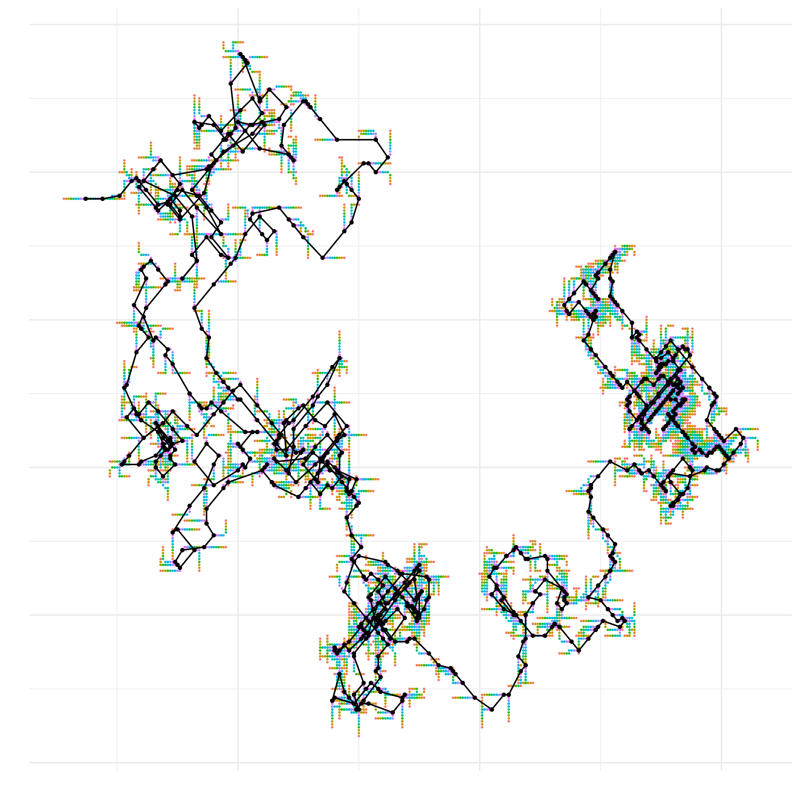
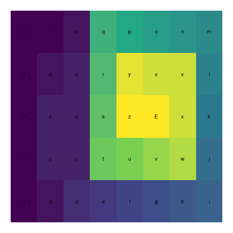
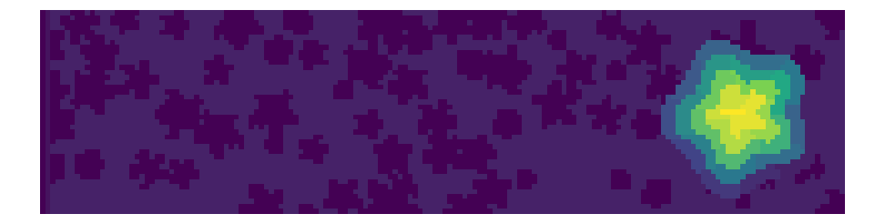
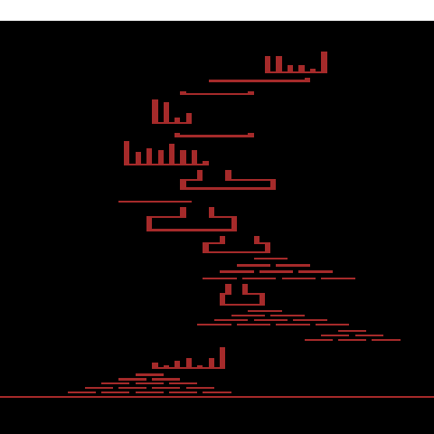
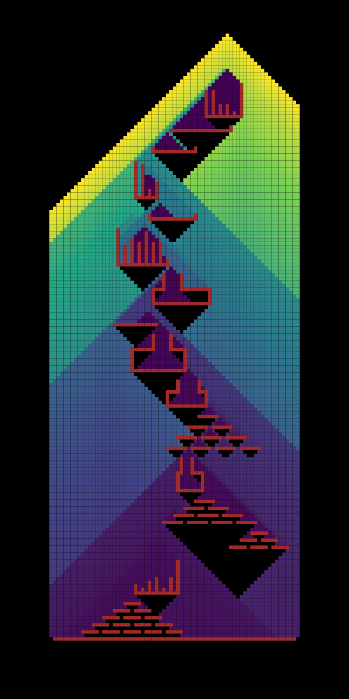
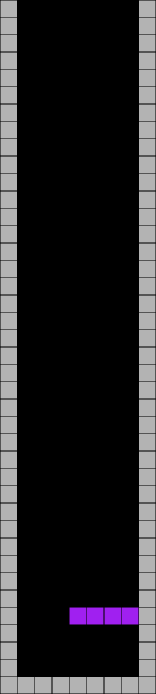
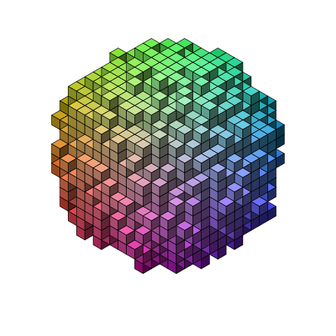

```{r, setup, include = FALSE}
knitr::opts_chunk$set(
  class.output  = "bg-success",
  class.message = "bg-info text-info",
  class.warning = "bg-warning text-warning",
  class.error   = "bg-danger text-danger"
)
```

In the lead up to Christmas each year, [Advent of Code](https://adventofcode.com/) 
offers a series of 25 puzzles which start out reasonably simple, but get progressively harder, eventually requiring knowledge of algorithms and dynamic programming techniques. Last year 
I solved these in (strictly) base R on the day they were released (or as close to as 
I could). I then (starting Dec 27) went back and re-solved (13 of) them in Rust.

This post details what I learned along the way and some fun visualisations I made.

<!--more-->

In the lead up to Christmas each year, [Advent of Code](https://adventofcode.com/) 
offers a series of 25 puzzles which start out reasonably simple, but get progressively harder, eventually requiring knowledge of algorithms and dynamic programming techniques. Last year 
I solved these in (strictly) base R on the day they were released (or as close to as 
I could). I then (starting Dec 27) went back and re-solved (13 of) them in Rust. 

This post details what I learned along the way and some fun visualisations I made.

<br />
<details open>
  <summary>
    Quicklinks (click here to hide):
  </summary>
  <ul style="columns: 3; -webkit-columns: 3; -moz-columns: 3;">
  <li>[Day 1: Calorie Counting](#day1)</li>
  <li>[Day 2: Rock Paper Scissors](#day2)</li>
  <li>[Day 3: Rucksack Reorganization](#day3)</li>
  <li>[Day 4: Camp Cleanup](#day4)</li>
  <li>[Day 5: Supply Stacks](#day5)</li>
  <li>[Day 6: Tuning Trouble](#day6)</li>
  <li>[Day 7: No Space Left On Device](#day7)</li>
  <li>[Day 8: Treetop Tree House](#day8)</li>
  <li>[Day 9: Rope Bridge](#day9)</li>
  <li>[Day 10: Cathode-Ray Tube](#day10)</li>
  <li>[Day 11: Monkey in the Middle](#day11)</li>
  <li>[Day 12: Hill Climbing Algorithm](#day12)</li>
  <li>[Day 13: Distress Signal](#day13)</li>
  <li>[Day 14: Regolith Reservoir](#day14)</li>
  <li>[Day 15: Beacon Exclusion Zone](#day15)</li>
  <li>[Day 16: Proboscidea Volcanium](#day16)</li>
  <li>[Day 17: Pyroclastic Flow](#day17)</li>
  <li>[Day 18: Boiling Boulders](#day18)</li>
  <li>[Day 19: Not Enough Minerals](#day19)</li>
  <li>[Day 20: Grove Positioning System](#day20)</li>
  <li>[Day 21: Monkey Math](#day21)</li>
  <li>[Day 22: Monkey Map](#day22)</li>
  <li>[Day 23: Unstable Diffusion](#day23)</li>
  <li>[Day 24: Blizzard Basin](#day24)</li>
  <li>[Day 25: Full of Hot Air](#day25)</li>
  </ul>
  </details>
  <br />
  
# <a rel="noopener" target="_blank" id="day1" href="#day1"><i class="fa fa-link" aria-hidden="true"></i></a> Day 1: Calorie Counting

## [R](https://github.com/jonocarroll/advent-of-code/blob/main/2022/R/R/day01.R)

I hadn't participated in AoC before this, so part of this day involved setting up 
a clean way to get the puzzle into R and figure out how I was going to run/test 
my solutions. The [{aoc}](https://github.com/tjmahr/aoc) package makes this quite smooth 
by using a session cookie to fetch the puzzle from the website and scaffold the input and 
functions for a given day.

Each puzzle has a small worked example, which requires a small example data input. For the 
first two weeks I painstakingly copied this input from the puzzle text to the templated 
`example_input_xx` function. The actual input for the puzzle is typically much larger 
and I believe is randomised from a handful of variants so that not everyone gets the 
exact same input, which makes sharing solutions less of a problem. This input is 
stored in a `.txt` file in the `inst/` directory by the {aoc} package, which also 
templates a `run-dayxx.R` file which reads said input.

All that's left for the user is to fill in the `fxxa` and `fxxb` functions which 
solve the part a and part b of each day's puzzle. 

Solving the puzzle begins with parsing the input data, which may be a newline-delimited 
series of numbers, or something more complex. In this case, groups of numbers 
delimited by a blank line. This puzzle asks us to find the group with the largest total. 
With the data loaded as a long string containing newlines `\n` I split at a double-newline, 
then spit within each group at the remaining newline, trimmed the string, converted 
to an integer, and summed the result, which gives a total value per group. Finally, I 
determined the largest value from the groups with the pattern `x[which.max(x)]`

```r
f01a <- function(x) {
  xvec <- strsplit(x, "\n\n")[[1]]
  tots <- unlist(lapply(xvec, \(y) sum(as.integer(trimws(strsplit(y, "\n")[[1]])))))
  tots[which.max(tots)]
}
```

An alternative would have been to sort `tots` and take the first value.

The second part of each puzzle expands the problem - in this case, rather than just the 
largest value from a group, it asks for the largest three groups

```r
f01b <- function(x) {
  xvec <- strsplit(x, "\n\n")[[1]]
  tots <- unlist(lapply(xvec, \(y) sum(as.integer(trimws(strsplit(y, "\n")[[1]])))))
  res <- 0
  for (i in 1:3) {
    n <- which.max(tots)
    res <- res + tots[n]
    tots <- tots[-n]
  }
  res
}
```

In hindsight, `sum(head(sort(tots, decreasing = TRUE), 3))` looks like it would have been clearer.

I wasn't interested in the performance of my solutions, but for the sake of comparison 
later, here is how long these take to run over the real input, which contains `2251` lines

```r
microbenchmark::microbenchmark(f01a(x), f01b(x), times = 100, check = NULL)
Unit: milliseconds
    expr      min       lq     mean   median       uq      max neval cld
 f01a(x) 21.21986 21.50103 22.26573 21.63479 21.82128 31.41858   100   a
 f01b(x) 21.18393 21.52034 22.29896 21.67297 21.87063 32.98093   100   a
```

Running the final solutions from the templated `inst/run-dayxx.R` file involves building the 
package (so that the daily functions are available) and running

```r
library(adventofcode22)
x <- readLines("./inst/input01.txt")
x <- paste(x, collapse = "\n")

p1 <- f01a(x)
p2 <- f01b(x)
```

## [Rust](https://github.com/jonocarroll/advent-of-code/blob/main/2022/Rust/src/bin/01.rs)

Returning to these puzzles from Rust presents the same issue - how do I get the inputs 
and parse them? The equivalent to the {aoc} package in Rust is a template repository
[{advent-of-code-rust}](https://github.com/fspoettel/advent-of-code-rust) which adds some 
functionality to `cargo` to scaffold and solve each day's puzzle. 

This crate also adds some helper functions for reading in the inputs and some tests for 
confirming that the solutions successfully solve with the example data.

Working with arbitrary data in Rust was a bit of a learning experience for me - until 
this point I'd worked with known structures where I knew exactly what size and shape 
to expect, and as such I could define what needed to happen. With the puzzle input, 
I needed to learn how to work with unknown lengths and anticipate what might not work.

I learned from my R solutions that a shared 'helper' function to read the data is 
quite useful, so I started there. As with the R solution, splitting the data into 
groups at a double newline produces the 'elf' groups. Splitting each of those groups 
involved a `map` which splits each group's text into `lines()`, converts to integers (`u32`) 
with `parse()`, then `sum()`s each group, `collect()`ing the result from each group back 
into a vector. The `unwrap()` in the middle of this is because `parse()` can fail - 
something may not be representable as an integer - so `parse()` returns a `Result` type, 
which can be either a value, or an error. `unwrap()` simply says "this will never fail, but 
if it does, crash the entire program". 

```r
fn parse01(input: &str) -> Vec<u32> {
    let elf = input.split("\n\n").collect::<Vec<&str>>();
    let calories: Vec<u32> = elf
        .into_iter()
        .map(|x| x.lines().map(|l| l.parse::<u32>().unwrap()).sum())
        .collect();
    calories
}
```

Actually solving the first part is then just converting the vector to an iterator and
taking the maximum value

```r
pub fn part_one(input: &str) -> Option<u32> {
    let calories = parse01(input);
    calories.into_iter().max()
}
```

This returns an `Option` because a) that's what the solution template requires, and b) 
`into_iter()` needs to be able to run out of values.

For the second part I took advantage of the idea I should have had for the R solution
and sorted the result (in-place), reversed it (in-place), took the first 3 values, 
and summed them

```r
pub fn part_two(input: &str) -> Option<u32> {
    let mut calories = parse01(input);
    calories.sort();
    calories.reverse();
    let top3 = calories.iter().take(3);
    Some(top3.sum())
}
```

Running this solution, the timing seems impressive

```
cargo solve 01
    Finished dev [unoptimized + debuginfo] target(s) in 0.02s
     Running `target/debug/01`
🎄 Part 1 🎄
72718 (elapsed: 1.01ms)
🎄 Part 2 🎄
213089 (elapsed: 1.07ms)
```

(about 20x faster than the R solution) except that this is the debug build - 
it still has debug symbols and some other things 
that make it not as fast as it can be. Using a `release` build...

```
cargo solve 01 --release
    Finished release [optimized + debuginfo] target(s) in 0.02s
     Running `target/release/01`
🎄 Part 1 🎄
72718 (elapsed: 115.74µs)
🎄 Part 2 🎄
213089 (elapsed: 116.51µs)
```

Yes - one hundred microseconds. 🤯

# <a rel="noopener" target="_blank" id="day2" href="#day2"><i class="fa fa-link" aria-hidden="true"></i></a> Day 2: Rock Paper Scissors

## [R](https://github.com/jonocarroll/advent-of-code/blob/main/2022/R/R/day02.R)

This puzzle involves combinations of A, B, C and X, Y, Z which lead to different 
configurations. I don't know if it's quite cheating, but I just hardcoded the 
results into some helper functions

```r
f02_helper <- function(x) {
  switch(x,
         AX = 1 + 3,
         AY = 2 + 6,
         AZ = 3 + 0,
         BX = 1 + 0,
         BY = 2 + 3,
         BZ = 3 + 6,
         CX = 1 + 6,
         CY = 2 + 0,
         CZ = 3 + 3)
}
```

and summed the matching values, dropping spaces

```r
f02a <- function(x) {
  x <- gsub(" ", "", x)
  sum(sapply(x, f02_helper))
}
```

The second part is just a variation on this, so another helper and the same idea

```r
f02b_helper <- function(x) {
  switch(x,
         AX = 3 + 0,
         AY = 1 + 3,
         AZ = 2 + 6,
         BX = 1 + 0,
         BY = 2 + 3,
         BZ = 3 + 6,
         CX = 2 + 0,
         CY = 3 + 3,
         CZ = 1 + 6)
}

f02b <- function(x) {
  x <- gsub(" ", "", x)
  sum(sapply(x, f02b_helper))
}
```

There was probably an algorithmic way to achieve this, but the answer works.

For comparison sake...

```r
microbenchmark::microbenchmark(f02a(x), f02b(x), times = 100, check = NULL)
Unit: milliseconds
    expr      min       lq     mean   median       uq      max neval cld
 f02a(x) 4.814174 4.921636 5.225773 4.992835 5.259293 8.873809   100   a
 f02b(x) 4.837843 4.918625 5.142451 4.984148 5.117036 7.762490   100   a
```

## [Rust](https://github.com/jonocarroll/advent-of-code/blob/main/2022/Rust/src/bin/02.rs)

I could do similar with Rust, using a `match` clause inside a `map`

```r
pub fn part_one(input: &str) -> Option<u32> {
    let guide = parse02(input);
    let res: Vec<u32> = guide
        .into_iter()
        .map(|x| match x.as_str() {
            "AX" => 1 + 3,
            "AY" => 2 + 6,
            "AZ" => 3 + 0,
            "BX" => 1 + 0,
            "BY" => 2 + 3,
            "BZ" => 3 + 6,
            "CX" => 1 + 6,
            "CY" => 2 + 0,
            "CZ" => 3 + 3,
            _ => 0,
        })
        .collect();
    Some(res.iter().sum())
}

pub fn part_two(input: &str) -> Option<u32> {
    let guide = parse02(input);
    let res: Vec<u32> = guide
        .into_iter()
        .map(|x| match x.as_str() {
            "AX" => 3 + 0,
            "AY" => 1 + 3,
            "AZ" => 2 + 6,
            "BX" => 1 + 0,
            "BY" => 2 + 3,
            "BZ" => 3 + 6,
            "CX" => 2 + 0,
            "CY" => 3 + 3,
            "CZ" => 1 + 6,
            _ => 0,
        })
        .collect();
    Some(res.iter().sum())
}
```

This time, the difference in timing wasn't so pronounced

```
cargo solve 02 --release
    Finished release [optimized + debuginfo] target(s) in 0.02s
     Running `target/release/02`
🎄 Part 1 🎄
15422 (elapsed: 699.20µs)
🎄 Part 2 🎄
15442 (elapsed: 527.74µs)
```

Still faster, but now we're dealing with string comparisons.

# <a rel="noopener" target="_blank" id="day3" href="#day3"><i class="fa fa-link" aria-hidden="true"></i></a> Day 3: Rucksack Reorganization

## [R](https://github.com/jonocarroll/advent-of-code/blob/main/2022/R/R/day03.R)

This puzzle involves 'rucksacks' containing letters so we're going to be doing more 
string comparisons. The problem statement says that we need to find the single 
character that is common between the first and second halves of a string. As will be 
a common theme, I approached this by first solving it for one input as a helper, then mapping
over all the inputs. My solution involves splitting the first and second halves of the 
string with `strsplit()`, finding the intersection of these (which should be a single
character), and matching that to either lowercase or uppercase letters, which R nicely 
has as inbuilt data structures `letters` and `LETTERS`, respectively. This makes for, I 
believe, a fairly compact solution

```r
f03a <- function(x) {
  sum(sapply(x, f03_helper))
}

f03_helper <- function(x) {
  half <- nchar(x)/2
  comp1 <- strsplit(substring(x, 1, half), "")[[1]]
  comp2 <- strsplit(substring(x, half+1), "")[[1]]
  solo <- intersect(comp1, comp2)
  prio <- match(solo, c(letters, LETTERS))
  prio
}
```

The second part expands to using 3 groups instead of the two halves. I needed a 
way to split the input (one string per line) into groups of 3. I haven't used this 
in a very long time, but I remembered learning about "**g**enerate factor **l**evels" `gl()` back 
when I first learned R. This produces a sequence of factors which can be passed to `split()`, 
so splitting 12 lines into blocks of 3 would produce 4 levels:

```{r}
gl(12/3, 3)
```

Aside from that, the only other difference was the double intersection - it's a shame 
that `intersect` only takes two arguments, so I just need to perform it twice

```r
f03b <- function(x) {
  grps <- split(x, as.integer(gl(length(x)/3, 3)))
  sum(sapply(grps, f03b_helper))
}

f03b_helper <- function(x) {
  x1 <- strsplit(x[1], "")[[1]]
  x2 <- strsplit(x[2], "")[[1]]
  x3 <- strsplit(x[3], "")[[1]]
  comm <- intersect(intersect(x1, x2), x3)
  prio <- match(comm, c(letters, LETTERS))
  prio
}
```

## [Rust](https://github.com/jonocarroll/advent-of-code/blob/main/2022/Rust/src/bin/03.rs)

Figuring out how to do this in Rust took a bit more effort. I don't know if it was 
the _best_ way, but I found I could take an intersection of a `HashSet` object. Rust 
has a nice `split_at()` method which helps split the strings, and (as with the `lines()` used 
earlier) a `chars()` method to split into individual characters. No inbuilt `letters`, 
though, so I used an ASCII lookup trick to calculate the priority.

```r
use std::collections::HashSet;

fn parse03(input: &str) -> Vec<String> {
    input.lines().map(|x| x.to_string()).collect()
}

fn shared_item(rucksack: String) -> Vec<char> {
    let l = rucksack.len();
    let (str1, str2) = rucksack.split_at(l / 2);

    let comp1: HashSet<char> = HashSet::from_iter(str1.chars());
    let comp2: HashSet<char> = HashSet::from_iter(str2.chars());

    let common = comp1.intersection(&comp2);

    common.copied().collect()
}

fn priority(item: char) -> u32 {
    match item {
        lowercase @ 'a'..='z' => lowercase as u32 - ('a' as u32) + 1,
        uppercase @ 'A'..='Z' => uppercase as u32 - ('A' as u32) + 27,
        _ => 0,
    }
}

pub fn part_one(input: &str) -> Option<u32> {
    let parsed = parse03(&input);
    let repeated: Vec<_> = parsed.iter().map(|x| shared_item(x.to_owned())).collect();
    let mut s = 0;
    for c in repeated {
        s += priority(c[0])
    }
    Some(s)
}
```

Definitely not as clean as the R solution, here. For the second part, I found 
some help in [a Reddit thread](https://www.reddit.com/r/rust/comments/zbikje/comment/iys0sgr/) 
about a three-way intersection. Here, the `chunks(n)` method nicely produces the three 
groups

```r
fn badge(rucksacks: Vec<String>) -> Vec<char> {
    let mut badges = vec![];

    for group in rucksacks.chunks(3) {
        let h1: HashSet<char> = HashSet::from_iter(group[0].chars());
        let h2: HashSet<char> = HashSet::from_iter(group[1].chars());
        let h3: HashSet<char> = HashSet::from_iter(group[2].chars());

        let common: Vec<_> = h1
            .iter()
            .filter(|e| h2.contains(e) && h3.contains(e))
            .collect();
        badges.push(*common[0]);
    }

    badges
}

pub fn part_two(input: &str) -> Option<u32> {
    let parsed = parse03(&input);
    let badge: Vec<_> = badge(parsed);
    let mut s = 0;
    for c in badge {
        s += priority(c)
    }
    Some(s)
}
```

# <a rel="noopener" target="_blank" id="day4" href="#day4"><i class="fa fa-link" aria-hidden="true"></i></a> Day 4: Camp Cleanup

Now the parsing gets harder. This puzzle involves finding where ranges overlap, so

```
5-7: ....567..  
7-9: ......789  
```

overlap at the 7, while

```
2-6: .23456...  
4-8: ...45678.  
```

overlaps at 4, 5, and 6.

## [R](https://github.com/jonocarroll/advent-of-code/blob/main/2022/R/R/day04.R)

Again, taking the "do it once, then map" approach, I converted the format `a-b` into 
`a:b` and then `eval(parse(text))`'d the result. This worked surprisingly well. The 
puzzle then asks how many times one of the pair is entirely contained within the other, 
so `all()` and `%in%` are great help here.

```r
f04a <- function(x) {
  sum(sapply(x, f04_helper))
}

f04_helper <- function(x) {
  both <- sapply(sub("-", ":", strsplit(x, ",")[[1]]), \(y) eval(parse(text = y)), simplify = FALSE, USE.NAMES = FALSE)
  all(both[[1]] %in% both[[2]]) || all(both[[2]] %in% both[[1]])
}
```

The second part asks for how many overlap at all, so it's just a change from `all()` to `any()`

```r
f04b <- function(x) {
  sum(sapply(x, f04b_helper))
}

f04b_helper <- function(x) {
  both <- sapply(sub("-", ":", strsplit(x, ",")[[1]]), \(y) eval(parse(text = y)), simplify = FALSE, USE.NAMES = FALSE)
  any(both[[1]] %in% both[[2]]) || any(both[[2]] %in% both[[1]])
}
```

## [Rust](https://github.com/jonocarroll/advent-of-code/blob/main/2022/Rust/src/bin/04.rs)

I created a structure to contain the ranges, parsed out the strings into 
actual ranges, and parsed the input

```r
#[derive(Debug)]
struct Assignments {
    sections: String,
}

impl Assignments {
    fn ids(&self) -> std::ops::Range<u32> {
        let rangelimits = &self.sections.split_once('-').unwrap();
        let start = rangelimits.0.parse::<u32>().unwrap();
        let end = rangelimits.1.parse::<u32>().unwrap();
        start..end
    }
}

fn create_assignments(line: &str) -> Vec<Assignments> {
    let pair = line.split_once(',').unwrap();
    let p1 = Assignments {
        sections: pair.0.to_string(),
    };
    let p2 = Assignments {
        sections: pair.1.to_string(),
    };
    vec![p1, p2]
}

fn parse04(input: &str) -> Vec<Vec<Assignments>> {
    let l = input.lines();
    l.into_iter().map(|x| create_assignments(x)).collect()
}
```

Having to do this in Rust made me a happy that R has an `intersect()` function, because now I 
needed one and had to code it by hand (I think...)

To determine if one range is fully contained within another, I compared the start 
and end values. Iterating over the pairs I just incremented a counter for those 
which were fully overlapping

```r
fn fully_contains(pairs: Vec<Assignments>) -> bool {
    let p1 = pairs[0].ids();
    let p2 = pairs[1].ids();
    if p1.len() >= p2.len() {
        return p1.start <= p2.start && p1.end >= p2.end;
    } else {
        return p2.start <= p1.start && p2.end >= p1.end;
    }
}

pub fn part_one(input: &str) -> Option<u32> {
    let all_assignments = parse04(input);
    let mut overlapping = 0;
    for ass in all_assignments {
        if fully_contains(ass) {
            overlapping += 1;
        }
    }
    Some(overlapping)
}
```

For the second part, I needed another algorithm, so [StackOverflow](https://stackoverflow.com/a/325964/4168169) to the rescue

```r
fn overlap_at_all(pairs: Vec<Assignments>) -> bool {
    let p1 = pairs[0].ids();
    let p2 = pairs[1].ids();
    // https://stackoverflow.com/a/325964/4168169
    // (StartA <= EndB) and (EndA >= StartB)
    p1.start <= p2.end && p1.end >= p2.start
}

pub fn part_two(input: &str) -> Option<u32> {
    let all_assignments = parse04(input);
    let mut overlapping = 0;
    for ass in all_assignments {
        if overlap_at_all(ass) {
            overlapping += 1;
        }
    }
    Some(overlapping)
}
```

# <a rel="noopener" target="_blank" id="day5" href="#day5"><i class="fa fa-link" aria-hidden="true"></i></a> Day 5: Supply Stacks

## [R](https://github.com/jonocarroll/advent-of-code/blob/main/2022/R/R/day05.R)

This one made me a little more afraid as it involved parsing ASCII-art-like input

```
    [D]
[N] [C]
[Z] [M] [P]
 1   2   3

move 1 from 2 to 1
move 3 from 1 to 3
move 2 from 2 to 1
move 1 from 1 to 2
```

Starting with the "stacks", I realised that a "crate" involved 4 characters and 
possibly a space (e.g. `[A] `) so I could substring into those. I reversed them 
so that the top "crate" was first

```r
extract_stack <- function(x) {
  # split into stacks
  n <- seq(1, nc <- nchar(x), by = 4)
  stack <- substring(x, n, c(n[-1]-1, nc))
  stack <- trimws(sub("]", "", sub("[", "", stack, fixed = TRUE), fixed = TRUE))
  stack
}

get_stacks <- function(x) {
  x <- x[1:(grep("^$", x)-1)]
  y <- t(sapply(x, extract_stack, USE.NAMES = FALSE))
  stackno <- y[nrow(y), ]
  y <- y[-nrow(y), ]
  z <- as.list(as.data.frame(y))
  z <- lapply(z, rev)
  z <- lapply(z, \(w) w[w != ""])
  z
}
```

Parsing the instructions was a great opportunity for something like [`{unglue}`](https://github.com/moodymudskipper/unglue), if only I wasn't limiting 
myself to strictly base R. Nonetheless, the instructions formed a straightforward 
pattern, so it wasn't too hard to work with

```r
get_instruction <- function(x) {
  x <- sub("move ", "", x)
  n <- as.integer(sub("([0-9]+).*", "\\1", x))
  x <- sub("^.*?from ", "", x)
  from = as.integer(sub("([0-9]+).*", "\\1", x))
  to <- as.integer(sub("^.*?to ", "", x))
  data.frame(n, from, to)
}

get_instructions <- function(x) {
  x <- x[(grep("^$", x)+1):length(x)]
  y <- lapply(x, get_instruction)
  do.call(rbind, y)
}
```

Performing the crane operations only involved selecting some number (1 or several) 
of elements from the `head` of some list and appending it to another

```r
crane <- function(stack, inst, model) {
  for (r in seq_len(nrow(inst))) {
    stack <- .crane(stack, inst[r, ], model)
  }
  stack
}

.crane <- function(stack, inst, model) {
  sfrom <- paste0("V", inst$from)
  sto <- paste0("V", inst$to)
  pick <- tail(stack[[sfrom]], inst$n)
  if (model == 9000) {
    pick <- rev(pick)
  }
  stack[[sfrom]] <- head(stack[[sfrom]], -inst$n)
  stack[[sto]] <- c(stack[[sto]], pick)
  stack
}
```

The flexibility and symmetry of `head(n)`, `head(-n)`, `tail(n)`, and `tail(-n)` made 
this particularly nice. This was one instance where I re-used my solution to the first 
part with an argument for the second part.

## [Rust](https://github.com/jonocarroll/advent-of-code/blob/main/2022/Rust/src/bin/05.rs)

If I thought the input parsing was hard in R, I wasn't looking forward to doing it 
in Rust. I implemented the stacks in much the same way - taking 4 `chars` at a time

```r
#[derive(Debug)]
struct Stacks {
    stacks: String,
}

impl Stacks {
    fn crates(&self) -> Vec<Vec<char>> {
        let stacklines = &self
            .stacks
            .lines()
            .into_iter()
            .map(|x| x.chars().collect::<Vec<char>>())
            .collect::<Vec<Vec<char>>>();
        let mut stackentries = vec![];
        for l in stacklines.iter() {
            stackentries.push(l.iter().skip(1).step_by(4).collect::<Vec<&char>>());
        }
        // reshape to stacks
        let mut stack = vec![vec![' '; 50]; stackentries[1].len()];
        for s in 0..stackentries.len() - 1 {
            for el in 0..stackentries[s].len() {
                stack[el][s] = stackentries[s][el].to_owned()
            }
        }
        for s in 0..stack.len() {
            stack[s].reverse();
            stack[s].retain(|x| *x != ' ');
        }

        stack
    }
}
```

The instructions invited a regex solution, but I found it to be (relatively) slow. 
I tried the 'unglue' approach

```r
let re = Regex::new(r"move (\d*) from (\d*) to (\d*)").unwrap();
let caps = re.captures(&self.input).unwrap();
```

and this ended up taking 89ms. The full R solution took 257ms which is certainly more, 
but I expected a better improvement moving to Rust. I refactored to avoid using the regex, 
instead just filtering to chars that parsed as numbers

```r
#[derive(Debug)]
struct Instructions {
    input: String,
}

impl Instructions {
    fn parse(&self) -> (usize, usize, usize) {
        let instr = String::from(&self.input);
        let caps = instr
            .split_whitespace()
            .filter(|c| c.parse::<usize>().is_ok())
            .collect::<Vec<_>>();
        let moveto = caps[0].parse::<usize>().unwrap();
        let from = caps[1].parse::<usize>().unwrap();
        let to = caps[2].parse::<usize>().unwrap();

        (moveto, from, to)
    }
}
```

and this version ran in 403µs - much better.

Putting the two pieces together as a tuple

```r
fn parse05(input: &str) -> (Stacks, Vec<Instructions>) {
    let parts = input.split_once("\n\n").unwrap();
    let stacks = Stacks {
        stacks: String::from(parts.0),
    };
    let instr = parts
        .1
        .lines()
        .map(|x| Instructions {
            input: String::from(x),
        })
        .collect::<Vec<_>>();
    (stacks, instr)
}
```

Actually running the simulation required a `crane` function

```r
fn crane(crates: Vec<Vec<char>>, instr: (usize, usize, usize)) -> Vec<Vec<char>> {
    let mut tmpcrates = crates.clone();
    for _i in 0..instr.0 {
        let tomove: char = tmpcrates[instr.1 - 1].pop().unwrap();
        tmpcrates[instr.2 - 1].push(tomove);
    }
    tmpcrates
}

pub fn part_one(input: &str) -> Option<String> {
    let (stacks, instr) = parse05(&input);
    let mut crates = stacks.crates();
    for i in 0..instr.len() {
        crates = crane(crates, instr[i].parse());
    }
    let tops = crates.iter().map(|s| s.last().unwrap()).collect::<String>();
    Some(tops)
}
```

and, not reusing the solution, part two

```r
fn crane9001(crates: Vec<Vec<char>>, instr: (usize, usize, usize)) -> Vec<Vec<char>> {
    let mut tmpcrates = crates.clone(); 
    let new_len = tmpcrates[instr.1 - 1].len();
    let mut tomove = vec![];
    for _i in 0..instr.0 {
        tomove.push(tmpcrates[instr.1 - 1].pop().unwrap());
    }
    tomove.reverse();
    tmpcrates[instr.1 - 1].truncate(new_len - instr.0);
    for x in tomove.into_iter() {
        tmpcrates[instr.2 - 1].push(x);
    }
    tmpcrates
}

pub fn part_two(input: &str) -> Option<String> {
    let (stacks, instr) = parse05(&input);
    let mut crates = stacks.crates();

    for i in 0..instr.len() {
        crates = crane9001(crates, instr[i].parse());
    }
    let tops = crates.iter().map(|s| s.last().unwrap()).collect::<String>();
    Some(tops)
}
```

Not as bad as it could have been. The fact that Rust treats strings as a 
vector of Chars (as many other languages do) makes some of this a lot nicer. It's 
something I do wish R did differently now that I've used it in other places, but 
strings are hard.

# <a rel="noopener" target="_blank" id="day6" href="#day6"><i class="fa fa-link" aria-hidden="true"></i></a> Day 6: Tuning Trouble

After complaining about strings the previous day, parsing this one sounded potentially 
tricky, but I think it worked out nicely. The problem involves finiding the first 
group of 4 characters where they are all different.

## [R](https://github.com/jonocarroll/advent-of-code/blob/main/2022/R/R/day06.R)

Returning to the 'do it once, then `*apply` approach, I was happy to know that 
R's `substring` is vectorised, so the `first` and `last` arguments can be 
vectors, e.g. taking 10 letters at a time of the alphabet

```{r}
l <- paste0(letters, collapse = "")
l

substring(l, seq(1, 17), seq(10, 26))
```

This is the exact sort of grouping I need for this puzzle. The rest is figuring 
out if the group contains 4 unique characters. The offset is to account for the 
number of characters since the start of the original string

```r
f06_helper <- function(x) {
  grp4 <- substring(x, seq(1, nchar(x)), seq(4, nchar(x)))
  4 + which(sapply(strsplit(grp4, ""), \(y) length(unique(y))) == 4)[1] - 1
}

f06a <- function(x) {
  sapply(x, f06_helper)
}
```

The second part really could have just been adding an argument to specify the group 
length, but I went the long way around

```r
f06b_helper <- function(x) {
  grp14 <- substring(x, seq(1, nchar(x)), seq(14, nchar(x)))
  14 + which(sapply(strsplit(grp14, ""), \(y) length(unique(y))) == 14)[1] - 1
}

f06b <- function(x) {
  sapply(x, f06b_helper)
}
```

## [Rust](https://github.com/jonocarroll/advent-of-code/blob/main/2022/Rust/src/bin/06.rs)

Without R's vectorised substring, I needed to parse 4 characters at a time - again I was
thankful that Rust treats strings as a series of Chars. To keep track of which Chars 
had been seen in the last 4 Chars I used a `HashSet`. I was pleased to learn that R does 
in fact have [such a structure in the form of `utils::hashtab()`](https://stat.ethz.ch/R-manual/R-devel/library/utils/html/hashtab.html) 
but this is only available in newer versions of R

```r
use std::collections::HashSet;

pub fn part_one(input: &str) -> Option<u32> {
    let mut i: u32 = 1;
    let mut recent = HashSet::new();
    let mut lastchars = vec![' '; 3];

    for c in input.chars() {
        for j in 0..3 {
            recent.insert(lastchars[j]);
        }
        recent.insert(c);
        if i > 3 && recent.len() == 4 {
            break
        };
        for i in 0..2 {
            lastchars[i] = lastchars[i+1];
        }
        lastchars[2] = c;
        recent.clear();
        i += 1;
    }
    Some(i)
}
```

The second part is again very similar, and again rather than adapting my solution 
I wrote a new one for part two

```r
pub fn part_two(input: &str) -> Option<u32> {
    let mut i: u32 = 1;
    let mut recent = HashSet::new();
    let mut lastchars = vec![' '; 13];

    for c in input.chars() {
        for j in 0..13 {
            recent.insert(lastchars[j]);
        }
        recent.insert(c);
        if i > 13 && recent.len() == 14 {
            break
        };
        for i in 0..12 {
            lastchars[i] = lastchars[i+1];
        }
        lastchars[12] = c;
        recent.clear();
        i += 1;
    }
    Some(i)
}
```

# <a rel="noopener" target="_blank" id="day7" href="#day7"><i class="fa fa-link" aria-hidden="true"></i></a> Day 7: No Space Left On Device

The input for this puzzle is a bit gnarly

```
$ cd /
$ ls
dir a
14848514 b.txt
8504156 c.dat
...
```

but it turned out a brute-force replacement approach didn't work too badly.

## [R](https://github.com/jonocarroll/advent-of-code/blob/main/2022/R/R/day07.R)

There's probably some good algorithm to deal with this, but instead I wrote a lot of 
for-loops to see what needed to be done. The tricky part of the recursion was having 
somewhere to keep track of a) which directory I was currently in, and b) what I'd already 
seen. I'm sure a recursive approach could be of help here, but instead I used an 
`environment` because I knew it was somewhat memory efficient; a global list would need 
to keep allocating and be slow. 

```r
f07a <- function(x) {
  dir_env <- new.env()
  current_dir <- "/"
  assign(current_dir, 0, envir = dir_env)
  for (inst in x) {
    if (inst == "$ cd /") next
    if (inst == "$ cd ..") {
      current_dir <- head(current_dir, -1)
      next
    }
    if (startsWith(inst, "$ cd")) {
      dir <- sub("$ cd ", "", inst, fixed = TRUE)
      current_dir <- c(current_dir, dir)
        assign(paste0(current_dir, collapse = "/"), 0, envir = dir_env)
      next
    }
    if (inst == "$ ls") next
    if (startsWith(inst, "dir")) {
      dir <- sub("dir ", "", inst)
      next
    } else if (grepl("^[0-9]", inst)) {
      l <- strsplit(inst, " ")[[1]]
      size <- l[1]
      for (d in seq_along(current_dir)) {
          this.d <- paste0(current_dir[1:d], collapse = "/")
          assign(this.d, dir_env[[this.d]] + as.integer(size), envir = dir_env)
      }
      next
    } else {
      stop("what?")
    }
  }
  sizes <- sapply(ls(dir_env), get, env = dir_env)
  res <- sum(sizes[which(sizes <= 100000)])
  list(del = res, env = dir_env)
}
```

This isn't recursive, but it works. The second part is much shorter, since it 
can reuse the first part

```r
f07b <- function(x) {
  alldirs <- f07a(x)$env
  todelete <- alldirs[["/"]] - 40000000
  sizes <- sapply(ls(alldirs), get, env = alldirs)
  candidates <- sizes[which(sizes >= todelete)]
  smallest <- candidates[which.min(candidates)]
  smallest
}
```

## [Rust](https://github.com/jonocarroll/advent-of-code/blob/main/2022/Rust/src/bin/08.rs)

Here I took the same approach, but using a `HashMap` as the filesystem

```rust
use std::{collections::HashMap};

pub fn part_one(input: &str) -> Option<u32> {
    let mut dir_deque = vec![];
    let mut current_dir = String::from("");
    let mut filesystem = HashMap::new();
    for l in input.lines() {
        if l == "$ cd .." {
            dir_deque.pop().unwrap();
            current_dir = dir_deque.join("");
            continue;
        } else if l == "$ cd /" {
            current_dir = String::from("/");
            filesystem.insert(current_dir.clone(), 0);
            dir_deque = vec![String::from("/")];
            continue;
        } else if l.starts_with("dir") {
            continue;
        } else if l.starts_with("$ cd") {
            let new_dir = l.replace("$ cd ", "");
            dir_deque.push(new_dir.clone() + &"/");
            current_dir = current_dir + &new_dir.clone() + &"/";
            filesystem.insert(current_dir.clone(), 0);
            continue;
        } else if char::is_digit(l.chars().nth(1).unwrap(), 10) {
            let parts = l.split_whitespace().collect::<Vec<_>>();
            let dir_size = parts[0].parse::<u32>().unwrap();
            for d in 0..dir_deque.len() {
                let this_d = dir_deque[0..=d].join("");
                let known_size = filesystem.get(&this_d).unwrap();
                filesystem.insert(this_d, known_size + dir_size);
            }
            continue;
        }
    }

    let totalsize = filesystem.iter()
            .filter(|&(_k, v)| *v <= 1e5 as u32)
            .map(|(_k, v)| *v)
            .collect::<Vec<u32>>()
            .iter()
            .sum();

    Some(totalsize)
        
}

pub fn part_two(input: &str) -> Option<u32> {
    let mut dir_deque = vec![];
    let mut current_dir = String::from("");
    let mut filesystem = HashMap::new();
    for l in input.lines() {
        if l == "$ cd .." {
            dir_deque.pop().unwrap();
            current_dir = dir_deque.join("");
            continue;
        } else if l == "$ cd /" {
            current_dir = String::from("/");
            filesystem.insert(current_dir.clone(), 0);
            dir_deque = vec![String::from("/")];
            continue;
        } else if l.starts_with("dir") {
            continue;
        } else if l.starts_with("$ cd") {
            let new_dir = l.replace("$ cd ", "");
            dir_deque.push(new_dir.clone() + &"/");
            current_dir = current_dir + &new_dir.clone() + &"/";
            filesystem.insert(current_dir.clone(), 0);
            continue;
        } else if char::is_digit(l.chars().nth(1).unwrap(), 10) {
            let parts = l.split_whitespace().collect::<Vec<_>>();
            let dir_size = parts[0].parse::<u32>().unwrap();
            for d in 0..dir_deque.len() {
                let this_d = dir_deque[0..=d].join("");
                let known_size = filesystem.get(&this_d).unwrap();
                filesystem.insert(this_d, known_size + dir_size);
            }
            continue;
        }
    }

    let to_delete = filesystem.get("/").unwrap() - (4e7 as u32);
    let candidates = filesystem.iter()
        .filter(|&(_k, v)| *v >= to_delete)
        .map(|(_k, v)| *v)
        .collect::<Vec<u32>>();
    Some(*candidates.iter().min().unwrap())

}
```

# <a rel="noopener" target="_blank" id="day8" href="#day8"><i class="fa fa-link" aria-hidden="true"></i></a> Day 8: Treetop Tree House

(see links)

## [R](https://github.com/jonocarroll/advent-of-code/blob/main/2022/R/R/day08.R)


## [Rust](https://github.com/jonocarroll/advent-of-code/blob/main/2022/Rust/src/bin/09.rs)

# <a rel="noopener" target="_blank" id="day9" href="#day9"><i class="fa fa-link" aria-hidden="true"></i></a> Day 9: Rope Bridge

This one involves keeping track of the positions of several 'knots' in a rope as it moves.

## [R](https://github.com/jonocarroll/advent-of-code/blob/main/2022/R/R/day09.R)

I wrote a *lot* of helper functions for this one

```r
f09a <- function(x) {
  visited <- list()
  head_pos <- c(5, 1)
  tail_pos <- c(5, 1)
  # print_grid(head_pos, tail_pos)
  visited <- c(visited, list(tail_pos))
  for (instr in x) {
    tmp <- move_rope(head_pos, tail_pos, instr)
    head_pos <- tmp[[1]]
    tail_pos <- tmp[[2]]
    visited <- c(visited, tmp[[3]])
  }
  length(unique(visited))
}

print_grid <- function(head_pos, tail_pos, size = 6) {
  grid <- matrix(".", nrow = size, ncol = size)
  grid[matrix(tail_pos, ncol = 2)] <- "T"
  grid[matrix(head_pos, ncol = 2)] <- "H"
  print(grid)
}

print_knots <- function(k, size = 10) {
  grid <- matrix(".", nrow = size, ncol = size)
  for (i in seq_len(length(k))) {
    grid[matrix(k[[i]], ncol = 2)] <- i
  }
  print(grid)
}

move_head <- function(head_pos, dir) {
  if (dir == "L") return(c(head_pos[1], head_pos[2] - 1))
  if (dir == "R") return(c(head_pos[1], head_pos[2] + 1))
  if (dir == "U") return(c(head_pos[1] - 1, head_pos[2]))
  if (dir == "D") return(c(head_pos[1] + 1, head_pos[2]))
}

move_rope <- function(head_pos, tail_pos, x) {
  visited <- list()
  dir <- sub(" .*", "", x)
  dist <- as.integer(sub("[LRUD] ", "", x))
  for (i in seq_len(dist)) {
    head_pos <- move_head(head_pos, dir)
    tail_pos <- move_tail(head_pos, tail_pos)
    visited <- c(visited, list(tail_pos))
  }
  return(list(head_pos, tail_pos, visited))
}

move_knots <- function(knots, x) {
  visited <- list()
  dir <- sub(" .*", "", x)
  dist <- as.integer(sub("[LRUD] ", "", x))
  for (i in seq_len(dist)) {
    knots[[1]] <- move_head(knots[[1]], dir)
    for (i in 2:10) {
      knots[[i]] <- move_tail(knots[[i-1]], knots[[i]])
    }
    visited <- c(visited, list(knots[[10]]))
  }
  return(list(knots, visited))
}

touching <- function(head_pos, tail_pos) {
  (head_pos[1] == tail_pos[1] && head_pos[2] == tail_pos[2]) ||
  (abs(head_pos[1] - tail_pos[1]) <= 1 && abs(head_pos[2] - tail_pos[2]) <= 1)
}

move_tail <- function(head_pos, tail_pos) {
  if (touching(head_pos, tail_pos)) return(tail_pos)
  if (tail_pos[1] == head_pos[1]) return(c(tail_pos[1], tail_pos[2] + sign(head_pos[2] - tail_pos[2])*1))
  if (tail_pos[2] == head_pos[2]) return(c(tail_pos[1] + sign(head_pos[1] - tail_pos[1]*1), tail_pos[2]))
  return(c(tail_pos[1] + sign(head_pos[1] - tail_pos[1])*1, tail_pos[2] + sign(head_pos[2] - tail_pos[2])*1))
}
```

This was also the first one I found the time to plot - here I plotted the path of the 10th knot, 
as well as the positions of the other knots after each step



## [Rust](https://github.com/jonocarroll/advent-of-code/blob/main/2022/Rust/src/bin/09.rs)

# <a rel="noopener" target="_blank" id="day10" href="#day10"><i class="fa fa-link" aria-hidden="true"></i></a> Day 10: Cathode-Ray Tube

(see links)

## [R](https://github.com/jonocarroll/advent-of-code/blob/main/2022/R/R/day10.R)

## [Rust](https://github.com/jonocarroll/advent-of-code/blob/main/2022/Rust/src/bin/10.rs)

# <a rel="noopener" target="_blank" id="day11" href="#day11"><i class="fa fa-link" aria-hidden="true"></i></a> Day 11: Monkey in the Middle

(see links)

## [R](https://github.com/jonocarroll/advent-of-code/blob/main/2022/R/R/day11.R)

## [Rust](https://github.com/jonocarroll/advent-of-code/blob/main/2022/Rust/src/bin/11.rs)

# <a rel="noopener" target="_blank" id="day12" href="#day12"><i class="fa fa-link" aria-hidden="true"></i></a> Day 12: Hill Climbing Algorithm

This one required that I learn a pathfinding algorithm - something I hadn't really done before. I ended up 
learning (and implementing) Dijkstra's Algorithm for finding the shortest paths between nodes in a graph.

## [R](https://github.com/jonocarroll/advent-of-code/blob/main/2022/R/R/day12.R)

```r
f12a <- function(x) {
  rows <- strsplit(x, "")
  grid <- matrix(unlist(rows), ncol = nchar(x[1]), byrow = TRUE)
  ngrid <- grid
  ngrid[which(grid == "S", arr.ind = TRUE)] <- "a"
  ngrid[which(grid == "E", arr.ind = TRUE)] <- "z"
  ngrid[] <- match(ngrid[], letters)
  mode(ngrid) <- "integer"
  startat <- which(t(grid) == "S")
  endat <- which(t(grid) == "E")
  min_path <- dijkstra(ngrid, endat, dir = -1)
  min_pathp[startat]
}

get_pos <- function(grid, v) {
  i <- floor((v-1)/ncol(grid))+1
  j <- ((v-1) %% ncol(grid))+1
  return(c(i, j))
}

can_reach <- function(ngrid, v, dir = 1) {
  x <- get_pos(ngrid, v)
  i <- x[1]
  j <- x[2]
  # can only move 1 row away
  res <- abs(floor(0:(prod(dim(ngrid))-1) / ncol(ngrid)) + 1 - i) <= 1 &
    # can only move 1 col away
    abs((0:(prod(dim(ngrid))-1)%%ncol(ngrid)) + 1 - j) <= 1 &
    # can't move diagonally
    abs(floor(0:(prod(dim(ngrid))-1) / ncol(ngrid)) + 1 - i) + abs((0:(prod(dim(ngrid))-1)%%ncol(ngrid)) + 1 - j) == 1
    if (dir == 1) {
    # can only step up 1
      res <- res & c(t(ngrid - ngrid[i, j] <= 1))
    } else {
      res <- res & c(t(ngrid[i, j] - ngrid <= 1))
    }
  as.integer(res)
}

dijkstra <- function(grid, start, dir = -1){
  #' Implementation of dijkstra using on-demand query
  #' derived from https://www.algorithms-and-technologies.com/dijkstra/r
  #' This returns an array containing the length of the shortest path from the start node to each other node.
  #' It is only guaranteed to return correct results if there are no negative edges in the graph. Positive cycles are fine.
  #' This has a runtime of O(|V|^2) (|V| = number of Nodes), for a faster implementation see @see ../fast/Dijkstra.java (using adjacency lists)
  #' @param graph an adjacency-matrix-representation of the graph where (x,y) is the weight of the edge or 0 if there is no edge.
  #' @param start the node to start from.
  #' @param dir are we going up or down? passed to can_reach()
  #' @return an array containing the shortest distances from the given start node to each other node

  # This contains the distances from the start node to all other nodes
  distances = rep(Inf, prod(dim(grid)))
  paths = rep(list(), prod(dim(grid)))

  # This contains whether a node was already visited
  visited = rep(FALSE, prod(dim(grid)))

  # The distance from the start node to itself is of course 0
  distances[start] = 0
  paths[[start]] = start

  # While there are nodes left to visit...
  repeat{

    # ... find the node with the currently shortest distance from the start node...
    shortest_distance = Inf
    shortest_index = -1
    for(i in seq_along(distances)) {
      # ... by going through all nodes that haven't been visited yet
      if(distances[i] < shortest_distance && !visited[i]){
        shortest_distance = distances[i]
        shortest_index = i
      }
    }

    if(shortest_index == -1){
      # There was no node not yet visited --> We are done
      return (list(distances, paths))
    }
    # ...then, for all neighboring nodes that haven't been visited yet....
    g <- can_reach(grid, shortest_index, dir = dir)
    for(i in seq_along(g)) {
      # ...if the path over this edge is shorter...
      if(g[i] != 0 && distances[i] > distances[shortest_index] + g[i]){
        # ...Save this path as new shortest path.
        distances[i] = distances[shortest_index] + g[i]
        paths[[i]] <- c(paths[[shortest_index]], i)
      }
      # Lastly, note that we are finished with this node.
      visited[shortest_index] = TRUE
    }
  }
}
```

With a decent amount of plotting code, I ended up with an animation showing the solution
for the test data



which I was very pleased about. Even better, was the full solution animation



## [Rust](https://github.com/jonocarroll/advent-of-code/blob/main/2022/Rust/src/bin/12.rs)

# <a rel="noopener" target="_blank" id="day13" href="#day13"><i class="fa fa-link" aria-hidden="true"></i></a> Day 13: Distress Signal

This one involves comparing nested lists like `[[1],[2,3,4]]` vs `[[1],4]`. I really want to go back 
and try this one in Haskell because those comparisons are (I believe) built-in.

## [R](https://github.com/jonocarroll/advent-of-code/blob/main/2022/R/R/day13.R)

## [Rust](https://github.com/jonocarroll/advent-of-code/blob/main/2022/Rust/src/bin/13.rs)

# <a rel="noopener" target="_blank" id="day14" href="#day14"><i class="fa fa-link" aria-hidden="true"></i></a> Day 14: Regolith Reservoir

I didn't finish my Rust solution for this one, but I was very happy with my R solution. The goal here 
is to fill the area with falling sand, allowing for some obstacles.

## [R](https://github.com/jonocarroll/advent-of-code/blob/main/2022/R/R/day14.R)

```r
f14a <- function(x) {
  allrocks <- lapply(x, rocks)
  cave <- matrix(".", nrow = 200, ncol = 1500)
  for (r in allrocks) {
    for (rr in seq_along(r[-1])) {
      f <- fill_rocks(r[rr], r[rr+1])
      cave[f] <- "#"
    }
  }
  done <- FALSE
  while(!done) {
    cave <- fall(cave, c(1, 500+500))
    done <- cave[matrix(c(1,1), ncol = 2)] == "X"
  }
  sum(cave == "o")
}

fall <- function(cave, sand, crit = "fall") {
  down <- c(sand[1]+1, sand[2])
  if (crit == "fall" && down[1] > 200) {
    cave[matrix(c(1,1), ncol = 2)] <- "X"
    return(cave)
  } else if (blocked(cave, c(1, 500+500))) {
    sandmat <<- rbind(sandmat, c(1, 500+500))
    cave[matrix(c(1,500+500), ncol = 2)] <- "o"
    cave[matrix(c(1,1), ncol = 2)] <- "X"
    return(cave)
  }
  if (blocked(cave, down)) {
    downleft <- c(sand[1]+1, sand[2]-1)
    if (blocked(cave, downleft)) {
      downright <- c(sand[1]+1, sand[2]+1)
      if (blocked(cave, downright)) {
        sandmat <<- rbind(sandmat, sand)
        cave[matrix(sand, ncol = 2)] <- "o"
      } else {
        return(fall(cave, downright))
      }
    } else {
      return(fall(cave, downleft))
    }
  } else {
    return(fall(cave, down))
  }
  return(cave)
}

blocked <- function(cave, x) {
  cave[matrix(x, ncol = 2)] %in% c("#", "o")
}

rocks <- function(x) {
  rocks <- strsplit(x, " -> ")[[1]]
  rocks <- strsplit(rocks, ",")
  for (r in seq_along(rocks)) {
    rocks[[r]] <- as.integer(rocks[[r]])
    rocks[[r]][1] <- rocks[[r]][1] + 500
  }
  rocks
}

fill_rocks <- function(x, y) {
  x <- x[[1]]
  x[2] <- x[2] + 1
  y <- y[[1]]
  y[2] <- y[2] + 1
  # horizontal
  if (x[1] == y[1]) {
    span <- x[2]:y[2]
    return(matrix(c(span, rep(x[1], length(span))), ncol = 2, byrow = FALSE))
  }
  # vertical
  if (x[2] == y[2]) {
    span <- x[1]:y[1]
    return(matrix(c(rep(x[2], length(span)), span), ncol = 2, byrow = FALSE))
  }
}
```

I animated the falling sand, filling up the cave, but with _so_ many particles it didn't go very well, 
especially when limiting the frames



Instead, a render of the final solution, with the sand coloured by the time at which it came to 
rest, looked much cooler



# <a rel="noopener" target="_blank" id="day15" href="#day15"><i class="fa fa-link" aria-hidden="true"></i></a> Day 15: Beacon Exclusion Zone

(see links)

## [R](https://github.com/jonocarroll/advent-of-code/blob/main/2022/R/R/day15.R)

# <a rel="noopener" target="_blank" id="day16" href="#day16"><i class="fa fa-link" aria-hidden="true"></i></a> Day 16: Proboscidea Volcanium

(see links)

## [R](https://github.com/jonocarroll/advent-of-code/blob/main/2022/R/R/day16.R)

# <a rel="noopener" target="_blank" id="day17" href="#day17"><i class="fa fa-link" aria-hidden="true"></i></a> Day 17: Pyroclastic Flow

While it was never mentioned by name, this one was essentially a game of Tetris.

## [R](https://github.com/jonocarroll/advent-of-code/blob/main/2022/R/R/day17.R)

At this point, there's too much code to copy inline. Check out the repo links.

I couldn't help but plot this one as an animation...



# <a rel="noopener" target="_blank" id="day18" href="#day18"><i class="fa fa-link" aria-hidden="true"></i></a> Day 18: Boiling Boulders

I got to learn even more algorithms for this one - this time a flood-fill algorithm.

## [R](https://github.com/jonocarroll/advent-of-code/blob/main/2022/R/R/day18.R)

I took advantage of one of coolbutuseless' packages [{isocubes}](https://github.com/coolbutuseless/isocubes)
to plot the shape of the lava droplet



# <a rel="noopener" target="_blank" id="day19" href="#day19"><i class="fa fa-link" aria-hidden="true"></i></a> Day 19: Not Enough Minerals

(see links)

## [R](https://github.com/jonocarroll/advent-of-code/blob/main/2022/R/R/day19.R)

# <a rel="noopener" target="_blank" id="day20" href="#day20"><i class="fa fa-link" aria-hidden="true"></i></a> Day 20: Grove Positioning System

(see links)

## [R](https://github.com/jonocarroll/advent-of-code/blob/main/2022/R/R/day20.R)

# <a rel="noopener" target="_blank" id="day21" href="#day21"><i class="fa fa-link" aria-hidden="true"></i></a> Day 21: Monkey Math

I had no intentions of making it on to the leaderboard for timing, even though the puzzles were 
released at an entirely reasonable time for me. I actually got to this one late in the 
evening due to some other commitments, but I am quietly confident that my R solution could 
have been one of the fastest solves...

The problem is figuring out what the value of the 'root' monkey is, given the following operations

```
root: pppw + sjmn
dbpl: 5
cczh: sllz + lgvd
zczc: 2
ptdq: humn - dvpt
dvpt: 3
lfqf: 4
humn: 5
ljgn: 2
sjmn: drzm * dbpl
sllz: 4
pppw: cczh / lfqf
lgvd: ljgn * ptdq
drzm: hmdt - zczc
hmdt: 32
```

## [R](https://github.com/jonocarroll/advent-of-code/blob/main/2022/R/R/day21.R)

I realised fairly quickly that I could just make each of the connections a function call, 
and evaluate the entire stack! This was very fast to write, and I got to my full solution 
faster than most of those at the top of the leaderboard, but much later in the day.

```r
f21a <- function(x) {
  defs <- sapply(x, parseInput)
  for (d in defs) {
    eval(parse(text = d))
  }
  format(root(), scientific = FALSE)
}

parseInput <- function(x) {
  monkey <- sub("^(.*):.*", "\\1", x)
  ret <- sub(".*: (.*)$", "\\1", x)
  if (is.na(suppressWarnings(as.integer(ret)))) {
    ret <- strsplit(ret, " ")[[1]]
    v1 <- ret[1]
    op <- ret[2]
    v2 <- ret[3]
    def <- paste0(monkey, " <- function() { ", v1, "() ", op, " ", v2, "() }")
  } else {
    def <- paste0(monkey, " <- function() { ", ret, " }")
  }
}
```

Sure, sometimes (most of the time), `eval(parse(text = ))` is a terrible idea, but in 
this case it worked out great!

# <a rel="noopener" target="_blank" id="day22" href="#day22"><i class="fa fa-link" aria-hidden="true"></i></a> Day 22: Monkey Map

(see links)

## [R](https://github.com/jonocarroll/advent-of-code/blob/main/2022/R/R/day22.R)

# <a rel="noopener" target="_blank" id="day23" href="#day23"><i class="fa fa-link" aria-hidden="true"></i></a> Day 23: Unstable Diffusion

(see links)

## [R](https://github.com/jonocarroll/advent-of-code/blob/main/2022/R/R/day23.R)

# <a rel="noopener" target="_blank" id="day24" href="#day24"><i class="fa fa-link" aria-hidden="true"></i></a> Day 24: Blizzard Basin

(see links)

## [R](https://github.com/jonocarroll/advent-of-code/blob/main/2022/R/R/day24.R)

# <a rel="noopener" target="_blank" id="day25" href="#day25"><i class="fa fa-link" aria-hidden="true"></i></a> Day 25: Full of Hot Air

(see links)

## [R](https://github.com/jonocarroll/advent-of-code/blob/main/2022/R/R/day25.R)

# Summary

I really enjoyed advent of code, and I ended up donating as thanks for providing such 
a nice experience. I'll be having a go at AoC 2023 but won't be so strict; I may not 
solve each puzzle _on the day it's released_ and I will be allowing myself to use whatever 
libraries and whatever languages I want.

Will you be participating? I'd love to compare solutions once we're done! I can be found on
[Mastodon](https://fosstodon.org/@jonocarroll) and I'll be commenting on the puzzles as I go.

<br />
<details>
  <summary>
    <tt>devtools::session_info()</tt>
  </summary>
```{r sessionInfo, echo = FALSE}
devtools::session_info()
```
</details>
<br />
