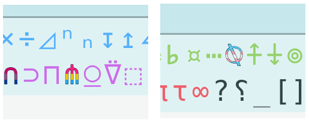

```{r, setup, include = FALSE}
knitr::opts_chunk$set(
  class.output  = "bg-success",
  class.message = "bg-info text-info",
  class.warning = "bg-warning text-warning",
  class.error   = "bg-danger text-danger"
)
```

I'm solving [Advent of Code](https://adventofcode.com/) this year using a
relaxed criteria compared to [last
year](https://jcarroll.com.au/2023/11/28/advent-of-code-2022/) in that I'm
allowing myself to use packages where they're helpful, rather than _strictly_
base R. Last year I re-solved half of the exercises using Rust which helped me
learn a lot about Rust. This year I'm enamored with APL, and I wanted to share a
particularly beautiful solution.

<!--more-->

I'm solving [Advent of Code](https://adventofcode.com/) this year using a
relaxed criteria compared to [last
year](https://jcarroll.com.au/2023/11/28/advent-of-code-2022/) in that I'm
allowing myself to use packages where they're helpful, rather than _strictly_
base R. Last year I re-solved half of the exercises using Rust which helped me
learn a lot about Rust. This year I'm enamored with APL, and I wanted to share a
particularly beautiful solution.

⚠⚠⚠⚠⚠

Spoilers ahead for Day 7, in case you haven't yet completed it yourself.

⚠⚠⚠⚠⚠

I solved Day 7 of Advent of Code using base R by testing whether or not a given
hand was of each type with an individual function, either returning 0 (if it was
not of that type) or `N` + a score, where `N` was sufficiently different between
each type that they would sort nicely. For the score, I initially tried
offsetting each card in a poor-man's base-15 as `15^(4:0)*card_score` but later
improved on that by using hex digits (which automatically sort nicer). The large `N` 
values ensured that 'type' would be sorted before the first/second/etc.. card.

That was sufficient to do an `apply(strength, hands)`, calculate the `order` of
those, and multiply by the relevant bids. Aside from a bug not caught by the
test case (the difference between `bid*order(x)` and
`bid[order(x)]*seq_along(x)`) it was an okay solution to the problem, and it
worked.

After solving each day, I've been trying to re-solve using APL; in particular Dyalog 
APL. For those who don't know, APL is an old language (circa 1960s) borne from a 
mathematical notation in which a single glyph (symbol) represents some operation 
or application of a function. This makes it look very different to more modern 
languages, partly because of the glyphs, but also because it requires no boilerplate 
whatsoever. As an array language, it deals with vectors and matrices without needing 
to "loop over columns" or "for i in values". It looks scary at first, but it's really 
not - once you're familiar with the glyphs it's actually beautiful!

Let's say you have a matrix `m` which contains the values `1` through `9`

```
    m
1 2 3
4 5 6
7 8 9
```

and you want to sum the columns. Chances are, the language you normally use will 
require you to first calculate the size of the matrix, maybe even perform a loop. In 
APL, it's 

```
    +⌿m
12 15 18
```

`⌿` is the glyph for "reduce along first axis", or perform some operation
(supplied as its left argument) to its right argument. `+⌿` is therefore "sum
columns". No boilerplate, just a direct explanation (the glyphs themselves are
better names than any word you could attach to them) of what needs to be done.

Sure, you need to learn the glyphs, and potentially even how to enter them; one option 
being a prefix key then a corresponding key. How committed am I to learning
those, you ask? Well, here's my laptop


I considered using APL for my Day 7 solution, but it was so many functions
defined, and fiddly if/else logic, I figured it was just ill-suited to APL. Then
I saw a [video recap of an APL solution for Day
7](https://www.youtube.com/watch?v=C395wCEDvOQ) and my mind was blown.

Meanwhile, I saw a post from [Elias
Mårtenson](https://fosstodon.org/@loke@functional.cafe), creator of the Kap
language, promoting some examples of Kap and was even more interested given that
it can do some things that (Dyalog) APL can't, like produce graphics. 

Can your APL do this?

```{r, eval = FALSE}
    chart:line mtcars 
┌→──────────────────────────────────────────────────────────────┐
↓1 1 1 0 0 0 0 0 0 0 0 0 0 0 0 0 0 1 1 1 0 0 0 0 0 1 1 1 1 1 1 1│
│4 4 4 3 3 3 3 4 4 4 4 3 3 3 3 3 3 4 4 4 3 3 3 3 3 4 5 5 5 5 5 4│
│4 4 1 1 2 1 4 2 2 4 4 3 3 3 4 4 4 1 2 1 1 2 2 4 2 1 2 2 4 6 8 2│
└───────────────────────────────────────────────────────────────┘
```


[Kap](https://kapdemo.dhsdevelopments.com/) is a fairly new APL-based language
(written in Kotlin) that supports most of Dyalog APL, but adds some cool
extensions and alterations like lazy evaluation and parallel execution.

[Uiua](https://www.uiua.org/) is another new language on the scene (written in
Rust) which also supports graphics; the Uiua logo itself is written in Uiua

```{r, eval = FALSE}
Xy ← °⍉⊞⊟. ÷÷2: -÷2,⇡.200
Rgb ← [:°⊟×.Xy ↯△⊢Xy0.5]
u ← ↥<0.2:>0.7.+×2 ×.:°⊟Xy
c ← <:⍜°√/+ Xy
⍉⊂:-¬u c1 +0.1 ↧¤c0.95Rgb
```


The online editor for Uiua uses colours to distinguish different
functions/operators, and the author has the flexibility to do what they want
with that, so it's awesome to see what they've used for "all" (`⋔`) and
"**trans**pose" (`⍉`)...



I figured I'd try to reproduce the APL solution in Kap as a way to learn more
about that language. The APL/Kap solution is so elegant! Additionally, I tried
writing equivalent R code. I'll interleave all three in this post (a nice excuse
to get [tabsets](https://yihui.org/en/2023/10/section-tabsets/) working!).

## Reading Input

To start with, get the data into the workspace - this reads in a vector with 
each element representing a row of input

<div class="tabset"></div>

* APL
  
  Reading from a file is performed using `⎕NGET`
  
  ```{r, eval = FALSE}
      ⊃⎕NGET'p07.txt'1
  ```
  ```{r, eval = FALSE, class.source = "bg-success"}
   32T3K 765  T55J5 684  KK677 28  KTJJT 220  QQQJA 483
  ```
  
* Kap

  Kap uses some namespaces, which makes reading in a bit nicer, and the output is 
  boxed, with explicit quotes for strings

  ```{r, eval = FALSE}
  p ← io:read "p07.txt"
  ```
  ```{r, eval = FALSE, class.source = "bg-success"}
  ┏━━━━━━━━━━━━━━━━━━━━━━━━━━━━━━━━━━━━━━━━━━━━━━━━━━━━━━━━━━┓
  ┃"32T3K 765" "T55J5 684" "KK677 28" "KTJJT 220" "QQQJA 483"┃
  ┗━━━━━━━━━━━━━━━━━━━━━━━━━━━━━━━━━━━━━━━━━━━━━━━━━━━━━━━━━━┛
  ```

* R

  `readLines` reads in each line as an element of a vector

  ```{r}
  p <- readLines("example07.txt")
  p
  ```

## Preprocessing

The input consists of hands of cards juxtaposed with a bid value, separated by 
a space. The approach here is not to treat them individually, but to create a 
matrix containing columns of hands and columns of bids.

<div class="tabset"></div>

* APL

  Partition (`(≠⊆⊢)`) on spaces (`' '`) for each (`¨`) row

  ```{r, eval = FALSE}
      ' '(≠⊆⊢)¨⊃⎕NGET'p07.txt'1
  ```
  ```{r, eval = FALSE, class.source = "bg-success"}
   32T3K  765    T55J5  684    KK677  28    KTJJT  220    QQQJA  483
  ```
  
  It's not entirely clear from this layout, but this is a vector of length-2 vectors. 

  These are "mixed" (stacked; `↑`), and the result assigned (`←`) to `p`

  ```{r, eval = FALSE}
  p←↑' '(≠⊆⊢)¨⊃⎕NGET'p07.txt'1
  ```
  ```{r, eval = FALSE, class.source = "bg-success"}
   32T3K  765 
   T55J5  684 
   KK677  28  
   KTJJT  220 
   QQQJA  483 
  ```

  This is now a matrix, where the first column contains the hands, the second
  (last) column contains the bids. 

* Kap

  Rather than the partition idiom, Kap has regex support, so splitting the 
  components involes `regex:split` for each (`¨`) element of input
  
  ```{r, eval = FALSE}
  p←⊃{" " regex:split ⍵}¨p
  ```
  ```{r, eval = FALSE, class.source = "bg-success"}
  ┌→────────────┐
  ↓"32T3K" "765"│
  │"T55J5" "684"│
  │"KK677"  "28"│
  │"KTJJT" "220"│
  │"QQQJA" "483"│
  └─────────────┘
  ```

* R

  The boilerplate of R's matrix construction takes a toll after using APL/Kap...

  ```{r}
  p <- matrix(unlist(strsplit(p, " ")), ncol = 2, byrow = TRUE)
  p
  ```

## Extraction

The hands and bids can be extracted into their own variables. 

<div class="tabset"></div>

* APL

  This can be achieved several ways, but a clean way is by reducing (`/`) with
  either the 'leftmost' (`⊣`) or 'rightmost' (`⊢`) operator, and evaluating
  (executing `⍎`) each (`¨`) of the bids to convert from strings to numbers
  
  ```{r, eval = FALSE}
  hands←⊣/p
  bids←⍎¨⊢/p
  ```
  
* Kap

  Kap uses exactly the same approach as APL for this

  ```{r, eval = FALSE}
  hands←⊣/p
  bids←⍎¨⊢/p
  ```

* R
  
  R's 'subset by index' works just fine, but if this was generalised I'd use 
  something like `p[, ncol(p)]` to get to the last column
  
  ```{r}
  hands <- p[,1]
  hands
  
  bids <- as.integer(p[,2])
  bids
  ```

## Tabulate
  
Now comes the interesting part! Rather than deal with the types separately, one
approach is to identify them by their relative counts; a five-of-a-kind has 5 of
one card and nothing elese; a four-of-a-kind has four of one and one of another.

<div class="tabset"></div>

* APL

  APL has a "key" (`⌸`) which takes a function as a left argument, which can be to 
  count the occurrences of each element with "tally" (`≢`)
  
  ```{r, eval = FALSE}
        {⍺,≢⍵}⌸'TGGATAACTTGAAC'
  ```
  ```{r, eval = FALSE, class.source = "bg-success"}
  T 4
  G 3
  A 5
  C 2
  ```
  
  In this case, we can get just the tallied count of each card in the hand with

  ```{r, eval = FALSE}
      {⊢∘≢⍵}⌸¨hands
  ```
  ```{r, eval = FALSE, class.source = "bg-success"}
  2 1 1 1  1 3 1  2 1 2  1 2 2  3 1 1
  ```

  We can then sort (`⍵[⍒⍵]`) these, take just the first two values (`2↑`), and
  decode (`⊥`) using base 10 to a single number. A nice feature of APL is that 
  trying to take the "first N" elements of a single element pads to the full N 
  with zeroes.

  ```{r, eval = FALSE}
      f←{10⊥2↑{⍵[⍒⍵]}⊢∘≢⌸⍵}
      f¨hands
  ```
  ```{r, eval = FALSE, class.source = "bg-success"}
  21 31 22 22 31
  ```

* Kap

  Kap doesn't have the equivalent Key, but after some discussion with the creator, 
  it's entirely possible to get something that does the same 
  
  ```{r, eval = FALSE}
    key⇐(⍪+⌿≡⌻)∘∪ ⍝ using outer product - see the R solution
    key2⇐{u←∪⍵ ⋄ c←⍸˝∧u⍳⍵} ⍝ using inverse 'where' and 'index of'
      
    key2¨hands
  ```
  ```{r, eval = FALSE, class.source = "bg-success"}
  ┌→────────────────────────────────────────┐
  │┌→──────┐ ┌→────┐ ┌→────┐ ┌→────┐ ┌→────┐│
  ││2 1 1 1│ │1 3 1│ │2 1 2│ │1 2 2│ │3 1 1││
  │└───────┘ └─────┘ └─────┘ └─────┘ └─────┘│
  └─────────────────────────────────────────┘
  ```
  
  The rest is the same as APL, except Kap uses a dedicated sort (`∨`) 
  
  ```{r, eval = FALSE}
      handrank⇐{10⊥2↑∨⊢/key ⍵}
      handrank¨hands
  ```
  ```{r, eval = FALSE, class.source = "bg-success"}
  ┏━━━━━━━━━━━━━━┓
  ┃21 31 22 22 31┃
  ┗━━━━━━━━━━━━━━┛
  ```
  
* R

  I wanted to recreate the above approach in R, so this will take the long way 'round.
  
  First, we need a 'key' function
  
  ```{r}
  key <- function(x) {
    l <- strsplit(x, "")[[1]]
    setNames(colSums(outer(l, unique(l), "==")), unique(l))
  }
  
  sapply(hands, key)
  ```

  The idea of this is to create an outer product between the set of 
  unique letters in the string, and the individual letters, performing 
  an `==` check on each combination

  ```{r}
  y <- strsplit(hands[2], "")[[1]]
  outer(y, unique(y), "==")
  ```
  
  This is, of course, unnecessary as R has a way to do this
  
  ```{r}
  table(y)
  ```

  but I wanted to see how to do it from scratch.

  Applying this over the hands, we can sort each of the counts again, but now 
  taking the first two values fails for the five-of-a-kind which only has a `5`, 
  so in that case I add the missing 0. Decoding as base 10 can be done a couple 
  of ways, but pasting and converting seems to work fine.

  ```{r}
  handrank <- function(x) {
    rank <- sort(sapply(x, key), decreasing = TRUE)
    if (length(rank) == 1) rank <- c(rank, 0)
    as.integer(paste(rank[1:2], collapse = ""))
  }
  
  sapply(hands, handrank)
  ```

## Subsequent Rankings and Answer

Finally, the part where the 'array' approach shines! Rather than constructing some 
sortable number for each hand, we can just score each card and use an array.

<div class="tabset"></div>

* APL

  Creating a vector of all the cards is aided by the 'numbers as a string'
  helper `⎕D`. Drop the first two of these (`2↓`)  then append the 'face' cards

  ```{r, eval = FALSE}
      r←'TJQKA',⍨2↓⎕D
      r
  ```
  ```{r, eval = FALSE, class.source = "bg-success"}
  23456789TJQKA
  ```

  Stacking the hands into a matrix of cards

  ```{r, eval = FALSE}
      ↑hands
  ```
  ```{r, eval = FALSE, class.source = "bg-success"}
  32T3K
  T55J5
  KK677
  KTJJT
  QQQJA
  ```

  we can ask for the index of matches to the individual cards with `⍳`

  ```{r, eval = FALSE}
      r⍳↑hands
  ```
  ```{r, eval = FALSE, class.source = "bg-success"}
   2  1  9  2 12
   9  4  4 10  4
  12 12  5  6  6
  12  9 10 10  9
  11 11 11 10 13
  ```

  Prepending (`,`) each column with the tabulated type of each hand

  ```{r, eval = FALSE}
      r{⍵,⍺⍳↑hands}f¨hands
  ```
  ```{r, eval = FALSE, class.source = "bg-success"}
  21  2  1  9  2 12
  31  9  4  4 10  4
  22 12 12  5  6  6
  22 12  9 10 10  9
  31 11 11 11 10 13
  ```

  Now, some real magic... APL support ["total array
  ordering"](https://aplwiki.com/wiki/Total_array_ordering) which means we can just 
  sort the entire thing - it will sort by the first column, using the second and 
  subsequent columns for ties. Given that the first column is the 'type' of hand, 
  and subsequent columns are values of each card in order, that's precisely 
  the sorting we need!

  ```{r, eval = FALSE}
      r{⍋⍋⍵,⍺⍳↑hands}f¨hands
  ```
  ```{r, eval = FALSE, class.source = "bg-success"}
  1 4 3 2 5
  ```
  
  There's a nice discussion about why the double grading from
  [BQN](https://github.com/mlochbaum/BQN/blob/master/doc/order.md#ordinals)

  Finally, multiplying by the bids themselves, and sum-reducing gives the final
  answer

  ```{r, eval = FALSE}
    +/r{bids×⍋⍋⍵,⍺⍳↑hands}f¨hands
  ```
  ```{r, eval = FALSE, class.source = "bg-success"}
  6440
  ```

* Kap

  This is mostly the same solution as APL, except I couldn't find the 'numbers
  as string' so i just typed it out. Kap also uses 'disclose' (`⊃`) in place of
  mix (`↑`)
  ([ref](https://kapdemo.dhsdevelopments.com/kap-comparison.html#_enclose_and_disclose:~:text=If%20%E2%8A%83%20is%20called%20on%20an%20array%2C)).

  ```{r, eval = FALSE}
      ranks←"23456789TJQKA"
      +/ranks{bids×1+⍋⍋⍵,⍺⍳⊃hands}handrank¨hands
  ```
  ```{r, eval = FALSE, class.source = "bg-success"}
  6440
  ```

* R

  R doesn't support Total Array Ordering, but it does seem to have a way to do it, 
  so say the documentation examples for `order`

  ```{r, eval = FALSE}
  ## or along 1st column, ties along 2nd, ... *arbitrary* no.{columns}:
  dd[ do.call(order, dd), ]
  ```

  That only works for a `data.frame`, which _is_ a `list` (per `do.call`'s requirement). We 
  can still work with that. First, smoosh together all the hands and convert the 
  individual cards to a matrix - again, a long line of commands for what is reasonably 
  straightforward in APL... `3 3⍴'abcdefghi'` reshapes those 9 letters into a 3x3 matrix.

  ```{r}
  m <- matrix(strsplit(paste0(hands, collapse = ""), "")[[1]], ncol = 5, byrow = TRUE)
  m
  ```
  
  The individual cards vector benefits from coercing the digits to characters
  
  ```{r}
  ranks <- c(2:9, "T", "J", "Q", "K", "A")
  ```
  
  The index mapping does actually work nicely with `match`, except it returns a single 
  vector, not a matrix, so we need to reshape yet again. Plus, this time, the matches went 
  down columns not along rows, so we need to use `byrow = FALSE`
  
  ```{r}
  mm <- matrix(match(m, ranks), ncol = 5, byrow = FALSE)
  mm
  ```
  
  Prepending with the type rankings does work nicely via `cbind`
  
  ```{r}
  g <- cbind(sapply(hands, handrank), mm)
  g
  ```
  
  Then ordering with the `do.call` idiom
  
  ```{r}
  gdf <- as.data.frame(g)
  gdf[do.call(order, gdf), ]
  ```
  
  Putting this all together into a function
  
  ```{r}
  sortrank <- function(x, y) {
    m <- matrix(strsplit(paste0(y, collapse = ""), "")[[1]], ncol = 5, byrow = TRUE)
    mm <- matrix(match(m, x), ncol = 5, byrow = FALSE)
    g <- cbind(sapply(y, handrank), mm)
    do.call(order, as.data.frame(g))
  }
  
  sortrank(ranks, hands)
  ```
  
  This _isn't_ the double sorting that APL and Kap used, and that little
  difference is what held me up for all too long trying to figure out why my
  solution passed tests but gave the wrong answer. Annoyingly, this mistake
  doesn't show up in the test case because the ranks only differ by a switched
  place. The true input was not so kind.

  This result _is_ the order in which we need to place the bids, so doing that, then 
  multiplying by the position (since it's sorted, this is just a vector from `1` to the 
  number of elements) we get the answer

  ```{r}
  sum(bids[sortrank(ranks, hands)]*seq_along(bids))
  ```

## Summary

So, how do these solutions all look? I'll stop with the tabsets for a side-by-side comparison.

Compacting the APL solution (which does involve some duplication) it's as simple as

```{r, eval = FALSE}
p←↑' '(≠⊆⊢)¨⊃⎕NGET'p07.txt'1
+/('TJQKA',⍨2↓⎕D){(⍎¨⊢/p)×⍋⍋⍵,⍺⍳↑⊣/p}{10⊥2↑{⍵[⍒⍵]}⊢∘≢⌸⍵}¨⊣/p
```

which, admittedly, requires a fair amount of unpacking to read. In full form, it's

```{r, eval = FALSE}
p←↑' '(≠⊆⊢)¨⊃⎕NGET'p07.txt'1
hands←⊣/p
bids←⍎¨⊢/p
f←{10⊥2↑{⍵[⍒⍵]}⊢∘≢⌸⍵}
r←'TJQKA',⍨2↓⎕D
+/r{bids×⍋⍋⍵,⍺⍳↑hands}f¨hands
```

which is still pretty nice, considering what it's doing.

The R solution, somewhat minimally, and leveraging `table`, is

```{r, eval = FALSE}
handrank <- function(x) {
  rank <- sort(sapply(strsplit(x, ""), table), decreasing = TRUE)
  if (length(rank) == 1) rank <- c(rank, 0)
  as.integer(paste(rank[1:2], collapse = ""))
}

sortrank <- function(x, y) {
  m <- matrix(strsplit(paste0(y, collapse = ""), "")[[1]], ncol = 5, byrow = TRUE)
  mm <- matrix(match(m, x), ncol = 5, byrow = FALSE)
  g <- cbind(sapply(y, handrank), mm)
  do.call(order, as.data.frame(g))
}

solve <- function(x) {
  p <- matrix(unlist(strsplit(x, " ")), ncol = 2, byrow = TRUE)
  hands <- p[,1]
  bids <- as.integer(p[,2])
  ranks <- c(2:9, "T", "J", "Q", "K", "A")
  sum(bids[sortrank(ranks, hands)]*seq_along(bids))
}

solve(readLines("example07.txt"))
```

Certainly more typing, but still a much shorter solution than the one I originally 
came up with.

## Takeaways

Both APL and Kap (and so many other languages) benefit greatly from treating a string 
as an array of characters. This always hurts in R, where `strsplit(x, "")` is needed.

The array approach here highlights how one can think differently about a problem, provided 
the tools are at hand. 

Kap has a lot to offer - it's (vastly) newer, which comes with both advantages
(can do new things) and disadvantages (things need to be implemented, and they
won't necessarily carry over 1:1).

Advent of Code once again proves to be a useful exercise.

## One more thing

I saw [a solution in Uiua on
Mastodon](https://mastodon.social/@jstepien/111549757943773283) and had to give
it a go, too...

```{r, eval = FALSE}
Input ← ⊜(⊜□≠@ .)≠@\n.&fras"p07.txt"
Label ← ⇌"AKQJT98765432"
Bids ← ⋕⊢↘1⍉
Cards ← ⊐≡(⊗:Label)⊢⍉
Types ← 0_1_2_4_8_5_10_9_3_6_12_11_13_7_14_15⊚1_4_3_3_2_2_1
TypeStr ← ⊏⊗⊙Types≡(°⋯≡/=◫2⊏⍏.)
/+×+1⍏⍏/+×ⁿ⇌⇡6⧻Label⊂⊃TypeStr⍉⊃Cards Bids Input
```

I *think* this is taking the same approach, though unpacking this is even 
trickier.

<hr>

Comments and improvements most welcome. I can be found on
[Mastodon](https://fosstodon.org/@jonocarroll) or use the comments below.

<br />
<details>
  <summary>
    <tt>devtools::session_info()</tt>
  </summary>
```{r sessionInfo, echo = FALSE}
devtools::session_info()
```
</details>
<br />
