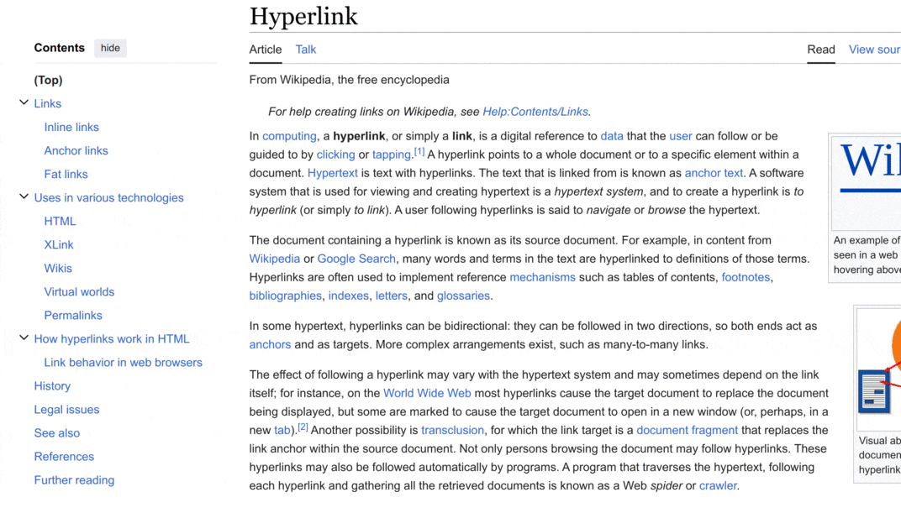

Hyperlinks are great - they add value to a block of text by adding additional
links out to more things to read - but they're a distraction if you're trying to
read an in-depth piece of text and comprehend it linearly. Let's hack the web!

<!--more-->

Hyperlinks are great - they add value to a block of text by adding additional
links out to more things to read - but they're a distraction if you're trying to
read an in-depth piece of text and comprehend it linearly. Let's hack the web!

I've been reading the updated edition of [The Shallows: What the Internet Is
Doing to Our Brains](https://www.goodreads.com/book/show/9778945-the-shallows)
and one particular point resonated with me - on discussing the differences
between print books and web content, the author notes that the proliferation of
hyperlinks throughout the latter distract us from reading because we constantly
assess whether or not we will click a link, or worse, we click it and read that
instead.

I'm very familiar with this distraction from reading long-form articles, and I
typically end up with a backlog of open tabs that I plan to get to later so that
I'm not too distracted from what I'm currently reading. With that said, I do
reflect on the fact that I don't think this is a _new_ thing - I eventually
stopped reading the footnotes in several non-fiction books recently because I
felt it was too hard to keep flipping between the text and the itemized notes at
either the end of the chapter or book.

Footnotes, with a number next to a word or at the end of a phrase, can be
overlooked a bit easier than inline hyperlinks, where some stretch of text
serves as the anchor to some other page, e.g. this link to
[Wikipedia](https://www.wikipedia.org/) without having to show the actual URL
of the page.

I started thinking - what if we just turn the hyperlinks off, temporarily? We
can do a full reading of some content, then come back with the hyperlinks back
on to see what additional content there is to read, knowing that we've already
parsed the primary content and are now available to investigate the secondary
components. I think that distinction is significant - if it was primary content,
it would be in the main text, but by using a hyperlink or a footnote, it is
deemed secondary.

Web content has the benefit that, while it's presented in one particular way on 
your screen, the instructions for doing so come along for the ride behind the scenes 
in the form of HTML, JavaScript, CSS, and other browser-related things. With the 
right knowledge, they're malleable, and we can change them. What if we just find 
all the hyperlinks and make them look like regular text?

I searched for whether or not such a thing already exists, and sure enough one
of the first results I found was a post from someone who came to exactly the
same conclusion after reading the same book! In [their
post](https://onestepcode.com/hide-link-extension/) they describe building a
Firefox extension that does what I want - turns off styling by overriding the
CSS of anchor tags so that they inherit their parent styling

```css
a,
a:hover,
a:focus,
a:active,
a:visited {
    text-decoration: none !important;
    color: inherit !important;
    background-color: inherit !important;
    border-bottom: initial !important;
}
```

This works for that person on that browser, but I want something a bit more general. 

I don't exactly know why they fell out of favor, but [JavaScript bookmarklets](https://en.wikipedia.org/wiki/Bookmarklet) are 
great - a bookmark containing JavaScript code you can run on any page. This seemed 
like what I wanted, so I started hacking away and eventually came up with this function

```javascript
(function () {
    ql = document.getElementById('quietlinks')
    if (ql) {
        ql.parentNode.removeChild(ql);
    } else {
        s = document.createElement('style')
        s.id = "quietlinks"
        s.innerText = "a, a:hover, a:focus, a:active, a:visited { text-decoration: none !important; color: inherit !important; background-color: inherit !important; border-bottom: initial !important;}"
        document.head.appendChild(s)
    }
})();
```

It checks to see if there is an element with the ID `"quietlinks"` and if not, it 
creates a new overriding style element with the above CSS and appends that to the 
page's head. If it _does_ find such an element, it removes it from the page. This 
function therefore toggles between applying custom CSS and removing it.

To work in a bookmarklet it needs to all be one line and quotes need to be translated, 
and the minifier I used shortens variable names, so it ends up looking like this 

```javascript
javascript:!function(){if(ql=document.getElementById(%22quietlinks%22),ql)ql.parentNode.removeChild(ql);else{var e=document.createElement(%22style%22);e.id=%22quietlinks%22,e.innerText=%22a, a:hover, a:focus, a:active, a:visited { text-decoration: none !important; color: inherit !important; background-color: inherit !important; border-bottom: initial !important;}%22,document.head.appendChild(e)}}();
```

To save this bookmarklet, drag this link into your bookmarks bar (or just click it 
to try it on this page)

<div align="center">
<a href="javascript:!function(){if(ql=document.getElementById(%22quietlinks%22),ql)ql.parentNode.removeChild(ql);else{var e=document.createElement(%22style%22);e.id=%22quietlinks%22,e.innerText=%22a, a:hover, a:focus, a:active, a:visited { text-decoration: none !important; color: inherit !important; background-color: inherit !important; border-bottom: initial !important;}%22,document.head.appendChild(e)}}();">QuietLinks</a>
</div>

Now you can use it - here are a few links to nowhere that are styled. Click on
the saved bookmarklet, and they should lose their styling. Click on it again and
the styling will return.

When [text](javascript:;) contains [a lot of links](javascript:;) it can be
[difficult](javascript:;) to read because we [continually](javascript:;) need to
stop to [decide](javascript:;) whether or not we will [follow](javascript:;) the
link. Disabling the [hyperlink](javascript:;) [decoration](javascript:;) could 
be helpful.

These are all fake links that go literally nowhere, so they don't have the
domain suffix (inserted via JavaScript, as described in [this
post](https://jcarroll.com.au/2023/06/02/hyperlink-annotations-in-javascript-and-css/))
but on a regular site, the result should look something like this



Note that the hyperlinks remain - they're still clickable - but they no longer have 
special styling applied to them (commonly blue with underline) so they just read like 
regular text.

There are some edge cases I discovered already, e.g. the links on Mastodon are all 
`<span>` elements, not `<a>`, so they aren't affected. My intention was for reading 
long articles, though, so that doesn't bother me too much. This approach is also a bit 
greedy in finding anchors, so the 'share' icons below disappear as their styling is
disrupted. I'll keep using this for a while and see if it really helps me comprehend 
what I'm reading.

Comments and improvements most welcome. I can be found on
[Mastodon](https://fosstodon.org/@jonocarroll) or use the comments below.

P.S. I'm conscious of the irony in writing a post filled with hyperlinks while at the 
same time disparaging them, but with this tool at hand, it's fine!

<br />
