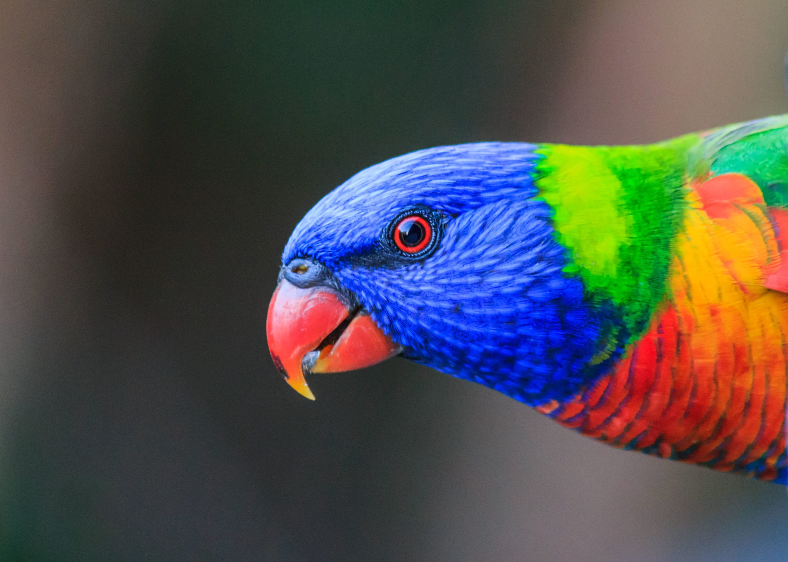

I've tried to get this same image transformation working at least three times now, but 
I can finally celebrate that it's working! I've been (re-)learning Julia and I still 
love the language, so it was time to take my learning to the next level and actually 
build a package.


<!--more-->


I've tried to get this same image transformation working at least three times now, but 
I can finally celebrate that it's working! I've been (re-)learning Julia and I still 
love the language, so it was time to take my learning to the next level and actually 
build a package.

For those not familiar, Julia is a much newer language than my daily-driver R, and with 
that comes the freedom to take a lot of good features from other languages and implement 
them. There are some features that R just won't ever get, but they're available in Julia and
they're very nice to use.

I've [written solutions](https://github.com/jonocarroll/ProjectEuler_Julia) to the first 20 
or so [Project Euler](https://projecteuler.net/) problems in Julia ... wow, 5 years ago.

More recently, I have solved the first 18 days of Advent of Code 2023 in Julia 
([my solutions](https://github.com/jonocarroll/advent-of-code/tree/main/2023/Julia/AdventOfCode2023.jl/src) 
are in a fork of a package that I'm not using, so they more or less run independently).

With those under my belt, I revisited a project I've tried to implement several times. I like 
the [low-poly look](https://www.pinterest.com.au/pin/528961918725401844/visual-search/?x=16&y=16&w=532&h=532&surfaceType=flashlight) and wanted to recreate it - it's just an image transformation, 
right? I'm even somewhat familiar with [Delaunay Triangulation](https://en.wikipedia.org/wiki/Delaunay_triangulation), or at least its dual the 
[Voronoi Tesselation](https://en.wikipedia.org/wiki/Voronoi_diagram) from my days building spatial maps 
of fishing areas.

It _sounds_ like a simple enough problem; choose some points all over the image, triangulate between 
all of them, then shade the resulting triangles with the average colour of the pixels they enclose.

I found this nice image of a [rainbow lorikeet](https://www.australiangeographic.com.au/topics/wildlife/2020/12/the-most-counted-aussie-bird-of-2020/) (these frequent my backyard)



so I got to work trying to chop it up into triangles.

Well, the naive approach _is_ simple enough, but it produces some terrible results. I've built that version into what I did eventually get working, and it's... not what I want


The problem is that by randomly selecting points across the image, you lose all the structure. With 
enough triangles you might recover some of that, but then you have a lot of triangles and lose that
low-poly vibe.

After much searching for a better way to do this, I found [this article](https://www.degeneratestate.org/posts/2017/May/24/images-to-triangles/) from 2017. It's 
a python approach, but I figured I knew enough Julia and Python now that I could try to make 
a 1:1 translation.

The first step is to get the random sampling working, because it allows me to start testing 
the triangulation parts quickly. Generating those is pretty clean

```julia
function generate_uniform_random_points(image::Matrix{RGB{N0f8}}, n_points::Integer=100)
    ymax, xmax = size(image)[1:2]
    rand(n_points, 2) .* [xmax ymax]
end
```

The triangulation itself is handled by `DelaunayTriangulation::triangulate()` - 
for once I'm happy that there's so much scientific/statistical support in Julia

```
rng = StableRNG(2)
tri = triangulate(all_points; rng)
```

Slightly trickier is figuring out which points are in which triangle. For that, I am 
thankful for `PolygonOps::inpolygon()`. With the pixels for each triangle identified, 
it was only a matter of averaging the R, G, and B channels to get the median colour.

I got that working, but with the results above - far from pleasant. The next, much harder step, 
was to weight the points towards the 'edges' of the image. I couldn't find an easy 
way to translate the python code for locally sampling the entropy (via `skimage`)

```python
filters.rank.entropy(im2, morphology.disk(entropy_width))
```

so I tried to build something of my own. I tried [edge-detection algorithms](https://juliaimages.org/stable/examples/contours/sujoy_edge_demo/) but 
I was clearly doing something wrong with it. Partly, I suspect, not doing the down-weighting
that the python version includes.

Since the pixels we want to up-weight are all along lines, choosing these at random can 
end up with several right next to each other, which we don't want. The python version does 
something a little clever - it selects one point, then reduces the weighting of the entire image
with a Gaussian around that point, so that nearby points are unlikely to also be selected.

In the end, I failed to find a good Julia alternative, but calling python code is (almost) as 
simple as `using PyCall; @pyimport skimage as skimage` (with slight modifications to use in a 
package, as I would later discover).

With that in place, I was able to successfully weight towards high-entropy regions; regions 
where a larger number of bytes are required to encode a histogram of the grayscale pixels, i.e. 
where there's a lot going on. The results are much more pleasing


Along the way I added some debug features, such as plotting the vertices and edges of the 
triangulation on top of the image


With the workflow more or less working, I ran some profiling to see if I could
speed it up. Unsurprisingly, generating the weighted points was one area where a
lot of time was spent, though it's not yet clear if that's because it's python
code or because that's genuinely one of the most complex parts of the code - my
best Julia alternative was to write my own short Shannon entropy function and
make it search locally with `ImageFiltering::mapwindow`

```julia
function shannon(w::AbstractMatrix)
   cm = collect(values(countmap(w))) / sum(size(w)) / 256
   sum([-x * log2(x) for x in cm])
end

mapwindow(shannon, image, (19, 19))
```

though, this creates a square subsampling, whereas the python version uses a nicer disk.

The profiling shows a lot of blank areas, and I'm not sure how to interpret those


I realised at this point that I actually didn't know how long the python version takes 
to run. I grabbed the [original source code](https://github.com/ijmbarr/images-to-triangles) 
and tried running it (after installing the relevant python packages) but it failed - 
some packages had changed their arguments and signatures since this was written. A couple 
of [small updates later](https://github.com/ijmbarr/images-to-triangles/compare/master...jonocarroll:images-to-triangles:master), [my fork](https://github.com/jonocarroll/images-to-triangles) 
now runs the code. It doesn't take terribly long to run - it doesn't display the image, 
it saves it, and I'm not sure if that's a factor. I (naively?) expected that the Julia 
version would be a lot faster, and I'm hopeful that there's performance I've left on the 
table.

If anyone is interested in playing with a small-ish Julia package, feel free to poke at 
this - it's definitely not being used for anything critical.

For now, I'm enjoying throwing images at this and getting some nice looking results


If you're interested in having a play with this package or helping to improve it, 
it's on [GitHub](https://github.com/jonocarroll/TriangulArt.jl) - I'm not planning 
to publish it to the registry any time soon, but that's perhaps something to look 
forward to in the future. For now, the main issues I see with this package are:

* The white border around the produced image remains - I have tried setting 
`margin=0mm` but that doesn't appear to help

* Performance is not as good as it can be, I suspect; the entropy calculation 
(calling python) is definitely a bottleneck.

* To speed up the processing, only every 10th pixel is used to determine the 
average colour of the triangle - this may fail to identify an entire triangle.

* CI - I generated this package in VSCode using `PkgTemplates` and it is the 
first Julia package I've built. CI failed immediately, so I've probably done 
something wrong.

* I am still somewhat of a beginner in Julia, so there are probably many places 
in which improvements can be made - feel free to suggest them!

As always, I can be found on [Mastodon](https://fosstodon.org/@jonocarroll) and 
the comment section below.

<br />
<details>
  <summary>
    <tt>devtools::session_info()</tt>
  </summary>
```{r sessionInfo, echo = FALSE}
devtools::session_info()
```
</details>
<br />
