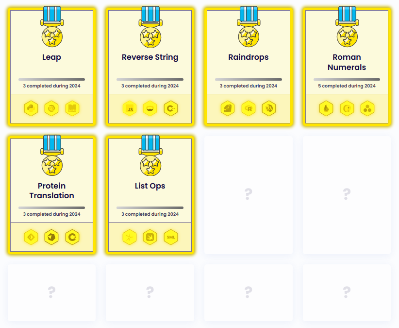
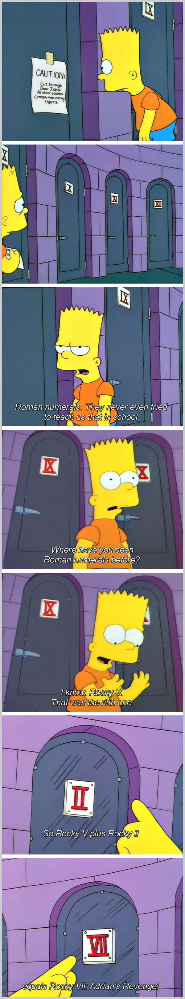

```{r, setup, include = FALSE}
knitr::opts_chunk$set(
  class.output  = "bg-success",
  class.message = "bg-info text-info",
  class.warning = "bg-warning text-warning",
  class.error   = "bg-danger text-danger"
)
```

With a serious yak shaving deviation, I have a really short "cheat" solution to 
one of the featured Exercism problems. It's been a really insightful journey 
getting to this point, and as always I've learned a lot along the way. The fact 
that I _was_ able to understand the required changes and propose them is thanks 
to the open-source nature of programming languages.

<!--more-->

With a serious yak shaving deviation, I have a really short "cheat" solution to 
one of the featured Exercism problems. It's been a really insightful journey 
getting to this point, and as always I've learned a lot along the way. The fact 
that I _was_ able to understand the required changes and propose them is thanks 
to the open-source nature of programming languages.

This all started out innocently enough - I've been using
[Exercism.org](https://exercism.org/) to get a feel for a lot of other
programming languages. Last year they hosted the 12in23 challenge where they
invited users to try out one programming language each month, solving 5
non-trivial (beyond printing `"Hello, World!"`) exercises in any of a handful of
featured languages, with a different 'theme' (functional, object-oriented,
low-level, ...) each month.

I ended up earning the "polyglot" badge for completing this, but I actually ended 
up doing a lot more


I found this to be an extremely useful exercise in finding out what I did and 
didn't like about different languages, and I'm diving a lot deeper into the ones 
I enjoyed the most. Worthwhile, but certainly an involved challenge as I solved 
all the exercises locally on my own machine, which means I had to install each 
of the languages and get their test suites working. My laptop is now capable of 
running code in more than 20 languages.

This year, Exercism are hosting a 48in24 challenge where rather than just
needing to use one language to solve several problems in a month, it's one
problem in three languages in a week. Spending a month to get up to speed with a
language I'd never seen (or installed) was one thing, but now I potentially need
to do that three times over in a week when the languages are all new to me. Still, I
persist, and so far I'm keeping up.



One of the featured problems was 'Roman Numerals' where we need to write an 
algorithm to convert integers into Roman numerals. The featured languages were Julia 
(I'm already familiar, nice), Elixir (fine, I get to learn what that looks like), and 
(Pharo) smalltalk, which needs its own IDE and is a workflow entirely distinct from 
anything I've done before. I won't be willingly writing any more smalltalk in the 
near future. 

When I saw that this was the challenge problem I was delighted - I know that R 
already has `as.roman()` in the standard library!

```{r}
as.roman(2024)
```

It even does math with these values - I base most of my real-life conversations with 
my wife around Simpsons quotes so I'm all-too familiar with this bit



Bart enters the backstage of the lion enclosure at a zoo and sees a sign:

> "Caution: exit through door 7 only. All other rooms contain man-eating tigers."

> "Think, Bart. Where have you seen Roman numerals before? I know... Rocky V! That was the fifth one. So, Rocky five plus Rocky two equals... Rocky VII! "Adrian's Revenge"!"

R can do this math just fine

```{r}
(five <- as.roman(5))
(two <- as.roman(2))
five + two
```

It's more than just concatenating those, of course

```{r}
(five + two) * 2
```

I downloaded the exercise and fired up RStudio. I edited the exercise template
to just pass the input argument to `as.roman()` and hit 'Run Tests'... all tests
failed 😢

Ah, `as.roman()` returns an object of class `roman`

```{r}
class(as.roman(321))
```

and the tests have an `expect_equal()` (not `expect_equivalent()`)

```r
test_that("48 is XLVIII", {
  expect_equal(roman(48), "XLVIII")
})
```

Okay, so it won't be _perfectly_ clean, but it just need to be re-classed

```{r}
as.character(as.roman(2024))
```

Re-run the tests, and... 

```
── Failure ('test_roman-numerals.R:105:3'): 3999 is MMMCMXCIX ──────────────────
roman(3999) not equal to "MMMCMXCIX".
1/1 mismatches
x[1]: NA
y[1]: "MMMCMXCIX"

[ FAIL 1 | WARN 0 | SKIP 0 | PASS 25 ]
```

What? twenty-five tests pass, one fails? And produces `NA`?

Back to the problem statement, it says

> For this exercise, we are only concerned about traditional Roman numerals, in which the largest number is MMMCMXCIX (or 3,999).

So, why does that fail? I checked the docs for `as.roman()` and it says

> Only numbers between 1 and 3899 have a unique representation as roman numbers, and hence others result in as.roman(NA).

Odd. 

I checked out some other languages. The intro video for the problem mentions another 
"cheat" solution which is to use Common Lisp, because that has a formatter. Using [GNU 
Common Lisp](https://www.gnu.org/software/clisp/)...

```{r, eval = FALSE}
(format nil "~@R" 2024)
```
```{r, eval = FALSE, class.source = "bg-success"}
"MMXXIV"
```

Trying out this last value works

```{r, eval = FALSE}
(format nil "~@R" 3999)
```
```{r, eval = FALSE, class.source = "bg-success"}
"MMMCMXCIX"
```

and a too-large value produces an informative error

```{r, eval = FALSE}
(format nil "~@R" 4000)
```
```{r, eval = FALSE, class.source = "bg-success"}
 The ~@R format directive requires an integer in the range 1 - 3999, not 4000
```

So, the limit does seem to be 3999, not 3899. Checking [Wikipedia](https://en.wikipedia.org/wiki/Roman_numerals), 
that also seems to be the case. I also found a [python implementation](https://www.oreilly.com/library/view/python-cookbook/0596001673/ch03s24.html) 
which goes up to 3999. 

So, why won't R convert those last 100 numbers?

I dug around the source code (an accessible copy is on [GitHub](https://github.com/wch/r-source) 
but the "real" copy is on SVN) and found several references to the 3899 limit, none 
of which could be circumvented.

I posted a quick summary of the issue I saw on [my side-blog](https://jcarroll.xyz/2024/02/10/friends-romans-countrymen.html) 
hoping that it was something I just misunderstood.

I asked around on Mastodon, and no one was sure why this was the case. The next step 
was to email the R-devel mailing list. I don't do this lightly, as it has a reputation 
for not being the friendliest place. Kurt Hornik, who originally wrote the 
implementation back in 2006 replied and agreed that it was probably just an oversight. 

He asked if I could file the bug in [Bugzilla](https://bugs.r-project.org/) the R bug tracker 
... and asked if I could also add a patch. At this point, I remembered what I was 
doing in the first place - solving an Exercism problem.


The term "Yak Shaving" means performing some task that appears entirely unrelated to 
what you were originally trying to do, usually as a result of several other related tasks. It's 
summarised well in this clip from the TV show 'Malcolm in the Middle'

<iframe width="560" height="315" src="https://www.youtube.com/embed/8fnfeuoh4s8?si=73eXUC2-vy9NC1q2" title="YouTube video player" frameborder="0" allow="accelerometer; autoplay; clipboard-write; encrypted-media; gyroscope; picture-in-picture; web-share" allowfullscreen></iframe>
<!-- https://youtu.be/8fnfeuoh4s8?si=73eXUC2-vy9NC1q2 -->

where the character goes to change a lightbulb but finds that the shelf is 
coming loose, so he gets a screwdriver from a drawer and notices that the drawer 
isn't running smoothly, so he gets some lubricant but it's empty so he gets in 
his car to go to the store to buy more but the car sounds funny, so he tries fixing that... 
When his wife asks him "are you going to replace that lightbulb" he yells - appearing 
from underneath the car covered in grease - "what does it look like I'm doing???".

The absurdity being that "before you can complete this task, you need to shave a yak."


In this scenario, someone is asking me "are you solving that Exercism problem?" and I'm 
emerging from a console typing `make check-devel` shouting "what does it look like 
I'm doing?".

So, how do I submit a patch to R itself? I recalled that I detailed some 
instructions for that the [last time I was trying to resolve an R-related bug](https://jcarroll.com.au/2019/10/12/r-bugs-file-info-object-size/). 
I pulled the bleeding-edge SVN commit and built R locally, which means

```bash
./configure --with-x=no --without-recommended-packages --disable-byte-compiled-packages --disable-java  
```

and

```bash
make -j4
```

to build the source (using 4 cores).

Then, I searched for the values I might need to change by running

```bash
grep -R 3890
```

This turns up a bunch of files

```
src/nmath/qnorm.c:                         2.04426310338993978564e-15 + 1.4215117583164458887e-7)*
src/library/utils/all.R:        if(upper > 3899L)
src/library/utils/all.R:            stop(gettextf("too many list items (at most up to %d)", 3899L),
src/library/utils/man/roman.Rd:  Only numbers between 1 and 3899 have a unique representation as roman
src/library/utils/man/roman.Rd:## simple consistency checks -- arithmetic when result is in  {1,2,..,3899} :
src/library/utils/man/format.Rd:    numerals (with the number of the last item maximally 3899).
src/library/utils/R/format.R:        if(upper > 3899L)
src/library/utils/R/format.R:            stop(gettextf("too many list items (at most up to %d)", 3899L),
src/library/utils/po/R-de.po:#~ msgid "too many list items (at most up to number 3899)"
src/library/utils/po/R-de.po:#~ msgstr "zu viele Listenelemente (höchstens 3899!)"
src/library/utils/po/R-fr.po:#~ msgid "too many list items (at most up to number 3899)"
src/library/utils/po/R-fr.po:#~ msgstr "trop d'entrées de liste (3899 maximum)"
src/library/utils/po/R-ja.po:#~ msgid "too many list items (at most up to number 3899)"
src/library/utils/po/R-ja.po:#~ msgstr " リストの項目が多すぎます（最大でも3899です） "
src/library/utils/po/R-zh_CN.po:#~ msgid "too many list items (at most up to number 3899)"
src/library/utils/po/R-zh_CN.po:#~ msgstr "串列项太多(最多只能有3899项("
src/library/utils/po/R-ru.po:#~ msgid "too many list items (at most up to number 3899)"
grep: src/library/utils/po/R-ru.po: binary file matches
src/library/stats/tests/ppr_test.csv:"153",0.0669524872438994,1,0.970846742038665
src/main/g_her_glyph.c:  /******** Hershey Glyphs 3800 to 3899 ********/
src/main/g_her_glyph.c:  /******** Oriental Hershey Glyphs 3800 to 3899 ********/
tests/d-p-q-r-tests.Rout: [1] 0.340823726 0.100413165 0.293668976 0.389968983 0.124439520 0.207270198
tests/reg-examples2.Rout:Zambia          0.16361 -0.07917 -0.33899  0.09406  0.228232  0.7482 0.512
tests/lm-tests.Rout.save:Zambia          0.16361 -0.07917 -0.33899  0.09406  0.228232  0.7482 0.512
tests/lm-tests.Rout:Zambia          0.16361 -0.07917 -0.33899  0.09406  0.228232  0.7482 0.512
tests/d-p-q-r-tests.Rout.save: [1] 0.340823726 0.100413165 0.293668976 0.389968983 0.124439520 0.207270198
tests/Examples/stats-Ex.Rout.save:[49]  0.29918521  0.05938999 -0.20355761 -0.02439309 -1.14548572 -0.94045141
tests/Examples/stats-Ex.Rout.save: 0.05510098  0.59958858  1.14407618  1.68856379  2.23305139  2.77753899 
tests/Examples/stats-Ex.Rout.save:9   0.7335126 -1.3468740  2.8138992
tests/Examples/stats-Ex.Rout:[49]  0.29918521  0.05938999 -0.20355761 -0.02439309 -1.14548572 -0.94045141
tests/Examples/stats-Ex.Rout: 0.05510098  0.59958858  1.14407618  1.68856379  2.23305139  2.77753899 
tests/Examples/stats-Ex.Rout:9   0.7335126 -1.3468740  2.8138992
```

Many of these I could ignore - float values which happen to match. But many were familiar 
from when I was digging through the source. 

I took the first of these `src/library/utils/all.R` and edited the value from 3899 to 3999 
then ran `svn status` and a lot of files were marked `?` (untracked) while none were 
`M` (modified). This confused me, until I realised that as part of the build process, R creates 
these `all.R` files which aren't the source-of-truth for the code. Changing, instead, 
`src/library/utils/R/format.R` the changes were reflected in `svn status`.

The `format` changes were from formatting functions I wasn't previously familiar with, namely 
`formatOL` for "format ordered list" which prefixes a list of items 

```{r}
formatOL(paste0("Chapter", 1:5))
```

and can do the conversion

```{r}
formatOL(paste0("Chapter", 1:5), type = "Roman")
```

and which produces an error if you try to pass in too many items (more than the critical value)

```{r, eval = FALSE}
formatOL(10:4010, type = "Roman")
```
```{r, eval = FALSE, class.source = "bg-danger"}
Error in formatOL(10:4010, type = "roman") : 
  too many list items (at most up to 3899)
```

In addition to the logic of the code itself, the .Rd files needed updating (base R does not 
use Roxygen and automatic generation of man files) and the `.po` files (language translations) 
with the translated error messages (which I hopefully corrected accurately; my French is okay-ish and 
that looks to be correct, and my Japanese is very beginner-level and I haven't yet learned those
words).

Since I had dug through the source, I knew that "3899" was not the only critical 
value; there were some tests for `x >= 3900` I needed to also take care of. This 
was a useful point to note - if you're going to change behaviour at a numeric 
boundary, it's probably a good idea to stick to either strictly greater than or
greater-than-or-equal if you want to make searching for that value straightforward.

Searching again for `3900` again turns up a lot of false positives, but also

```
src/library/utils/R/roman.R:    if(check.range) x[x <= 0L | x >= 3900L] <- NA
src/library/utils/R/roman.R:    ind <- is.na(x) | (x <= 0L) | (x >= 3900L)
```

so I edited those as well.

Producing the requisite patch is then just

```bash
svn diff > as.roman-upper-limit.patch
```

creating the file I eventually attached to my Bugzilla report.

Kurt Hornik approved these changes and merged them on my behalf (only R-core
members can merge into the source) so my changes should be reflected in the next
release.

To prove to myself that this was done and dusted, I wanted to pull the latest 
version again, but I didn't want to risk that my local changes were what I was seeing. 
Docker is a good option in this case (and may have been for the development itself).

Beyond my previous instructions, I figured there were more up-to-date instructions out there. 
[This](https://kbroman.org/blog/2020/12/03/debugging-with-docker-and-r-devel/) 
is a slightly newer post about the process, but I eventually just copied the 
[Dockerfile from rocker's drd image](https://github.com/rocker-org/drd/blob/master/Dockerfile) and built the 
most up-to-date image locally. This means that I was definitely running an independent installation of R 
(in docker) and not my local copy (still distinct from my installed copy that RStudio sees).

Using this docker image, I could confirm that my changes had been merged

```{r, eval = FALSE}
 as.roman(3999)
```
```{r, eval = FALSE, class.source = "bg-success"}
[1] MMMCMXCIX
```

as well as the necessary translations; I noticed that a simple `Sys.setenv(LANGUAGE="ru")`
worked once, but after that I couldn't change the language again. The `{and}` package 
seemed to do the trick

```{r, eval = FALSE}
formatOL(1:4000, type = "roman")
```
```{r, eval = FALSE, class.source = "bg-danger"}
Error in formatOL(1:4000, type = "roman") : 
  too many list items (at most up to 3999)
```

```{r, eval = FALSE}
and::set_language("ru")
formatOL(1:4000, type = "roman")
```
```{r, eval = FALSE, class.source = "bg-danger"}
Ошибка в formatOL(1:4000, type = "roman") :
  слишком много элементов в списке (самое большее 3999)
```

```{r, eval = FALSE}
and::set_language("fr")
formatOL(1:4000, type = "roman")
```
```{r, eval = FALSE, class.source = "bg-danger"}
Erreur dans formatOL(1:4000, type = "roman") : 
  trop d'entrées de listes (3999 maximum)
```

```{r, eval = FALSE}
and::set_language("ja")
formatOL(1:4000, type = "roman")
```
```{r, eval = FALSE, class.source = "bg-danger"}
 formatOL(1:4000, type = "roman") でエラー: 
   リストの項目が多すぎます (最大でも 3999 です) 
```

```{r, eval = FALSE}
and::set_language("de")
formatOL(1:4000, type = "roman")
```
```{r, eval = FALSE, class.source = "bg-danger"}
Fehler in formatOL(1:4000, type = "roman") : 
  zu viele Listenpunkte (höchstens 3999)
```

```{r, eval = FALSE}
and::set_language("zh_CN")
formatOL(1:4000, type = "roman")
```
```{r, eval = FALSE, class.source = "bg-danger"}
Error in formatOL(1:4000, type = "roman") : 列表项太多(最多只能有3999项)
```

With all looking good on the R side, now I just need to wait for the changes to 
be officially released and then for Exercism to update their version to that so 
that I can submit my "cheat" one-line solution to the Roman Numerals exercise.

I'll be waiting!

I'm hoping that the process described here can be of use to someone else who finds 
a similar issue in the language; the process can be fairly straightforward, but I 
believe success was dependent on a few key points;

* don't _assume_ that the language is broken, it may be something you did wrong or 
misunderstood

* look through the source to confirm what you're seeing and do your best to 
understand it

* ask around; someone may be able to resolve the confusion or point you in the 
right direction

* "it takes a village" - if you want it to get fixed, you might need to put in 
some work.

This definitely ended up being more of an exercise than I planned, but I'm grateful 
for Exercism prompting me to try out both languages I do and don't know; for R being 
open-source so I could find this bug; and for the wealth of knowledge out there 
to figure out how to do all this.

If you have any comments, feel free to use the comment section below, or hit me up on 
[Mastodon](https://fosstodon.org/@jonocarroll).

<br />
<details>
  <summary>
    <tt>devtools::session_info()</tt>
  </summary>
```{r sessionInfo, echo = FALSE}
devtools::session_info()
```
</details>
<br />
