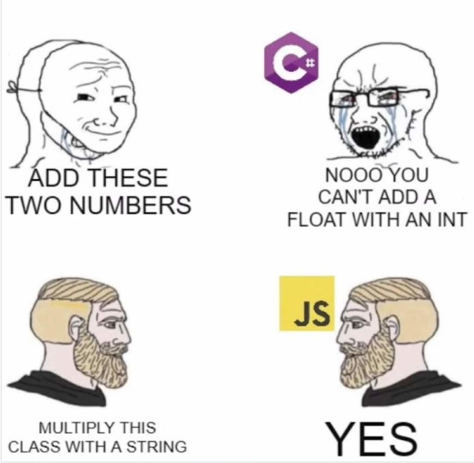

```{r, setup, include = FALSE}
knitr::opts_chunk$set(
  class.output  = "bg-success",
  class.message = "bg-info text-info",
  class.warning = "bg-warning text-warning",
  class.error   = "bg-danger text-danger"
)
```

I heard that learning Elm is a good way to approach learning Haskell, so I gave
it a go and was surprised early on about an approach to writing abstracted HTML.
In this post I compare the way that R and Elm generate HTML and the differences
between their approaches.

<!--more-->

I heard that learning Elm is a good way to approach learning Haskell, so I gave
it a go and was surprised early on about an approach to writing abstracted HTML.
In this post I compare the way that R and Elm generate HTML and the differences
between their approaches.

I was listening to the Linux Dev Time podcast based on a recommendation and this episode 
([episode 100](https://www.linuxdevtime.com/linux-dev-time-episode-100/)) was about 
"how many different programming languages should you learn?"

One suggestion in amongst the interesting discussions was that "if you want to 
learn Haskell, start by learning Elm, because Elm uses Haskell syntax but it 
removes most of the most difficult concepts in Haskell."

I've been trying to learn Haskell this year, building on some intermittent
exposure to it in the last couple of years and partly because I joined a local
functional programming meetup group which is fortunate enough to have some
Haskell developers. I've read the first few chapters of 
['Learn You a Haskel for Great Good!'](https://www.learnyouahaskell.com/) and Haskell is a [supported track on Exercism](https://exercism.org/tracks/haskell). As you can see 
from my
[summary of complete exercises](https://github.com/jonocarroll/exercism-solutions) 
Haskell is the language I've solved the most exercises in, followed very closely by R.

Haskell definitely feels like an academic language - even reading other people's
solutions to puzzles and code problems I find myself struggling to understand
both the somewhat unique syntax and the approach at the same time. The fact that
there is no if-else construct in Haskell means a lot of pattern matching, and
the fact that there are no loops means a lot of recursion. All arguments to 
functions are whitespace separated, so the expression `add 1 2` is a call 
of the function `add` with arguments `1` and `2` meaning that parentheses are 
frequently required, or other specific syntax quirks.

Rust (another language I've spent quite a bit of time learning) lists Haskell as
[one of its influences](https://doc.rust-lang.org/reference/influences.html) and 
that becomes quite apparent once you see the keyword `deriving` (for typeclasses) 
in both languages, e.g. https://book.realworldhaskell.org/read/using-typeclasses.html

But Rust doesn't use Haskell syntax, and isn't nearly as 'pure' (lacking side-effects).

The advice to start with Elm sounded like it came from a good place, and seemed
reasonable.

[Elm is also one of the languages offered on Exercism](https://exercism.org/tracks/elm) 
but again referring to my summary, I haven't done much at all with it - the introduction 
'hello, world' exercise and one other. That at least means I installed it locally 
and got the toolchain working, but I certainly wasn't familiar at all. 
[My solution](https://github.com/jonocarroll/exercism-solutions/blob/main/elm/allergies/src/Allergies.elm) 
to the problem that I did solve involved a big if-else block.

I like learning languages (can you tell?) so I figured I'd give it a fair go and 
started reading [Elm in Action](https://www.manning.com/books/elm-in-action) by 
Richard Feldman. As well as an Elm core member, Richard is the author of the 
[Roc language](https://www.roc-lang.org/) which is built in Rust and aims to be 
better than both Elm and Rust in the sense of being a "fast, friendly, functional language" 
with specific emphasis on each of the words in that phrase. I do plan to learn 
more Roc as well, but for now I'm focussed on gaining a better understanding of 
Haskell via Elm, so back to Elm...

Elm isn't a new language - it first appeared in 2012 - but it's also considered 
somewhat "stable" in that there haven't been any big changes to it for a few 
years. Some people seem to rush to the conclusion that a language not in a 
constant state of change is "dead" or "stale", but the author (of the language/compiler)
[makes it clear](https://github.com/elm/compiler/blob/master/roadmap.md) that 

> If you like what you see now, that's pretty much what Elm is going to be for a while.

I have no problem with that.

Elm comes with a REPL, something I find extremely helpful for playing with a new
language. One of the big surprises was how good the error messages are. Trying to 
do something like adding a number and string produces an explanation of what 
is wrong

```
> 1 + "a"
-- TYPE MISMATCH ---------------------------------------------------------- REPL

I cannot do addition with String values like this one:

3|   1 + "a"
         ^^^
The (+) operator only works with Int and Float values.

Hint: Switch to the (++) operator to append strings!
```

not a screen full of stack traces (I'm looking at you, JVM languages).

I think of Rust's error messages as the most helpful; pointing out not only 
_what_ went wrong, but a link to documentation explaining that pattern, and often 
a code suggestion for how to fix it. The tooling can even 'auto fix' some of those
errors when it's clear what the code _should_ have been. Roc aims to have even 
better error messages than both of these - a high bar, but fantastic to aim for.

I have tended towards dynamic languages (R being one of them) where classes of 
variables might be coerced, promoted, or combined sensibly. Not every language 
supports that, and for good reason - I've definitely seen the value in strongly 
typed languages preventing the need for defensive coding such as a huge block 
of assertions at the top of every function to make sure what's passed in actually 
makes sense. Some languages are less fussy...



I started following along Elm in Action - properly following along; not just reading 
and pretending to take things in like I've done all too many times with technical 
books. I had the REPL open and played around with what I could do as I was 
reading about each example.

One of the things this book gets right is to get to building something early on. A 
common complaint about Haskell books is that, since IO is a bit complicated in a 
language where functions are 'pure' and have no side-effects such as input and output, 
actually building even a 'hello, world' program tends to show up pretty late. Within 
Chapter 2 of Elm in Action we're building a website. Kudos on that one. 

One of the first examples was to output some HTML for a static site. 
This is, of course, an overly simple starting point and one could absolutely say 
that Elm isn't required for this part, but it fits in nicely with what comes next - 
making the site interactive.

I'm old enough that in high school we had a class where we wrote a website. I don't 
mean "built" one with some framework or package, I mean opening a text file and writing 
out the HTML to be rendered in a browser (Netscape). This wasn't state-of-the-art design, but 
it gave me a reasonable introduction to the essentials of HTML markup.

The example code in Elm for the static site is

```
div [ class "content" ]
    [ h1 [] [ text "Photo Groove" ]                           
    , div [ id "thumbnails" ]                                 
        [ img [ src "http://elm-in-action.com/1.jpeg" ] []
        , img [ src "http://elm-in-action.com/2.jpeg" ] []
        , img [ src "http://elm-in-action.com/3.jpeg" ] []
        ]
    ]
```

which might need some unpacking. This is a call of the function `div` which takes two 
arguments; a list containing a call to `class` with an argument `"content"`, and 
a list containing a call to `h1` and its 2 arguments (an empty list and a call to 
`text` with a string argument), and another call to `div` and its arguments.

What blew my mind here was not that `div` and `h1` were functions - I'm familiar 
with doing that in R via {htmltools}. Joe Cheng makes the claim in his 
[rstudio::conf(2022) talk](https://youtu.be/HpqLXB_TnpI&t=1720) that "R is a 
bizarrely good host language for Shiny" (R's interactive web framework) _because_ 
of the nature of positional and named arguments. It translates quite well to 
HTML.

But the Elm code doesn't use named arguments (it doesn't have those, though you 
_could_ use a record as an argument and get that effect if you needed to); every 
function in the Html module that creates elements takes two arguments, either of 
which may be empty (`[]`); a list of attributes, and a list of child nodes.

So, `class` is _also_ a function here, taking a string argument.

I suspect I've spent _too_ long working with strings instead of types. The thing 
that represents a class should definitely be an object of type 'class', and the 
thing that represents some text should be of a different type - 'text'. All of this 
strong typing gets around the all-too-common problem of passing in a value to an 
R function as a string and having it used in unexpected ways...

Spot the difference:

```{r}
nchar("😀😀😀", "char")
nchar("😀😀😀", "byte")

nchar(c("😀😀😀", "char"))
nchar(c("😀😀😀", "byte"))
```

Enums get you a bit closer to not using strings to represent unique things, without 
going all-in on types, but R doesn't really have enums that are useful in that way. 
[I do wish it did](https://jcarroll.xyz/2024/06/06/enums-in-r.html).

One might have expected an error here - it might have saved a headache or two 

```{r}
nchar(100)
nchar(1000)
nchar(10000)
nchar(100000)
nchar(1000000)
```

(to see why this happens, try entering the numbers into a console)

So, how would I write the HTML generating code in R?

```{r, eval = FALSE}
library(htmltools)

body <- div(class = "content", 
            h1("Photo Groove"),
            div(id = "thumbnails",
                img(src = "http://elm-in-action.com/1.jpeg"),
                img(src = "http://elm-in-action.com/2.jpeg"),
                img(src = "http://elm-in-action.com/3.jpeg")
            )
)

body
```

```{r, eval = FALSE, class.source= "bg-success"}
<div class="content">
  <h1>Photo Groove</h1>
  <div id="thumbnails">
    
    
    
  </div>
</div>
```

If I ran `browsable(body)` in RStudio I'd get a rendered view of that HTML, i.e.


The construction of HTML attributes and child nodes gels nicely with R syntax.

Compiling the Elm code and inspecting the output I get exactly that HTML in the 
source, along with the reason it's more complicated than that; the source contains 
the entire Elm runtime, needed for building interactive elements. Elm compiles 
down to Javascript, but since it's strongly typed it prevents a lot of issues from 
ending up in the final product, in the same way that Typescript aims to.

If I wanted to interact with the images (Elm in Action walks through using these 
images as thumbnails and opening a larger version alongisde, depending on which 
one is clicked on) I'd need to write some Javascript into the body and/or use an 
entire runtime like Shiny to handle the effects.

I was a little shocked when I saw the paragraph

> Back in the Wild West days of the web, it was common to store application state primarily in the DOM itself. Is that menu expanded or collapsed? Check whether one of its DOM nodes has class="expanded" or class="collapsed". Need to know what value a user has selected in a drop-down menu? Query it out of the DOM at the last possible instant.


But... that's how I thought it was supposed to be done. I'm not a front-end dev, 
that's for sure. I suppose I'm also old.

['The Elm Architecture'](https://guide.elm-lang.org/architecture/) involves
passing messages around in a somewhat object-oriented way (at least reminiscent
of smalltalk) but those messages are created and received by pure functional
code - the runtime itself is not pure (and can communicate with the outside world
via the browser) but that's considered 'tested' and any code the user writes in
Elm still follows the pure functional paradigm.

On top of all of that, it makes for (surprisingly?) [super fast performance](https://elm-lang.org/news/blazing-fast-html).

This also means that functions can be tested, since the functions will be free 
of side-effects. This is so well received that it's endorsed by 
[RATatui](https://ratatui.rs/concepts/application-patterns/the-elm-architecture/) 
for building Rust terminal user interfaces.

I'm still early in the process of learning Elm, but I can definitely see that it's 
a more beginner-friendly way to ease into Haskell, and who knows, maybe I'll build 
a front-end to something. I'm curious if there's any surface area for interop 
with some of the other languages I know.

I wasn't expecting to be surprised by function layout quite so quickly, but I 
think that's part of the benefit of learning several languages (once you're very
familiar with one to start with) - little differences with deep reasonings for them.

If you have comments, suggestions, or improvements, as always, feel free to use
the comment section below, or hit me up on
[Mastodon](https://fosstodon.org/@jonocarroll).

<br />
<details>
  <summary>
    <tt>devtools::session_info()</tt>
  </summary>
```{r sessionInfo, echo = FALSE}
devtools::session_info()
```
</details>
<br />
