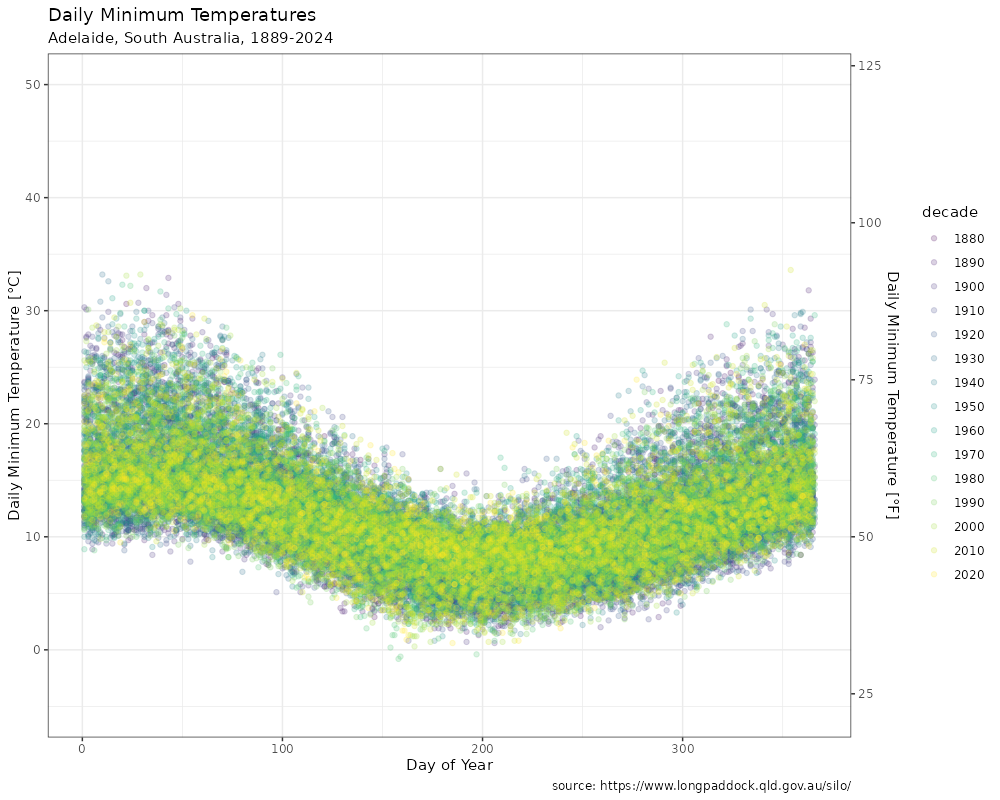
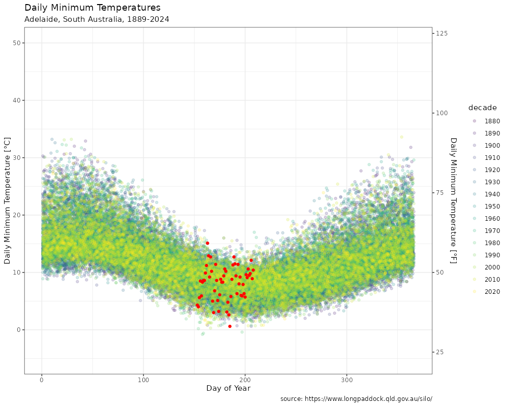
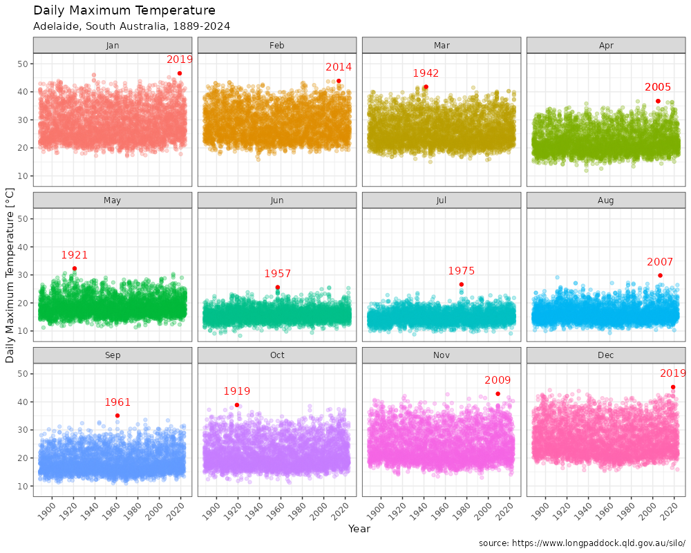
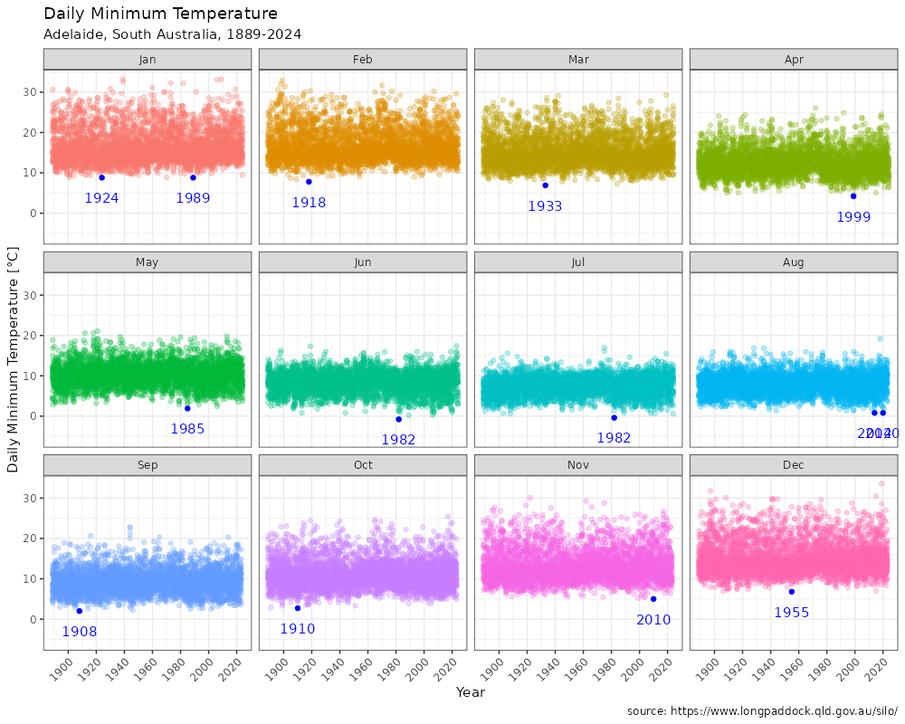

```{r, setup, include = FALSE}
knitr::opts_chunk$set(
  class.output  = "bg-success",
  class.message = "bg-info text-info",
  class.warning = "bg-warning text-warning",
  class.error   = "bg-danger text-danger"
)
```

```{r, echo = FALSE}
silo_data <- readRDS("~/Projects/ADLweather/2024/adl_silo_data.rds")
ngayirdapira <- readRDS("~/Projects/ADLweather/2024/ngayirdapira.rds")
adl_stations <- readRDS("~/Projects/ADLweather/2024/adl_stations.rds")
```

A while ago I made some plots I really liked, but I never made a blog post 
about them. Then the data source stopped working and I couldn't make them 
again. Now there's a new data source, so it's time for a post about some 
weather data!

<!--more-->

A while ago I made some plots I really liked, but I never made a blog post 
about them. Then the data source stopped working and I couldn't make them 
again. Now there's a new data source, so it's time for a post about some 
weather data!

Way back in the mid 2010s I was interested in getting my hands on some weather
data to answer a question I had. In Australia we have the Bureau of Meteorology
(["don't call it 'the bom'"](https://www.abc.net.au/news/2022-10-19/bureau-meteorology-rebrand-cost-200-thousand/101552620))
which has been keeping track of weather data for a very long time (on the scale
of colonial Australia). They don't have an official API to get to that data,
they have a website that doesn't use HTTPS - if you _have_ a link to a page on
their site and try to visit in in any modern browser which assumes you want to
use HTTPS, you'll see this page


then be redirected to the landing page, regardless of where your link was trying
to send you. They _are_ working on improving this, and there's a new
[https://beta.bom.gov.au/](https://beta.bom.gov.au/) which notes it's a test
website.

That rant aside, if you wanted some temperature data, you clicked your way
through the interface on the website to specify a station and some settings, and
eventually were presented with a tabular output of the data and the ability to
export it as a .zip file containing an actual .csv plus a note file.

At the time, I was aware of a BoM-related R package `{bomrang}` by Adam Sparks,
which began life at the rOpenSci AUUnconf in Brisbane, 2016 where I had the
pleasure of meeting him. It didn't have access to the weather data the way I 
wanted, but it had a lot of other cool functionality such as finding the closest 
station and fetching forecasts, radar imagery, and bulletins. I wasn't able to 
use a package to get the data I wanted, so I had to figure something out myself.

I realised that the generated URL to that .zip file was parameterized, involving
the station id, and some codes presumably representing what type of data was
being fetched (temperature, rainfall, ...). The codes themselves weren't
documented on the site, they were most likely only for internal use, but if I
knew which one I wanted, I probably had enough information to get the full URL.
With a bit of tinkering, I figured out the meaning of one of the codes (rain =
136, min_temp = 123, max_temp = 122, solar = 193) and could specify which one I
wanted. There was still one more code in the URL, and I found a way to decode
that via an additional URL query, at which point I could build the entire URL.

After that, I could programatically unpack the .zip with `utils::unzip()` and 
read in the .csv data. Thus, `bomrang::get_historical_weather()` was forged and 
introduced [via a pull request](https://github.com/ropensci-archive/bomrang/pull/68).

Fast forward to 2021 and this function started failing - the data was available 
just fine via a browser, but was returning an error in R/RStudio. It turned out 
that changing the user-agent allowed for a brief period of access, but eventually 
the official statement was released

> The Bureau is monitoring screen scraping activity on the site and will
commence interrupting, and eventually blocking, this activity on www.bom.gov.au
from Wednesday, 3 March 2021

and there was no way to get to the data nicely. This was extremely frustrating, 
especially since we (taxpayers) technically pay for this data.

All was not lost, however - Adam continued to develop package infrastructure and 
found a new resource in the form of [SILO](https://www.longpaddock.qld.gov.au/silo/). 
Adam built a new package {weatherOz} and submitted a paper to [JOSS](https://joss.theoj.org/papers/10.21105/joss.06717) 
including all the original authors as contributors to both - I can't claim to have 
contributed to the new package, so I'm somewhat hopeful that a detailed blog post 
can help repay some of that kindness.

`{weatherOz}` has now been accepted onto [CRAN](https://cran.r-project.org/package=weatherOz) 
([announcement]( https://rstats.me/@adamhsparks/112855926571892452)) and so can be installed with

```{r, eval = FALSE}
install.packages("weatherOz")
```

Adam also has a nice blog post exploring some temperature data 
[here](https://adamhsparks.netlify.app/2024/06/02/plotting-perth-month-of-may-high-temperatures-with-weatheroz/).

Now it's my turn!

```{r, eval = FALSE}
library(weatherOz)
```

There are many weather stations within capital cities, so I need to narrow down 
to just one. I can get the station information from SILO with

```{r, eval = FALSE}
adl_stations <- get_stations_metadata(station_name = "Adelaide", which_api = "silo")
```

```{r}
adl_stations
```

and I can select one of those - the station with code 023000 has a lot of data

```{r, eval = FALSE}
ngayirdapira <- adl_stations[adl_stations$station_code == "023000", ]
```

```{r}
dplyr::glimpse(ngayirdapira)
```

The listed start date of the data is `r ngayirdapira$start` but trying to use 
that produces an error. I'll start from the listed year of SILO data (1889).

Getting the actual data from SILO doesn't technically need an API key, it just
wants to know who is fetching the data, so asks that you use an email address as
the key. I have that set as an environment variable. I'm also saving the data to
disk since I don't want to fetch it every time I edit this post as I'm writing
it.

```{r, eval = FALSE}
silo_data <- get_patched_point(
  station_code = ngayirdapira$station_code,
  start_date = "1889-01-01",
  end_date = ngayirdapira$end,
  values = "all",
  api_key = Sys.getenv("SILO_API_KEY")
)
saveRDS(silo_data, file = "adl_silo_data.rds")
```

There's a lot of data here - along with the (air) temperature min and max, there
are other measurements that I'm not interested in at the moment.

```{r}
dplyr::glimpse(silo_data)
```

That's `r format(nrow(silo_data), big.mark = ",")` daily weather observations 
covering the last 135 or so years!

I'll add some convenience columns; the day of the year, the decade, and the 
abbreviation for the month.

```{r}
silo_data$doy <- lubridate::yday(silo_data$date)
silo_data$decade <- cut(silo_data$year, 
                        breaks = seq(1880, 2030, by = 10), 
                        right = FALSE, 
                        labels = seq(1880, 2020, by = 10))
silo_data$monthabb = factor(month.abb[silo_data$month], levels = month.abb)
```

My original motivation for getting any of this data was Christmas 2016 - I live in 
the southern hemisphere so I get to enjoy Christmas in summer (despite being 
inundated with snowy imagery and having to explain to my kids why none of it is 
relevant here).

We still partake in some of the northern hemisphere traditions like a roast lunch 
and warm puddings for dessert, but we complement that with some cold, fresh prawns 
and some cold beers.

2016 was a particularly hot Christmas day, and I wanted to know how it compared
historically. It's not uncommon, I suppose, for someone in the USA to note that
it was 40 degrees on Christmas (40&deg;F = 4&deg;C) but here it was also
expected to hit 40... Celsius. 40&deg;C = 104&deg;F.

We can find all the entries in the silo data where it was 40&deg;C or more on 
Christmas day

```{r}
silo_data |> 
  dplyr::filter(air_tmax >= 40, month == 12, day == 25) |> 
  dplyr::select(date, air_tmin, air_tmax)
```

So, those were the hottest, but were they exceptional for that time of year?

I originally produced these plots using the (now superseded) `{bomrang}` package, 
and now that I had a useful replacement, I wanted to recreate and update them with 
some new data.

These plots aren't terribly fancy; they show the min or max temperature for each 
day of the year, coloured by the decade. They demonstrate the range of temperature 
variation throughout the year, but aren't super useful for extracting information 
necessarily - squint to see the general pattern.

```{r, eval = FALSE}
library(ggplot2)

ggplot(silo_data) +
  geom_point(aes(x = doy, y = air_tmax, col = decade), alpha = 0.2)  +
  theme_bw() +
  labs(
    title = "Daily Maximum Temperatures",
    subtitle = "Adelaide, South Australia, 1889-2024",
    caption = "source: https://www.longpaddock.qld.gov.au/silo/",
    y = "Daily Maximum Temperature [°C]",
    x = "Day of Year"
  ) +
  scale_y_continuous(
    limits = c(-5, 50),
    sec.axis = sec_axis( ~ . * 9 / 5 + 32, name = "Daily Maximum Temperature [°F]")
  ) +
  viridis::scale_color_viridis(discrete = TRUE)
```


The same for the minimum temperatures:

```{r, eval = FALSE}
pmin <- ggplot(silo_data) +
  geom_point(aes(x = doy, y = air_tmin, col = decade), alpha = 0.2)  +
  theme_bw() +
  labs(
    title = "Daily Minimum Temperatures",
    subtitle = "Adelaide, South Australia, 1889-2024",
    caption = "source: https://www.longpaddock.qld.gov.au/silo/",
    y = "Daily Minimum Temperature [°C]",
    x = "Day of Year"
  ) +
  scale_y_continuous(
    limits = c(-5, 50),
    sec.axis = sec_axis( ~ . * 9 / 5 + 32, name = "Daily Minimum Temperature [°F]")
  ) +
  viridis::scale_color_viridis(discrete = TRUE)
pmin
```



This winter (middle of the year here) feels like it's been particularly cold - but 
is it colder than usual? I saw someone demonstrate a feature of `{ggplot2}` that 
I haven't previously made good use of; the `data` argument to a `geom` can take a 
formula for a function as long as the result of that is another `data.frame`, so 
a `filter` or `head` or `slice` operation works great here.

I'll add in the points for June onward this year in <span style='color: #FF0000;'>red</span>:

```{r, eval = FALSE}
pmin +
  geom_point(
    data = ~ dplyr::filter(.x, year == 2024, month > 5),
    aes(x = doy, y = air_tmin),
    col = "red"
  )
```



Definitely one particularly cold day there - it got as low as -5&deg;C in some places.

In order to see how the temperatures have changed over the years, I also split out 
the data for each month and plotted the max/min for every day in the month for each 
year - this nicely shows that the spread is a lot tighter in winter and the days in 
our summer are a lot more variable. Again I'm using the helpful `data = ~f(.x)` pattern, 
this time with `dplyr::slice_max()`.

```{r, eval = FALSE}
ggplot(dplyr::arrange(silo_data, monthabb), aes(x = year, y = air_tmax)) +
  geom_point(aes(col = factor(monthabb)), alpha = 0.3, show.legend = FALSE) +
  geom_point(
    data = ~ dplyr::slice_max(.x, air_tmax, n = 1, by = monthabb),
    aes(x = year, y = air_tmax),
    col = "red"
  ) +
  geom_text(
    data = ~ dplyr::slice_max(.x, air_tmax, n = 1, by = monthabb),
    aes(x = year, y = air_tmax + 5, label = year),
    col = "red"
  ) +
  facet_wrap( ~ monthabb) +
  labs(
    title = "Daily Maximum Temperature",
    subtitle = "Adelaide, South Australia, 1889-2024",
    caption = "source: https://www.longpaddock.qld.gov.au/silo/",
    x = "Year",
    y = "Daily Maximum Temperature [°C]"
  ) +
  theme_bw() +
  scale_x_continuous(breaks = seq(1880, 2030, 20)) +
  ggeasy::easy_rotate_x_labels(angle = 45, side = "right")
```



The same for the minimum temperatures:

```{r, eval = FALSE}
ggplot(dplyr::arrange(silo_data, monthabb), aes(x = year, y = air_tmin)) +
  geom_point(aes(col = factor(monthabb)), alpha = 0.3, show.legend = FALSE) +
  geom_point(
    data = ~ dplyr::slice_min(.x, air_tmin, n = 1, by = monthabb),
    aes(x = year, y = air_tmin),
    col = "blue"
  ) +
  geom_text(
    data = ~ dplyr::slice_min(.x, air_tmin, n = 1, by = monthabb),
    aes(x = year, y = air_tmin - 5, label = year),
    col = "blue"
  ) +
  facet_wrap( ~ monthabb) +
  labs(
    title = "Daily Minimum Temperature",
    subtitle = "Adelaide, South Australia, 1889-2024",
    caption = "source: https://www.longpaddock.qld.gov.au/silo/",
    x = "Year",
    y = "Daily Minimum Temperature [°C]"
  ) +
  theme_bw() +
  scale_x_continuous(breaks = seq(1880, 2030, 20)) +
  ggeasy::easy_rotate_x_labels(angle = 45, side = "right")
```



I'm very pleased that I'm once again able to query weather data for my country, 
and am deeply grateful to Adam Sparks for building and maintaining `{weatherOz}`.

If you have comments, suggestions, or improvements, as always, feel free to use
the comment section below, or hit me up on
[Mastodon](https://fosstodon.org/@jonocarroll). Also let me know if you can think 
of (or make) some remix or other visualization of this data!

Stay cool/warm/comfortable!

<br />
<details>
  <summary>
    <tt>devtools::session_info()</tt>
  </summary>
```{r sessionInfo, echo = FALSE}
devtools::session_info()
```
</details>
<br />
