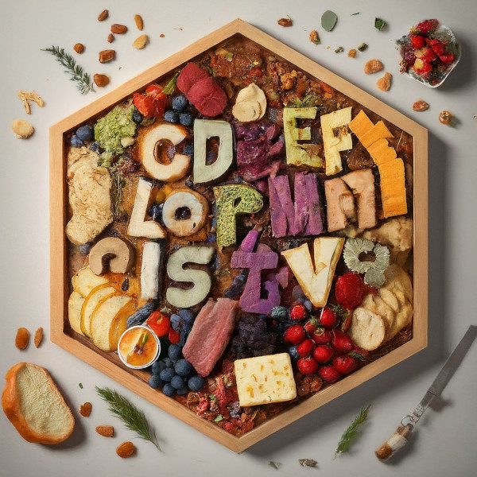

```{r, setup, include = FALSE}
library(charcuterie)

knitr::opts_chunk$set(
  class.output  = "bg-success",
  class.message = "bg-info text-info",
  class.warning = "bg-warning text-warning",
  class.error   = "bg-danger text-danger"
)
```

I've been using a lot of programming languages recently and they all have their 
quirks, differentiating features, and unique qualities, but one thing most of 
them have is that they handle strings as a collection of characters. R doesn't, 
it has a "character" type which is 0 or more characters, and that's what we call 
a "string", but what if it _did_ have iterable strings?

<!--more-->

I've been using a lot of programming languages recently and they all have their 
quirks, differentiating features, and unique qualities, but one thing most of 
them have is that they handle strings as a collection of characters. R doesn't, 
it has a "character" type which is 0 or more characters, and that's what we call 
a "string", but what if it _did_ have iterable strings?

For comparison, here's some Python code

```python
for i in "string":
    print(i)

```
```{r, eval = FALSE, class.source= "bg-success"}
s
t
r
i
n
g
```

and some Haskell

```haskell
upperA = map (\c -> if c == 'a' then 'A' else c)
upperA "banana"
```
```{r, eval = FALSE, class.source= "bg-success"}
"bAnAnA"
```

and some Julia

```julia
[x+1 for x in "HAL"]
```
```{r, eval = FALSE, class.source= "bg-success"}
3-element Vector{Char}:
 'I': ASCII/Unicode U+0049 (category Lu: Letter, uppercase)
 'B': ASCII/Unicode U+0042 (category Lu: Letter, uppercase)
 'M': ASCII/Unicode U+004D (category Lu: Letter, uppercase)
```

In each of these cases the string is treated as a collection of individual 
characters. Many languages make this distinction, going so far as using different 
quotes to distinguish them; e.g. double quotes for strings `"string"` and single 
quotes for individual characters `'s'`. This makes a even more sense when the 
language supports _types_ in that a string has a `String` type that is composed 
of 0 or more `Char` types.

R is dynamically typed, so we don't strictly enforce type signatures, and is an 
array language, so it has natural support for arrays (vectors, lists, matrices). 
So why are strings not collections of characters? 

My guess is that for the majority of use-cases, it wasn't necessary - a lot of
the time when we read in text data we want the entirety of the string and don't
want to worry about dealing with a collection on top of the collection of strings
themselves. Plus, if you really need the individual characters you can split the
text up with `strsplit(x, "")`.

But if you _do_ want to work with individual characters, calling 
`strsplit(x, "")[[1]]` throughout your code gets ugly. I solved the Exercism 
problem 'Anagram' in R and really didn't like [how it looked](https://exercism.org/tracks/r/exercises/anagram/solutions/jonocarroll)

```{r}
anagram <- function(subject, candidates) {
  # remove any same words and inconsistent lengths
  nonsames <- candidates[tolower(candidates) != tolower(subject) & 
                           nchar(subject) == nchar(candidates)]
  if (!length(nonsames)) return(c()) # no remaining candidates
  s_letters <- sort(tolower(strsplit(subject, "")[[1]]))
  c_letters <- sapply(sapply(nonsames, \(x) strsplit(x, "")), sort, simplify = FALSE)
  # find all cases where the letters are all the same
  anagrams <- nonsames[sapply(c_letters, \(x) all(s_letters == tolower(x)))]
  # if none found, return NULL
  if(!length(anagrams)) NULL else anagrams
}
```

Two calls to `strsplit`, then needing to `sapply` over that collection to sort it... 
not pretty at all. Here's [a Haskell solution](https://exercism.org/tracks/haskell/exercises/anagram/solutions/jontra) 
from someone very knowledgeable in our local functional programming Meetup group

```haskell
import Data.List (sort)
import Data.Char (toLower)
anagramsFor :: String -> [String] -> [String]
anagramsFor xs = filter (isAnagram xs' . map toLower)
  where xs' = map toLower xs
isAnagram :: String -> String -> Bool
isAnagram a b
  | a == b = False
  | otherwise = sort a == sort b
```

which, excluding the type declarations and the fact that it needs to deal with 
the edge case that it _has to be_ a rearrangement, could nearly be a one-liner

```haskell
import Data.List (sort)
import Data.Char (toLower)
isAnagram a b = sort (map toLower a) == sort (map toLower b)
```

Wouldn't it be nice if we could do things like this in R?


I don't expect it would ever happen (maaaybe via some special string handling
like the bare strings `r"(this doesn't need escaping)"` but unlikely). I
couldn't find a package that did this (by all means, let me know if there _is_ 
one) so I decided to build it myself and see how it could work. 

Introducing [{charcuterie}](https://github.com/jonocarroll/charcuterie) - named 
partly because it looks like "cut" "char", and partly because of charcuterie boards 
involving lots of little bits of appetizers. 



```{r, eval = FALSE}
library(charcuterie)
```

At its core, this is just defining `chars(x)` as `strsplit(x, "")[[1]]` and
slapping a new class on the output, but big improvements don't immediately come
from moonshots, they come from incremental improvements. Once I had this, I wanted 
to do things with it like sort the individual characters. There is of course a 
sort method for vectors (but not for individual strings) so 

```{r}
sort("string")
sort(c("s", "t", "r", "i", "n", "g"))
```

One aspect of treating strings as collections of characters is that they should
_always_ look like strings, so I needed to modify the sort method to return an 
object of this new class, and make this class display collections of characters 
as a string. That just involves pasting the characters back together for printing, 
so now I can have this

```{r}
s <- chars("string")
s

sort(s)
```

It _looks_ like a string, but it behaves like a collection of characters!


I thought about what other operations I might want to do and now I have methods to 

- sort with `sort`
- reverse with `rev`
- index with `[`
- concatenate with `c`
- print with `format` and `print`
- slice with `head` and `tail`
- set operations with `setdiff`, `union`, `intersect`, and a new `except`
- leverage existing vectorised operations like `unique`, `toupper`, and `tolower`

I suspect the concatenation will be the one that raises the most eyebrows... I've 
dealt with the way that other languages join together strings [before](https://jcarroll.com.au/2018/10/06/adding-strings-in-r/) 
and I'm certainly open to what this version _should_ do, but I think it makes 
sense to add the collections as

```{r}
c(chars("butter"), chars("fly"))
```

If you need more than one `chars` at a time, you're asking for a vector of vectors, 
which R doesn't support - it supports a _list_ of them, though

```{r}
x <- lapply(c("butter", "fly"), chars)
x
unclass(x[[2]])
```

This still sounds simple, and it is - the point is that it feels a lot more 
ergonomic to use this inside a function compared to `strsplit(x, "")[[1]]` and 
working with the collection manually.

I added an entire vignette of examples to the package, including identifying vowels

```{r}
vowels <- function(word) {
  ch <- chars(word)
  setNames(ch %in% chars("aeiou"), ch)
}
vowels("string")
vowels("banana")
```

palindromes

```{r}
palindrome <- function(a, ignore_spaces = FALSE) {
  a <- chars(a)
  if (ignore_spaces) a <- except(a, " ")
  all(rev(a) == a)
}
palindrome("palindrome")
palindrome("racecar")
palindrome("never odd or even", ignore_spaces = TRUE)
```

and performing character-level substitutions

```{r}
spongebob <- function(phrase) {
  x <- chars(phrase)
  odds <- seq(1, length(x), 2)
  x[odds] <- toupper(x[odds])
  string(x)
}
spongebob("you can't do anything useful with this package")
```


On top of all that, I felt it was worthwhile stretching my R package building 
muscles, so I've added tests with 100% coverage, and ensured it fully passes 
`check()`.

I don't expect this would be used on huge text sources, but it's useful to me
for silly little projects. If you have any suggestions for functionality that
could extend this then by all means let me know either in 
[GitHub Issues](https://github.com/jonocarroll/charcuterie/issues), the comment section
below, or [Mastodon](https://fosstodon.org/@jonocarroll).


<br />
<details>
  <summary>
    <tt>devtools::session_info()</tt>
  </summary>
```{r sessionInfo, echo = FALSE}
devtools::session_info()
```
</details>
<br />
