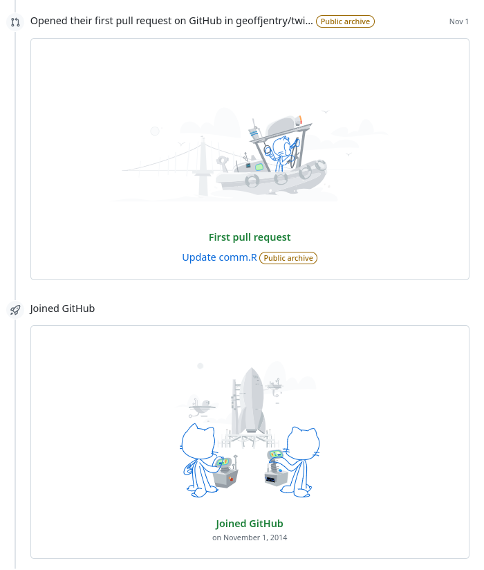
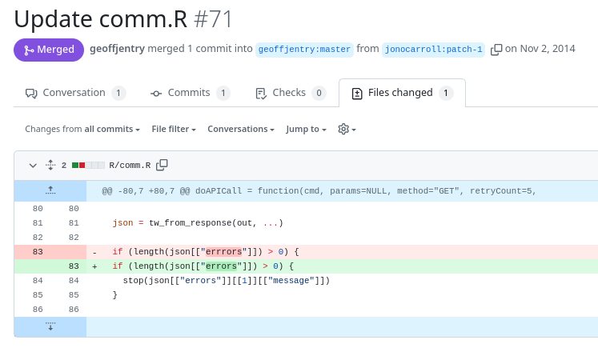

```{r, setup, include = FALSE}
knitr::opts_chunk$set(
  class.output  = "bg-success",
  class.message = "bg-info text-info",
  class.warning = "bg-warning text-warning",
  class.error   = "bg-danger text-danger"
)
```

As October rolls around once more, the term Hacktoberfest might pop across your
feeds. This is an effort towards encouraging people to contribute to open-source
software, particularly if they're new to that. In this post I'll describe what
I'm offering towards that goal.

<!--more-->

As October rolls around once more, the term Hacktoberfest might pop across your
feeds. This is an effort towards encouraging people to contribute to open-source
software, particularly if they're new to that. In this post I'll describe what
I'm offering towards that goal.

[Hacktoberfest](https://hacktoberfest.com/participation/) has been running since 
(I think) 2017 and I've participated in at least one year - previously 
contributors who had the requisite 4 PRs merged received a free t-shirt, but I 
suspect that program became overly costly. 

The site describes the event as "DigitalOcean’s annual event that encourages
people to contribute to open source" and while one could be cynical (as I
usually am) about a corporate-sponsored "hack" event I have instead decided to
take the opportunity to be encouraging. 

I've been sending pull requests to repositories I don't own for very nearly 10
years now (it seems I created my [GitHub account](https://github.com/jonocarroll) 
on Nov 1, 2014) 



in the now archived repository for the {twitteR} package to fix a single-letter 
typo in some code, presumably because I noticed it was broken when using it



and in which I apologised just in case I was fixing something that wasn't broken.

Since then I've created another 271 pull requests (according to [GitHub](https://github.com/search?q=author%3Ajonocarroll+&type=pullrequests)) to 
various repositories - some my own (82) but most not. It's all too easy to forget 
how familiar I've become with that workflow. 

At [RWeekly](https://rweekly.org) we encourage users to submit new blog posts to
us (particularly those that we aren't otherwise likely to capture via our RSS
feed fetches) via pull requests, and we try to make that as smooth as possible, 
but I would bet there's a reasonable number of readers out there who don't feel 
comfortable with the pull request process to do that.

There's no shortage of material on the web explaining how to work with pull requests 
in R either at the command line or in RStudio

- [https://r-bio.github.io/intro-git-rstudio/](https://r-bio.github.io/intro-git-rstudio/)
- [https://rfortherestofus.com/2021/02/how-to-use-git-github-with-r/](https://rfortherestofus.com/2021/02/how-to-use-git-github-with-r/)
- [https://www.r-bloggers.com/2019/01/a-newbies-guide-to-making-a-pull-request-for-an-r-package/](https://www.r-bloggers.com/2019/01/a-newbies-guide-to-making-a-pull-request-for-an-r-package/)
- [https://r-pkgs.org/software-development-practices.html#git-pullreq](https://r-pkgs.org/software-development-practices.html#git-pullreq)

but that's theory - how does a new user practice making a pull request?

Sure, you could create a toy repository and make your own pull request to that - 
and I recommend you do, it's great practice - but will that make you sufficiently 
comfortable to make a request to _someone else's_ codebase?

If not, I'm here for you...

Introducing [{safespace}](https://github.com/jonocarroll/safespace) which is a
"broken" repository full of things that need fixing, with zero consequences if
you accidentally break something while learning. The idea of this repository is
to have somewhere a very new user can submit a *real* pull request, have it
reviewed (with compassion but aiming to help you improve), and merged. As a
bonus, it's tagged with the `hacktoberfest` topic, so if you do get a pull
request merged it counts towards your contributions; if you have 4 pull requests 
started and merged during October across participating repositories and get a 
shiny digital badge!

The repository contains a "real" (but toy) R package that is currently in a broken 
state - it requires some code changes to make it work. It also has all sorts of 
things that could be improved; typos, documentation, logic issues, etc... it's 
also (hopefully) a good way to learn about building R packages and seeing what 
needs to be fixed.

My target audience for this repository is people who wish they had somewhere to 
send a real pull request because they don't yet feel comfortable participating in 
open source software. It's not for people already comfortable who just want to show 
off that they can make pull requests or code changes; I'll probably just close 
any of those if I spot them.

I've added some instructions to the README since this audience is, by definition, 
less familiar with the workflow. If those aren't clear enough or are plain old 
wrong, please let me know!

Open a pull request suggesting some code changes, and I'll provide some feedback 
on the changes; things you may have overlooked, other ways to achieve the same, or
notes on construction. All going well, by the end of October, the repository and 
package will be in a fully "working" state, passing `devtools::check()`, and with 
some reasonable documentation.

Lastly, this really only works if some of the people who would benefit from such 
a learning opportunity find out about it, so boosts and re-shares would be 
greatly appreciated.

As always, I can be found on
[Mastodon](https://fosstodon.org/@jonocarroll) and the comment section below.

<br />
<details>
  <summary>
    <tt>devtools::session_info()</tt>
  </summary>
```{r sessionInfo, echo = FALSE}
devtools::session_info()
```
</details>
<br />
