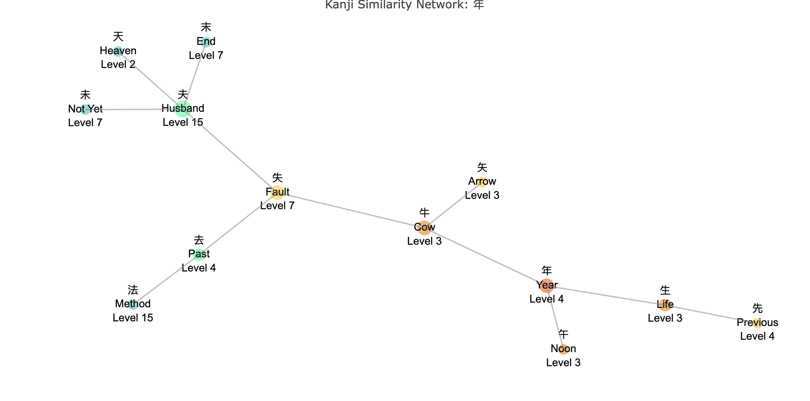
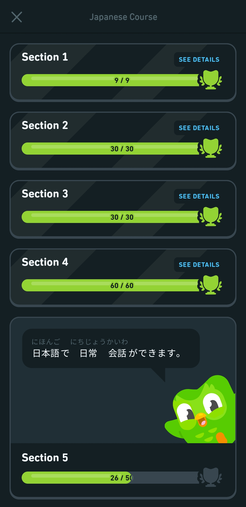
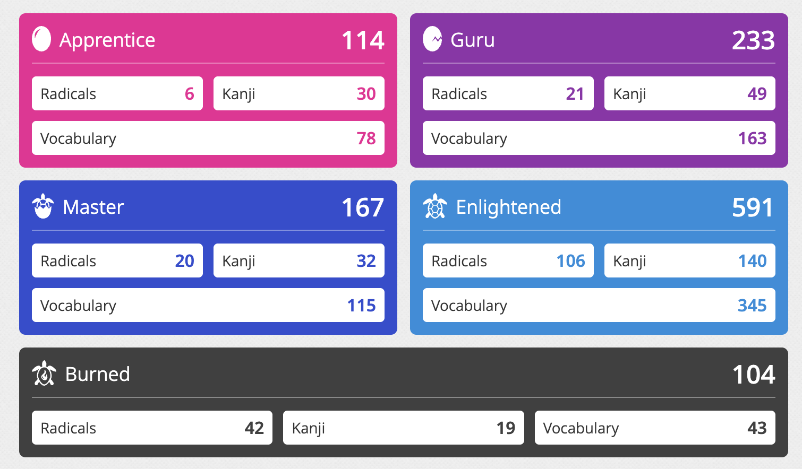
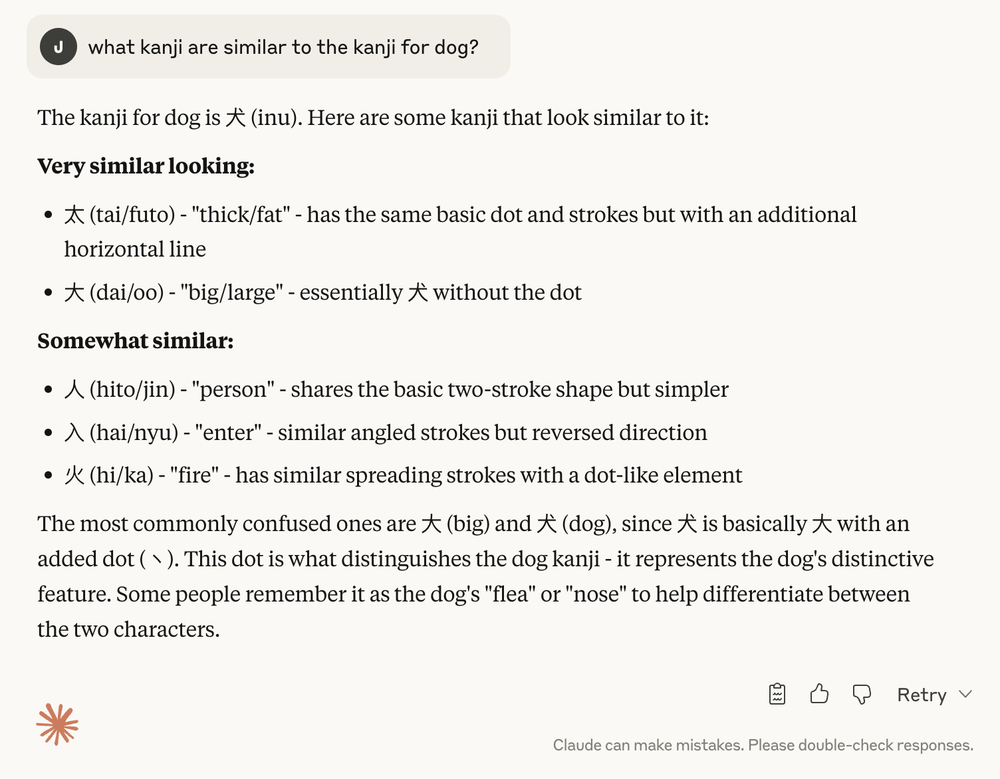
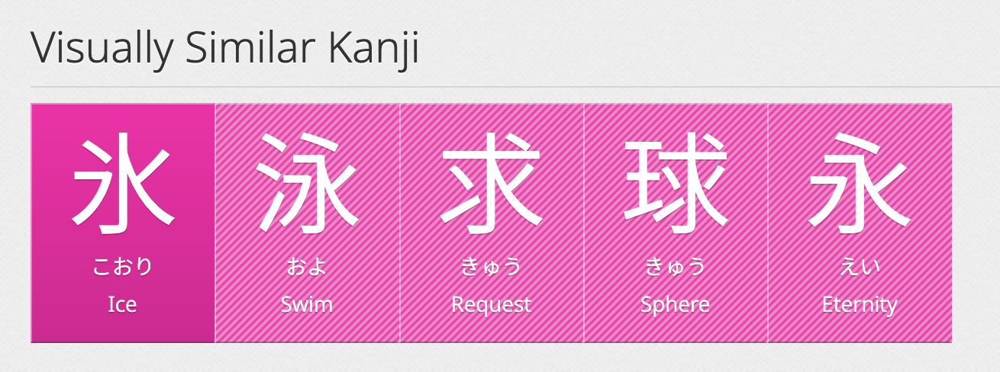
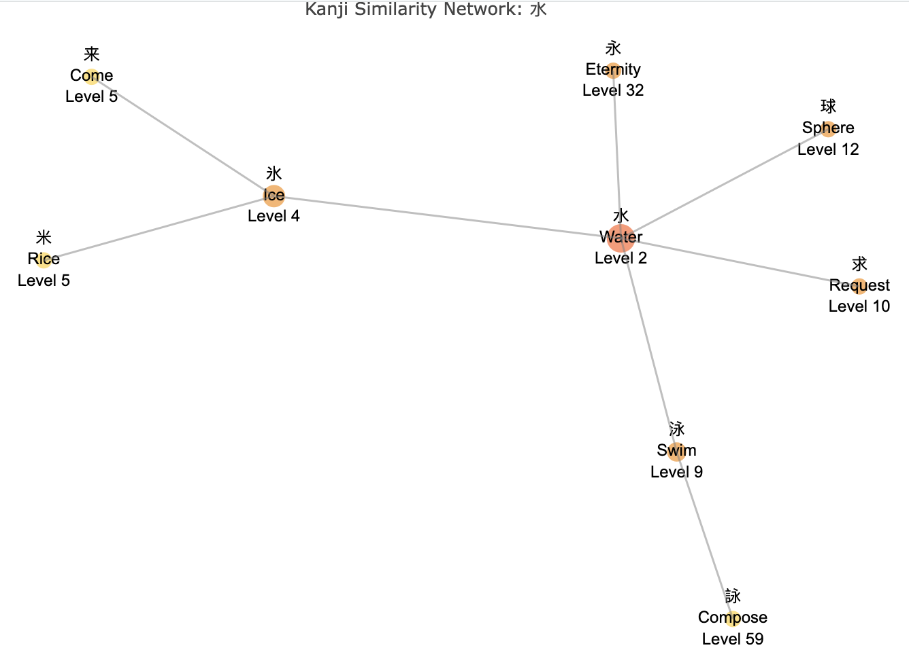
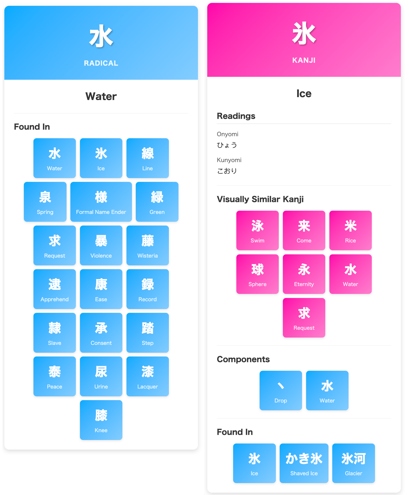
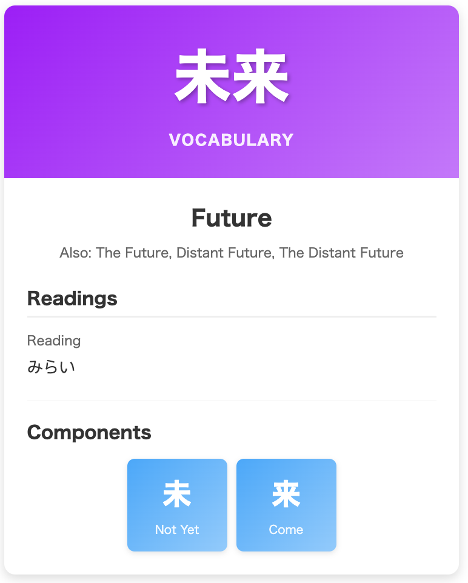
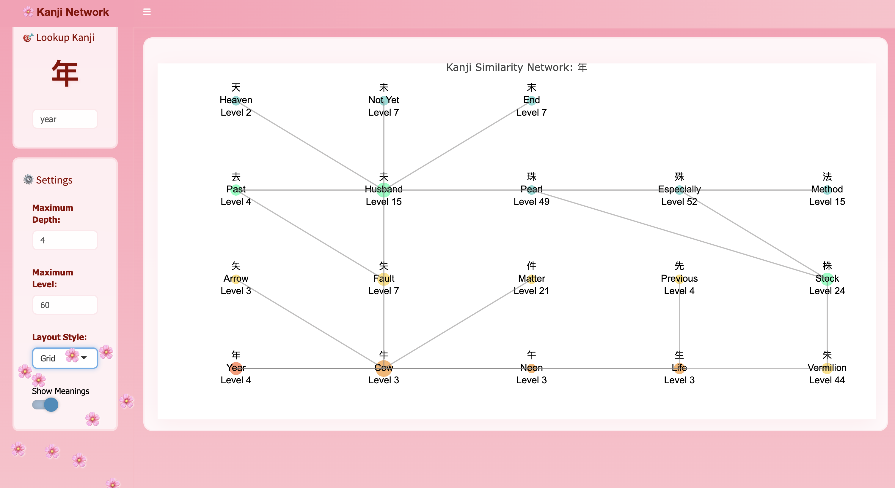

```{r, setup, include = FALSE}
knitr::opts_chunk$set(
  class.output  = "bg-success",
  class.message = "bg-info text-info",
  class.warning = "bg-warning text-warning",
  class.error   = "bg-danger text-danger"
)
knitr::opts_chunk$set(fig.path = "") 
```


I wanted calculate something, and there wasn't an R package for it yet (rare,
these days). Here's how I built a solution with an AI model, and how you could
do it too if there's something that you want to bring into existence.

<!--more-->

I wanted calculate something, and there wasn't an R package for it yet (rare,
these days). Here's how I built a solution with an AI model, and how you could
do it too if there's something that you want to bring into existence.

I won't keep you in suspense - here's the result: 

{width=800px}

This is exactly what I wanted - a way to explore visually similar kanji in
Japanese and identify the differences between them so I could better remember
which is which. I barely wrote any of the code to make it happen, and I couldn't
be happier with it.

### How did I get here? 

I've been learning Japanese since my daughter started high school at the start
of last year. My main resource is [Duolingo](https://www.duolingo.com/), which I
think is okay, but not brilliant. My 'Duolingo Japanese Score' is 72 with a 625
day streak. I'm on Section 5 unit 27, and there's only one Section left after
this.

{width=600px}

{width=400px}

so I'm a lot of the way through the course, but it doesn't really _teach_ me
anything; it's purely by example, which I suppose is how children learn their
native language, but it is pretty slow going for remembering what things mean. I
bought some grammar books which are enlightening and I frequently say "Oh,
that's why they did that!" I was recommended to try
[WaniKani](https://www.wanikani.com/), which uses spaced-repetition to teach the
radicals, the kanji, and vocabulary and provides mnemonics to help remember
which things mean what. I've found that extremely useful for my Duolingo-based
learning because now I can sometimes recognise what a word might mean based on
what I've learned in WaniKani and that helps me at least get closer to which
word is correct. WaniKani is free until you clear level 3 after which it's paid,
but I found it so useful I paid for a subscription and am now on level 8. There
are 60 levels, and the first 10 are labelled "pleasant", the next 10 "painful",
followed by "death", then "hell", so I'm not nearly through even the easy bit
yet.

{width=600px}

One of the complexities with Japanese language (and Chinese) is that part of the
writing system is logographic (meaning-based, rather than phonemic, based on
alphabets) and there are thousands of characters all with multiple meanings and
multiple readings. Some of them look extremely similar to each other even though
they refer to completely different things. The words for "dog" 犬 and "big" 大 and
"fat" 太 differ by one little stroke which is easy to confuse. In the end, you
just have to know which one is which, but I wanted to be able to compare which
things are similar.

### Prior Art

Alex Chan's 2020 post [Storing language vocabulary as a graph](https://alexwlchan.net/2020/storing-language-vocabulary-as-a-graph/)
explored a really cool idea about linking together words that look similar or
have similar components in Chinese, and I wanted to do something like that for
Japanese. I've had the idea floating in the back of my mind since I read that
post, but I had no idea how I was going to build it.

{width=600px}

One option was just to ask an AI model every time I was confused about things
and get it to produce the answer, but this seemed both wasteful and potentially
just slow and annoying (or at worst, plain old wrong). I gave it a go, and I
think it does some of what I need to, but I'd rather build something I have some
faith in that I can query on demand without having to go and fetch an AI answer
every time.

{width=600px}

(oh, so "dog" 犬 has an extra "dot" compared to "big" 大 ... that certainly won't
come to mind when I see "fat" 太. Also, what "additional horizontal line"???)

WaniKani does give you this 'visually similar' information when it shows you the
kanji, and I figured maybe I can use that data to build out a graph.

{width=600px}

### Trying to do it manually

I had a look around and couldn't find any R packages that did what I wanted (I
didn't search other programming languages; maybe there's something in python?).
There was [one WaniKani API package](https://github.com/ZenBrayn/wanikanir)
`{wanikanir}` (on GitHub, not CRAN) that was a bit out of date from 7 years ago.
I couldn't use that as-is and I couldn't find another WaniKani API package. I
did find Dominic Schuhmacher's
[package](https://github.com/dschuhmacher/kanjistat/) for comparing or looking
up kanji. But that doesn't do the similarity analysis that I wanted. The
WaniKani API exists and that's what [Smouldering Durtles](https://github.com/jerryhcooke/smouldering_durtles) (the unofficial Android app I occasionally use to view my progress) uses behind the scenes, and
I needed a way to query it. So I started by trying to fetch the data myself. I
[got my API key](https://www.wanikani.com/settings/personal_access_tokens),
looked up the [documentation](https://docs.api.wanikani.com/), figured out what
I need to fetch, and then tweaked `{wanikanir}` to use `{httr2}` (with
pagination) and query the data via the up-to-date endpoint. I got the results as
a giant JSON blob, so I needed to dive into what was in there.

I had to parse out the different pieces that I want, which was the internal IDs,
the kanji, their readings, their meanings, and then the similarities (which just
returns another list of IDs to look up). I ended up staying up until about 1am
that night and _only just_ managed to get the actual data in the form of a table
that I could look at and maybe see that it would have the pieces that I needed,
but this was going to take a very long time.

```r
# get all the kanji
kanji <- wanikanir::get_wk_data_by_name("subjects", opt_arg = "kanji")

# map meaning, readings, level, and similar ids
kanji_maps <- purrr::map_df(
  seq_along(kanji),
  ~ data.frame(
    id = kanji[[.x]]$id,
    type = kanji[[.x]]$object,
    kanji = kanji[[.x]]$data$characters %||% NA,
    meanings = purrr::map_chr(kanji[[.x]]$data$meanings, ~ .x$meaning),
    readings = paste(
      purrr::map(kanji[[.x]]$data$readings, ~ .x$reading),
      collapse = " / "
    ),
    level = kanji[[.x]]$data$level,
    similar = toString(unlist(
      kanji[[.x]]$data$visually_similar_subject_ids
    )) %||%
      NA
  )
) |>
  dplyr::arrange(id, level)
  
dplyr::slice_sample(kanji_maps[kanji_maps$level < 10, ], n=10)
#      id       type kanji        meanings          readings level         similar
# 1  8664 vocabulary  番組         Program          ばんぐみ     8                
# 2  2657 vocabulary    字 Kanji Character                じ     3                
# 3   644      kanji    食            Meal  しょく / た / く     6             805
# 4   690      kanji    者        Somebody       しゃ / もの     8                
# 5   685      kanji    役            Duty       やく / えき     8 686, 2304, 2118
# 6  2795 vocabulary  空気            Mood            くうき     5                
# 7  3109 vocabulary  名物  Famous Product          めいぶつ     9                
# 8  2570 vocabulary  日本           Japan にほん / にっぽん     2                
# 9  2539 vocabulary  上手      Skilled At          じょうず     2                
# 10 2602 vocabulary  大切        Valuable          たいせつ     3         
```

Just in case that's of use to anyone, I've updated my fork with these changes
and it now passes `devtools::check()`

https://github.com/jonocarroll/wanikanir

This was still a long way off from what I needed it to do, though. 

### Get to work, agent

A couple of days later, I'd been watching some videos on [Claude Code](https://www.anthropic.com/claude-code), in particular starting it up in
the base directory of an [Obsidian](https://obsidian.md/) vault full of markdown
files which seems to be _very_ powerful, e.g.

```{r, eval=TRUE, echo=FALSE, result='asis'}
blogdown::shortcode("youtube", "d7Pb73dbcIM")
```

and decided to take it for a proper spin. I've previously briefly tried used
[Amp](https://ampcode.com/) to vibe code something – Geoff Huntley [demonstrated that](https://ghuntley.com/agent/) at [DataEngBytes](https://dataengbytes.com/)
and while I don't necessarily agree with everything he said, the take-away that
"developers need to be aware of (and familiar with) these tools" really stuck
with me. The Agentic workflow works quite nicely for iterating by itself if it
can run tools (e.g. via `bash`) so I can trust that it'll run the tests, build
the docs, and commit all of the code only when everything passes. I loaded up
Claude Code, gave it some funds, and tried to see how productive this is going
to be. The entire prompt, not even using the `/init` setup, was just

> "Build an R package that uses this API https://docs.api.wanikani.com/. Support
all the endpoints. Add documentation and tests and make sure it passes check".

and off it went to started building. It made a plan for what it needed to do to
build the package:

- It needed to query the API
- It needed to figure out which functions to use
- It needed to write documentation and tests

```
☒ Examine WaniKani API documentation to understand endpoints
☒ Create R package structure and configuration files
☒ Implement core API client functions
☒ Create functions for each API endpoint
☒ Add comprehensive documentation with roxygen2
☒ Write tests with mocking using testthat and httptest
☐ Create package vignette with usage examples
```

And then it just went step-by-step and ticked off things on its to-do list.

I'll point out at this point that the recent videos I'd seen — as well as
Geoff's presentation — used voice dictation. So I installed Wispr Flow, and it
gave me two weeks of pro-level usage, which means I can just talk to my computer
about what I wanted to do. I'm pretty happy with how this is working, and in
fact I dictated most of this article as a draft. I don't let any AI write my
blog posts for me; this is definitely **me** writing all of this — even if I do
use an em-dash or two. But Wispr Flow seems pretty cool. If you want to give it
a go, here's a referral code

[wisprflow.ai/r?JONATHAN746](wisprflow.ai/r?JONATHAN746)

that I think gives you two weeks of full pro-level usage, and in theory if I end
up keeping on using this, gives me some free weeks too.

Once it was done, Claude Code had queried the API documentation page, found all
of the endpoints, and then built an entire R package with modern approaches that
queries the endpoints using `{httr2}`. This is exactly what I would have done
myself if I'd spent a *lot* more time with it. It added documentation for all of
the functions and a set of mocked tests using `{httptest}`. It confirmed that it
passed `devtools::check()` by actually running it from the command line and
fixing any errors that came up.

I wanted to make sure that it was clear when I was "doing an AI" and when I was
doing my own work, so as part of my initial instructions to Claude, I told it
that any time it commits, it needs to have "(claude)" in the commit message.
This might have been redundant because it adds itself as a co-author, so all of
the commits show "co-authored by Claude" in GitHub if it was involved, but I
think it's worthwhile calling it out in the commit messages.

I had everything that I needed to get started actually pulling some data, so I
gave it a subset of the JSON output that I'd manually extracted the other day
and said that I wanted to be able to reproduce this. It built a function that
queried the data according to all of the things that it had found/built so far
and built the exact same table that I'd spent my entire evening building, but
now the package could do everything else as well. It also wrote a a vignette of
basic usage that keeps track of all the things it can do. Here I think it's a
little less competent in terms of writing documentation that shows how to use
something, but these models aren't necessarily great at knowing the intention of
what you're trying to do.

One of the problems that I found from manually inspecting the data was that the
'visually similar' component (the bit that I actually want) returned a list of
IDs, but I wanted to get the actual kanji that were related so that I could see
them on the network graph. So again, I just asked Claude Code to resolve those
so that we have the actual names and meanings, and that's where it did something
a little bit wrong; it started querying the API again for each character that it
needed to look up. But Claude Code lets you interrupt and change course, so I
interrupted it and told it to use the data it already had, and it cheerfully
agreed (I'm sure we're all sick of hearing "You're absolutely right!"). Now, for
each kanji I get any similar kanji and their meaning.

The last piece is to actually show this on a network graph. Again, I'm not going
to be writing any of the code here, so I just asked it to build me a function
that queries on any one kanji and shows all of the related ones in either
direction up to some depth. It went off and built that, and again, it works. It
added tests. It made sure that it passed check and added documentation and
examples to the README and vignette. When I started testing it out, I realised
that I had to actually paste in kanji, which isn't the interface that I
necessarily wanted, so I asked it to modify the function to optionally use the
English word and just search for that in the meanings.

### Functionality

Now I can query for 'water' either by the kanji 水 or by the English word "water". 

{width=800px}

Looking through the vignette of what it was able to do, it had some extra
wrapper functions around the raw data that it fetched, so I asked it to
integrate them into the actual functions so that they didn't just return raw
data. One of the things it can do now is fetch the worst mistakes that I've made
in WaniKani so that I can review those

```
=== Review Statistics Summary ===

Total subjects with reviews: 500 
Average meaning accuracy: 91.9% 
Average reading accuracy: 89.4% 

Meaning Accuracy Distribution:
  0-50%: 0 subjects
  51-70%: 0 subjects
  71-80%: 46 subjects
  81-90%: 161 subjects
  91-100%: 293 subjects

Subjects That Need Most Practice:
  1. 出 (Exit) - 72% [Level 2 Kanji]
  2. 少女 (Girl, Young Girl) - 72% [Level 3 Vocabulary]
  3. 年中 (Year Round, All Year, Whole Year, Throughout The Year) - 72% [Level 4 Vocabulary]
  4. 去年 (Last Year) - 72% [Level 4 Vocabulary]
  5. 村人 (Villager) - 75% [Level 4 Vocabulary]
```

(most of my errors are "spelling"-related; is it "しゅう" or "しょう"?)

and my level progress 

```
=== Level Progression Summary ===

Total levels tracked: 8 
Levels completed: 0 
Levels passed (not completed): 7 
Levels in progress: 1 

Passing Time Statistics:
  Average days to pass: 25.5 
  Median days to pass: 21.2 
  Fastest level passed: 10.1 days
  Slowest level passed: 48.6 days

Individual Level Progress:
   Level 1 - passed in 13 days 
   Level 2 - passed in 10.1 days 
   Level 3 - passed in 24 days 
   Level 4 - passed in 21.2 days 
   Level 5 - passed in 13.7 days 
   Level 6 - passed in 47.8 days 
   Level 7 - passed in 48.6 days 
   Level 8 - in progress 
```

(I'm slowing down, but it's definitely getting harder to keep up)

Since it can query all of this from WaniKani, I thought maybe I'd do something a
bit similar to what is in there and on-demand build a card for each character
(either kanji or radical) to show the readings and the name and the similar
kanji independent of the network graph, especially for kanji containing
radicals.

At this point, I realised that every time it went and fetched all of this data
it was fetching directly from the API, so I asked it to add a caching layer that
fetched all of the kanji once and stored it with the package, reloading whenever
necessary and referred to that. Again, it did it. So now it used the cache of
that data and could look up all of it, and when I checked what was actually in
that cache it was the full raw JSON processed data, so now it could fetch
everything, not just the pieces that I was interested in. It built the cards and
they look amazing - it would've taken me a while to figure out the CSS styling
of this; definitely not impossible but so much easier to just ask and have it
done.

Just look at these!

```
wk_create_character_card("水")
wk_create_character_card("氷")
```
{width=600px}

Oh, and is everyone using the new 'Minimalist Async Evaluation Framework for R'
[mirai](https://mirai.r-lib.org/)? みらい 未来

```
wk_create_character_card("未来")
```

{width=300px}

The package has everything that I wanted it to do:

- queries all of the endpoints on WaniKani
- shows the meaning and definition for kanji
- shows how they're related in a network graph

I'm *extremely* happy. I let it do all the committing and pushed it to Github. I
added the `{pkgdown}` docs to actually render things, and dealt with the issue
of having to pre-render the vignette because it needs an API key. Apart from
that, I had all of this done in a matter of hours. Now that's not to say that
this is just free and easy for everyone; I did spend about US$20 on building
this and that included an about an hour of API time. But these things are
constantly getting better, and they're getting cheaper. Honestly I would've
spent a week building these components myself, so I think that's a pretty good
deal. A thing that didn't exist before now exists, and all it took was one
person spending $20 and connecting up their thoughts of what they wanted to a
capable system.

```
Total cost:            $20.06
Total duration (API):  1h 13m 18.5s
Total code changes:    5605 lines added, 750 lines removed
Usage by model:
      claude-sonnet:  813 input, 170.6k output, 38.0m cache read, 1.6m cache write
	    claude-3-5-haiku:  284.2k input, 7.3k output, 0 cache read, 0 cache write
```

### Putting It To Use

So does it "work"? Well, I built a Shiny app that uses just this package and a
stored copy of all the cached data (so that it doesn't need my API key) to show
the network graph for any kanji at any depth, and you can play with it here

https://jcarroll.shinyapps.io/kanjiexplorer/

I've hosted it on shinyapps.io, and of course I got Claude (not Code this time)
to help me build it. It takes either kanji or an English word and builds the
network graph to some maximum depth, with a limitation on the level (in case you
don't care about words you haven't learned yet) and some settings for layout.

{width=800px}

FYI, it's ... not great on a phone screen. I haven't spent a lot of time
refining this, and don't plan to.

In terms of "does it work?" I think it definitely does all of the things that I 
wanted it to do. The old saying of ["Make it work, make it right, make it fast"](https://wiki.c2.com/?MakeItWorkMakeItRightMakeItFast) probably applies
here. I think "work" gets a tick. Is it right? I don't know. As far as I can
see, it uses the data from the WaniKani API and gets the same results that I did
when I got it manually, but I'm relying on that data. Sure, there's possibly
(probably) bugs in there. But this is pretty low-risk work I'm doing here. The
very worst that could happen with any of this code is it deletes my WaniKani
account, and in that case I'll live to tell the tale. In terms of "fast", this
is also low-risk. It doesn't need to do anything computationally heavy;
everything here seems to work okay. I got it to add caching, so that I wasn't
being wasteful. But apart from that, what more could I want to do?

### Reflections

Should *you* build one of these packages to connect to your banking app?
Probably not. I think it would probably build something that might be capable
and "look right enough" if your bank had an API, but the risk there is just too
high to actually let a system vibe code it.

One of the sayings I like was that people used to say "ideas are free,
implementation costs." I think it was Jeff Huntley's who said in his
DataEngBytes presentation (something along the lines of) "implementations are
now free for prototypes," and I think that definitely holds here. If somebody
wanted to take this and create a business that made a "production ready" version
of this shiny app, go for it! You're welcome to; I'll maybe even subscribe to
it. But I built this entire prototype from an empty file in a day and twenty
dollars, so I have what I need to continue with that.

Does this mean that R programmers can stop learning and just rely on AI now?
Absolutely not. I think the only way that I managed to get this to work the way
that I wanted it to was by querying the data manually myself first and having a
look at it. That helped me understand what was available, where things were in
the response, and when the model had trouble building around that I was able to
say or point out that oh there's a `x$data$something` field. In terms of
business requirements, that's always been something that you need to have before
you can start building a package. Can it speed up your iteration process? I
think absolutely. I got nowhere near actually building the first function for a
package in the night that I spent working on this, and within about an hour with
an AI agent I had something that was not only documented with tests, but fully
passing `devtools::check()`. That's so much faster than I could have built it
even if it is just a prototype. The old advice of "throw away your first
prototype" is very likely still applicable here, and if I went through and
rewrote all of these things in my own style, I don't think much would change in
terms of the functionality. The big difference from doing it manually is that I
now *have* that first version, and can see if it does what I actually want it to
do (it does!).

I don't mind if no one beyond me uses this. I built it exclusively for me. It
does what I want it to do. The code and the shiny app are available if that's
helpful to you, and if there's something else that you'd find useful, maybe I'll
find that useful too, so feel free to send in any pull requests or issues about
what you think it could or should do. In the meantime, I'll be using this to
enhance my own Japanese learning.

I'd love to hear what people think about this... Was this all a terrible idea?
Is there already a better tool which does this? Have I wasted $20 enjoying seeing
something come to life? As always, I can be found on
[Mastodon](https://fosstodon.org/@jonocarroll) and the comment section below.

<br />
<details>
  <summary>
    <tt>devtools::session_info()</tt>
  </summary>
```{r sessionInfo, echo = FALSE}
devtools::session_info()
```
</details>
<br />
