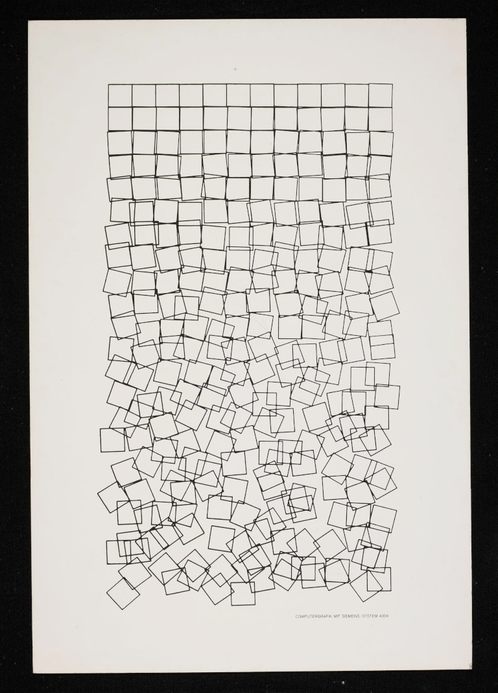
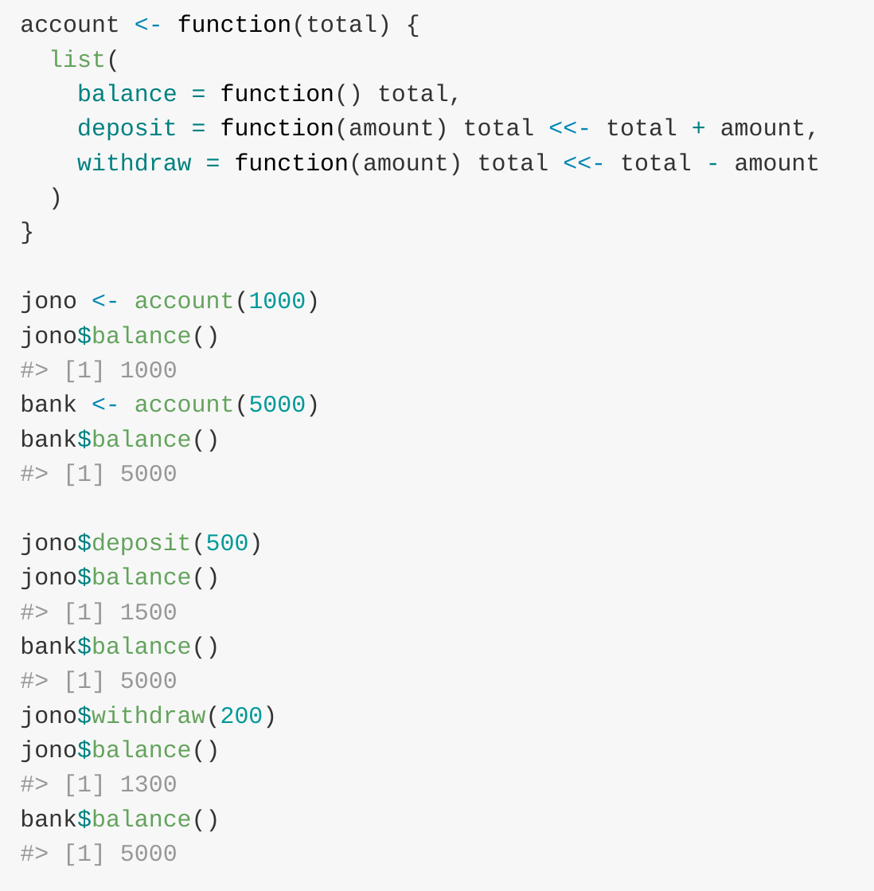
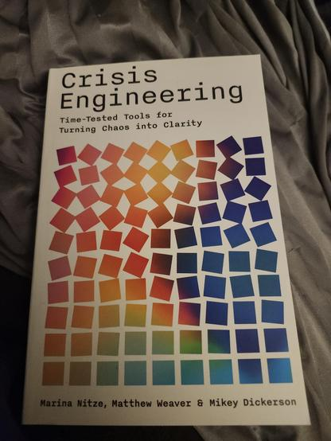

```{r, setup, include = FALSE}
knitr::opts_chunk$set(
  class.output  = "bg-success",
  class.message = "bg-info text-info",
  class.warning = "bg-warning text-warning",
  class.error   = "bg-danger text-danger"
)
knitr::opts_chunk$set(fig.path = "") 
reticulate::py_require('drawsvg')
reticulate::py_require('IPython')
```

Translating things between languages reveals how each language approaches 
different design trade-offs, and I believe it's a useful exercise. Having 
something to translate is the first step. I found a plot I wanted to generate, 
and some code that reproduced it, so off we go!

<!--more-->

Translating things between languages reveals how each language approaches 
different design trade-offs, and I believe it's a useful exercise. Having 
something to translate is the first step. I found a plot I wanted to generate, 
and some code that reproduced it, so off we go!

I don't recall how I originally found [this page](https://zellyn.com/2024/06/schotter-1/) 
(I didn't keep a note on it, it seems) and this has been sitting on my 
to-be-posted-about pile for way too long, so here's the post I've been meaning to write. 

That post details some ALGOL code that generates Georg Nees' "Schotter" 
computer-generated art from 1968 which shows a grid of squares which get 
increasingly displaced in position and rotation

```algol
1   'BEGIN''COMMENT'SCHOTTER.,
2   'REAL'R,PIHALB,PI4T.,
3   'INTEGER'I.,
4   'PROCEDURE'QUAD.,
5   'BEGIN'
6   'REAL'P1,Q1,PSI.,'INTEGER'S.,

7   JE1.=5*1/264.,JA1.=-JE1.,
8   JE2.=PI4T*(1+I/264).,JA2.=PI4T*(1-I/264).,
9   P1.=P+5+J1.,Q1.=Q+5+J1.,PS1.=J2.,
10  LEER(P1+R*COS(PSI),Q1+R*SIN(PSI)).,
11  'FOR'S.=1'STEP'1'UNTIL'4'DO'
12  'BEGIN'PSI.=PSI+PIHALB.,
13  LINE(P1+R*COS(PSI),Q1+R*SIN(PSI)).,
14  'END".,I.=I+1
15  'END'QUAD.,
16  R.=5*1.4142.,
17  PIHALB.=3.14159*.5.,P14T.=PIHALB*.5.,
18  I.=0.,
19  SERIE(10.0,10.0,22,12,QUAD)
20  'END' SCHOTTER.,

1   'REAL'P,Q,P1,Q1,XM,YM,HOR,VER,JLI,JRE,JUN,JOB.,
5   'INTEGER'I,M,M,T.,
7   'PROCEDURE'SERIE(QUER,HOCH,XMAL,YMAL,FIGUR).,
8   'VALUE'QUER,HOCH,XMAL,YMAL.,
9   'REAL'QUER,HOCH.,
10  'INTEGER'XMAL,YMAL.,
11  'PROCEDURE'FIGUR.,
12  'BEGIN'
13  'REAL'YANF.,
14  'INTEGER'COUNTX,COUNTY.,
15  P.=-QUER*XMAL*.5.,
16  Q.=YANF.=-HOCH*YMAL*.5.,
17  'FOR'COUNTX.=1'STEP'1'UNTIL'XMAL'DO'
18  'BEGIN'Q.=YANF.,
19  'FOR'COUNTY.=1'STEP'1'UNTIL'YMAL'DO'
20  'BEGIN'FIGUR.,Q.=Q+HOCH
21  'END'.,P.=P+QUER
22  'END'.,
23  LEER(-148.0,-105.0).,CLOSE.,
24  SONK(11).,
25  OPBEN(X,Y)
26  'END'SERIE.,
```



What's missing from this ALGOL code is the seeds needed to reproduce the plot. 
[The author went down a rabbit hole](https://zellyn.com/2024/06/schotter-2/) 
investigating and calculating different values, but managed to determine them to 
be "(1922110153) for the x- and y-shift seed, and (1769133315) for the rotation 
seed". They also provided a translation into Python

```{python, fig.asp=2, fig.cap="'Schotter' in Python", results='asis'}
import math
import drawsvg as draw

class Random:
    def __init__(self, seed):
        self.JI = seed

    def next(self, JA, JE):
        self.JI = (self.JI * 5) % 2147483648
        return self.JI / 2147483648 * (JE-JA) + JA

def draw_square(g, x, y, i, r1, r2):
    r = 5 * 1.4142
    pi = 3.14159
    move_limit = 5 * i / 264
    twist_limit = pi/4 * i / 264

    y_center = y + 5 + r1.next(-move_limit, move_limit)
    x_center = x + 5 + r1.next(-move_limit, move_limit)
    angle = r2.next(pi/4 - twist_limit, pi/4 + twist_limit)

    p = draw.Path()
    p.M(x_center + r * math.sin(angle), y_center + r * math.cos(angle))
    for step in range(4):
        angle += pi / 2
        p.L(x_center + r * math.sin(angle), y_center + r * math.cos(angle))
    g.append(p)

def draw_plot(x_size, y_size, x_count, y_count, s1, s2):
    r1 = Random(s1)
    r2 = Random(s2)
    d = draw.Drawing(180, 280, origin='center', style="background-color:#eae6e2")
    g = draw.Group(stroke='#41403a', stroke_width='0.4', fill='none',
                   stroke_linecap="round", stroke_linejoin="round")

    y = -y_size * y_count * 0.5
    x0 = -x_size * x_count * 0.5
    i = 0

    for _ in range(y_count):
        x = x0
        for _ in range(x_count):
            draw_square(g, x, y, i, r1, r2)
            x += x_size
            i += 1
        y += y_size
    d.append(g)
    return d
  
d = draw_plot(10.0, 10.0, 12, 22, 1922110153, 1769133315).set_render_size(w=500) 
print(d.as_svg())
```

I wanted to see if I could also translate that to R – base `plot` can draw line 
segments just fine, and I was curious about colouring the squares my own way.

Most of that code translates straightforwardly, with the exception that the 
'randomness' is actually a sequence of values, starting with a specific seed. I 
[tooted](https://fosstodon.org/@jonocarroll/116417076133600830) recently about 
an older [post of mine](https://jcarroll.com.au/2016/05/30/seed/) which (ab)uses 
the `set.seed()` function to generate specific 'random' words

```{r}
printStr <- function(str) paste(str, collapse="")

set.seed(2505587); x <- sample(LETTERS, 5, replace=TRUE)
set.seed(11135560);y <- sample(LETTERS, 5, replace=TRUE)

paste(printStr(x), printStr(y))
```

which I was inspired to revisit based on 
[a post by Andrew Heiss](https://www.andrewheiss.com/blog/2026/04/13/seeds-predetermined-universes/).

The `Random` class in that Python translation produces an iterator which 
returns a 'next' value each time it's called with a specific 'seed' and 
two values

```{python}
class Random:
    def __init__(self, seed):
        self.JI = seed

    def next(self, JA, JE):
        self.JI = (self.JI * 5) % 2147483648
        return self.JI / 2147483648 * (JE-JA) + JA
      
r = Random(1)
r.next(2, 3)
r.next(2, 3)
r.next(2, 3)
```

with the added complexity that the subsequent calls _update the seed itself_. 

When I first saw this, my mind went back to reading the 
["original" R paper](https://stat.auckland.ac.nz/~ihaka/downloads/R-paper.pdf) 
'R: A Language for Data Analysis and Graphics' by Ross Ihaka and Robert Gentleman, 
in which 
[I recalled seeing the cool example of an OO system](https://fosstodon.org/@jonocarroll/111077962097245990)
maintaining a (non-global) state via `<<-`



With this same trick we can write an equivalent of the `Random` class which also 
updates the seed internally

```{r}
random <- function(seed) {
  list(
    nextval = function(a, b) { 
      seed <<- (seed * 5) %% 2147483648
      seed / 2147483648 * (b-a) + a
    }
  )
}

r <- random(1)
print(r$nextval(2, 3), digits = 16)
print(r$nextval(2, 3), digits = 16)
print(r$nextval(2, 3), digits = 16)
```

Cool! 

The rest of the translation is mostly aligning to base plot syntax. 

This is what I ended up with

```{r, fig.asp=2, fig.cap="'Schotter' in R"}
draw_square <- function(x, y, i, r1, r2, col) {
  r = 5 * 1.4142
  move_limit = 5 * i / 264
  twist_limit = pi/4 * i / 264
  
  y_center = y + 5 + r1$nextval(-move_limit, move_limit)
  x_center = x + 5 + r1$nextval(-move_limit, move_limit)
  angle = r2$nextval(pi/4 - twist_limit, pi/4 + twist_limit)
  
  x0 <- x_center + r * sin(angle)
  y0 <- y_center + r * cos(angle)
  
  for (step in 1:4) {
    angle <- angle + pi / 2
    x1 <- x_center + r * sin(angle)
    y1 <- y_center + r * cos(angle)
    segments(x0, y0, x1, y1, lwd = 1.75, col = col)
    x0 <- x1
    y0 <- y1
  }
}

draw_plot <- function(x_size, y_size, x_count, y_count, s1, s2) {
  r1 = random(s1)
  r2 = random(s2)
  
  plot(NULL, NULL, xlim = c(-60, 60), ylim = c(120, -120), axes = FALSE, ann = FALSE)
  
  y = -y_size * y_count * 0.5
  x0 = -x_size * x_count * 0.5
  i = 0
  
  for (z in 1:y_count) {
    x = x0
    for (zz in 1:x_count) {
      draw_square(x, y, i, r1, r2, "black")
      x <- x + x_size
      i <- i + 1
    }
    y <- y + y_size
  }
}

draw_plot(10.0, 10.0, 12, 22, 1922110153, 1769133315)
```

Which uses the special seeds discovered in that original post. Checking the 
rotations, this does indeed appear to match the original art.

Why stop there, though? Now that I can plot it, I can change things... what if I 
used a different set of seeds, e.g. swapped them?

```{r, fig.asp=2, fig.cap="'Schotter' in R with swapped seeds"}
draw_plot(10.0, 10.0, 12, 22, 1769133315, 1922110153)
```

or completely different values?

```{r, fig.asp=2, fig.cap="'Schotter' in R with new seeds"}
draw_plot(10.0, 10.0, 12, 22, 12345, 67890)
```

What about changing the colours? I could plot the colour as a function of the 
progression down the grid, which I think looks pretty cool.

```{r, fig.asp=2, fig.cap="'Schotter' in R with viridis colours"}
draw_plot <- function(x_size, y_size, x_count, y_count, s1, s2) {
  r1 = random(s1)
  r2 = random(s2)
  
  plot(NULL, NULL, xlim = c(-60, 60), ylim = c(120, -120), axes = FALSE, ann = FALSE)
  
  y = -y_size * y_count * 0.5
  x0 = -x_size * x_count * 0.5
  i = 0
  
  for (z in 1:y_count) {
    x = x0
    rcol <- scales::viridis_pal(option = "viridis")(y_count)[z]
    for (zz in 1:x_count) {
      draw_square(x, y, i, r1, r2, rcol)
      x <- x + x_size
      i <- i + 1
    }
    y <- y + y_size
  }
}

draw_plot(10.0, 10.0, 12, 22, 1922110153, 1769133315)
```

Ever since I first drafted this post, I've seen other examples of similar work. 
[This toot](https://mastodon.social/@safest_integer/114296256313964335) 
demonstrated a simplified version

```{r, fig.asp=1, fig.cap="https://mastodon.social/@safest_integer/114296256313964335"}
suppressPackageStartupMessages(library(tidyverse))
crossing(x=0:10, y=x) |>  
  mutate(dx = rnorm(n(), 0, (y/20)^1.5),  
         dy = rnorm(n(), 0, (y/20)^1.5)) |>  
  ggplot() +  
  geom_tile(aes(x=x+dx, y=y+dy, fill=y), colour='black',  
            lwd=2, width=1, height=1, alpha=0.8, show.legend=FALSE) +  
  scale_fill_gradient(high='#9f025e', low='#f9c929') +  
  scale_y_reverse() + theme_void()
```

while [this one](https://fosstodon.org/deck/@arclight@oldbytes.space/116380342929564058) 
showed a book 'Crisis Engineering' with a similar idea



I'm sure I've seen others around, too.

This was a fun exploration of some artistically inspired code translation, and I got 
to stretch my 'maintaining internal state' muscles a little. I have no doubt that 
someone more artistic than I could do a lot more with it.

As always, I can be found on
[Mastodon](https://fosstodon.org/@jonocarroll) and the comment section below.

<br />
<details>
  <summary>
    <tt>devtools::session_info()</tt>
  </summary>
```{r sessionInfo, echo = FALSE}
devtools::session_info()
```
</details>
<br />
